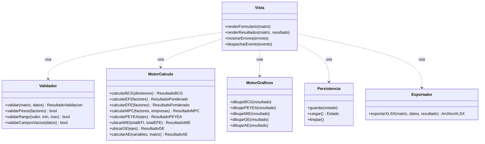
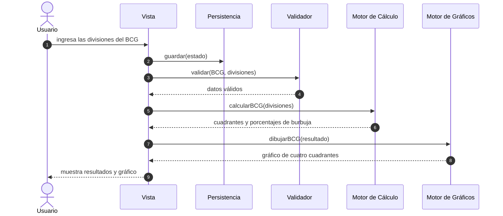
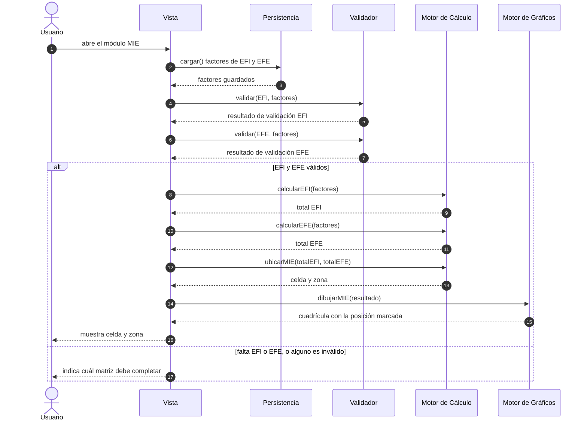
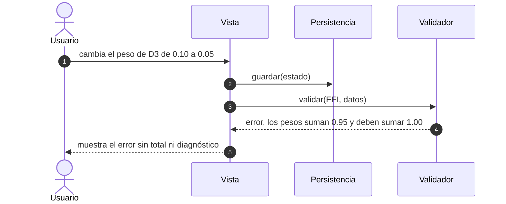
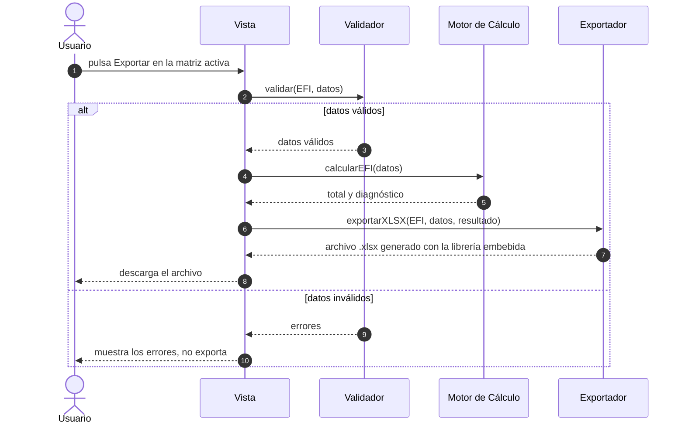
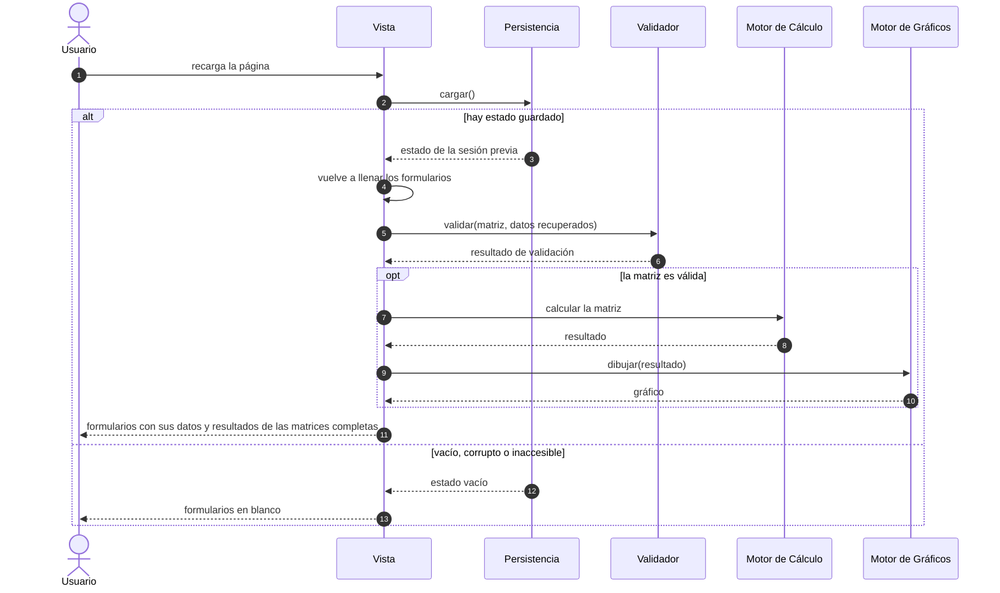
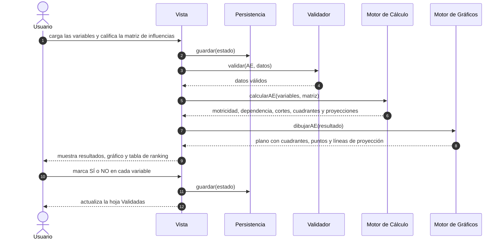
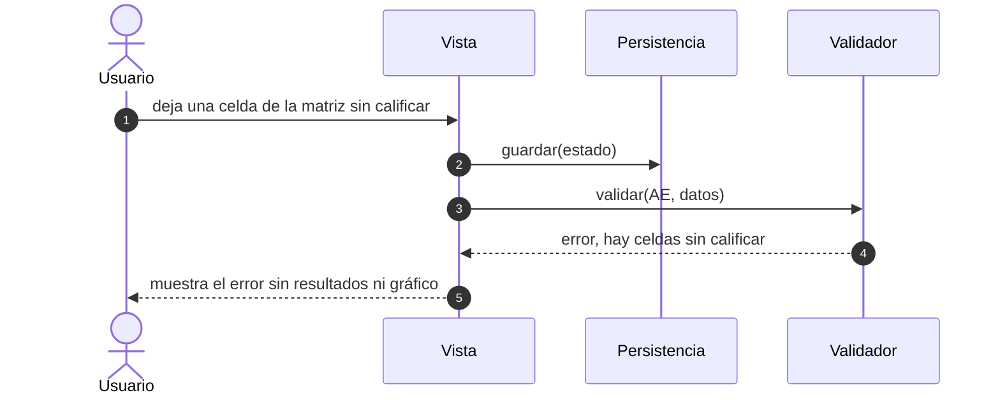

# Mtx: Documento VUP (Vibe Unified Process)

Estado: borrador de la fase Inception, pendiente de confirmación de Gerson antes de pasar a Elaboration I.
Referencia del proceso: https://vibeprocess.org/ (Vibe Unified Process, Dr. Michael Dorin, University of St. Thomas), adaptado de Jacobson, Booch y Rumbaugh (1999), El Proceso Unificado de Desarrollo de Software.

Flujo de trabajo acordado: este documento y el código viven en esta carpeta local. Claude Code trabaja aquí como constructor (fases de Elaboration II en adelante). La sesión de Cowork del Project "Prompt Engineering" en claude.ai actúa como juez, lee este mismo documento y el código a través del puente con la computadora, aplica los prompts de revisión de rol de VUP (Product Owner, QA, Arquitecto, Desarrollador) y documenta qué se acepta o se rechaza antes de desbloquear la siguiente fase.

## Inception

### Nombre del proyecto
Mtx

### Declaración de visión

Para los estudiantes y profesores del curso de Gestión Estratégica, que necesitan aplicar las matrices clásicas de planeamiento estratégico sin depender de una instalación frágil de Excel con macros VBA y bases de datos Access, Mtx es una suite de calculadoras estratégicas interactivas que corre íntegramente en el navegador. Calcula y grafica cada matriz al instante, sin instalación ni configuración previa. A diferencia de las plantillas actuales en Excel VBA más Access, Mtx elimina toda dependencia de software de escritorio, macros bloqueadas por seguridad de Windows, y bases de datos que se rompen al mover la carpeta a OneDrive o SharePoint.

### Fuera de alcance (v1)

- Replicar el modelo PE-BSC completo (34 hojas: misión, visión, EFI, EFE, objetivos estratégicos, análisis FLOR, ADN de misión y visión, Balanced Scorecard) queda para una fase posterior.
- Análisis Estructural (estilo MICMAC) ya se inició como Módulo 2 (ver la sección "Inception — Módulo 2: Análisis Estructural" al final de este documento). Priorización de Iniciativas y Radar Estratégico siguen pendientes para fases posteriores.
- Persistencia compartida entre varios integrantes de un mismo grupo trabajando a la vez no se resuelve en esta primera versión.
- Generación de conclusiones asistida por IA, al estilo de Praxio, se evalúa en una fase posterior, no en el primer entregable.

### Justificación

El sistema actual depende de Excel VBA más Access, lo que genera fallas documentadas en el propio manual técnico del profesor: macros bloqueadas por seguridad la primera vez que el archivo llega por internet o WhatsApp, rutas rotas si la carpeta se mueve a OneDrive o SharePoint, necesidad de tener instalado el motor de Access del mismo bitness que Office, y solo un usuario a la vez por archivo porque Access no soporta escritura simultánea. Migrar a una suite HTML autónoma elimina esa fricción sin costo de licencias, mejora la experiencia de los alumnos del curso de Gestión Estratégica, y sirve como caso de estudio propio de ingeniería de software asistida por IA.

### Historias de usuario (v1, módulo Matrices de Combinación)

1. Como estudiante, quiero cargar los ingresos y utilidades de cada división de mi empresa y obtener automáticamente el gráfico BCG, para no depender de una hoja de Excel con macros.
2. Como estudiante, quiero calificar mis factores internos y externos con peso y clasificación, y obtener el puntaje ponderado de EFI y EFE automáticamente, para no sumar a mano.
3. Como estudiante, quiero comparar mi empresa contra varios competidores en una matriz de perfil competitivo (MPC), para visualizar mi posición relativa.
4. Como estudiante, quiero ingresar los valores de fuerza financiera, ventaja competitiva, fuerza de la industria y estabilidad del entorno, para obtener automáticamente el vector y el cuadrante de la matriz PEYEA.
5. Como estudiante, quiero que el sistema ubique automáticamente mi empresa en la matriz interna-externa (MIE) a partir de mis totales de EFI y EFE, para saber en qué celda cae.
6. Como estudiante, quiero ver la matriz de la gran estrategia con mi posición marcada, para identificar qué tipo de estrategias me corresponden.
7. Como profesor, quiero que mis alumnos puedan usar estas siete matrices sin instalar nada ni depender de un laboratorio con Office y Access configurados.

### Requisitos no funcionales

- Todos los cálculos se ejecutan en el navegador, sin backend ni servidor propio.
- El archivo abre directamente haciendo doble clic o desde un enlace, sin instalación.
- Los resultados y gráficos deben coincidir exactamente con las fórmulas clásicas de cada matriz (BCG, PEYEA, EFI, EFE, MPC, MIE, GE), verificables contra un caso de bibliografía conocido.
- La interfaz debe ser usable por un estudiante sin conocimientos técnicos, replicando o mejorando la simplicidad guiada del Excel original (qué se escribe a mano y qué sale solo).
- El progreso del usuario se guarda automáticamente en el navegador (localStorage) para no perderse si cierra la pestaña.

### Riesgos de desarrollo

- Terminología ambigua en el modelo PE-BSC original (análisis FLOR, ADN de misión y visión) que no corresponde a bibliografía estándar reconocible y requiere confirmación del profesor antes de replicarla en fases posteriores.
- Las bases de datos Access originales del profesor fueron reconstruidas y arrancan vacías, sin datos de ejemplo ya resueltos contra los cuales validar los cálculos; hay que construir casos de prueba propios a partir de las fórmulas documentadas y de la bibliografía clásica de gestión estratégica.
- Fidelidad a la terminología exacta de D'Alessio (EFI, EFE, PEYEA, MPC, MIE, GE), dado que probablemente se usa para calificar en el curso.

### URLs de referencia

- https://github.com/hcornejovillena-cmd/praxio (referencia arquitectónica: aplicación HTML única, sin backend, flujo por módulo de carga, validación, análisis, resultados, exportación y conclusiones asistidas por IA)

## Elaboration I

Objetivo de la fase: definir, para cada historia de usuario de Inception, al menos una prueba de aceptación concreta en formato Given-When-Then (Dado / Cuando / Entonces), con valores numéricos y resultado esperado exacto. Todos los resultados esperados fueron recalculados con un script aparte antes de escribirse aquí.

Convenciones generales de las pruebas:

- Los valores numéricos se comparan con dos decimales, salvo donde se indique otra cosa.
- Las marcas [VERIFICAR] señalan una convención que las fórmulas estándar no fijan de forma única y que debe confirmarse con el profesor o el material del curso antes de la fase de construcción. Se consolidan al final de esta sección.
- Las pruebas de las historias 2, 3 y 5 comparten datos a propósito: el EFI (2.45) y el EFE (2.90) de las pruebas 2.1 y 2.2 son las entradas de la prueba 5.1, para verificar la coherencia entre matrices.

### Historia 1: BCG

Hallazgo sobre la historia: el texto solo menciona "ingresos y utilidades", pero el eje X (participación relativa de mercado) y el eje Y (tasa de crecimiento del mercado) necesitan sus propios datos de entrada. La prueba los incluye como datos que el estudiante ingresa. Si el curso pide que la herramienta calcule la participación relativa a partir de ventas de competidores, la historia debe ampliarse [VERIFICAR].

**Prueba 1.1: cuadrantes y tamaño de burbuja**

- Dado que el estudiante carga cuatro divisiones con estos datos (ingresos y utilidades en millones):

  | División | Ingresos | Utilidades | Participación relativa (X) | Crecimiento del mercado (Y) |
  |---|---|---|---|---|
  | A | 500 | 100 | 1.80 | 15 % |
  | B | 300 | 30 | 0.40 | 12 % |
  | C | 150 | 60 | 1.50 | 4 % |
  | D | 50 | 10 | 0.30 | 2 % |

- Cuando calcula el gráfico BCG usando los umbrales participación relativa = 1.0 y crecimiento = 10 % [VERIFICAR]
- Entonces se cumple todo lo siguiente:
  - A cae en Estrella, B en Interrogante, C en Vaca lechera y D en Perro.
  - Los ingresos totales son 1 000 y las utilidades totales son 200.
  - El tamaño de burbuja por % de ingresos es A = 50 %, B = 30 %, C = 15 %, D = 5 % (suma 100 %).
  - El tamaño de burbuja por % de utilidades es A = 50 %, B = 15 %, C = 30 %, D = 5 % (suma 100 %).

Puntos sin definir en la historia, no probados hasta que se decidan [VERIFICAR]:

- Qué hace la burbuja cuando una división tiene utilidad negativa o cero (el tamaño no puede ser negativo).
- A qué cuadrante pertenece una división con participación relativa exactamente 1.0 o con crecimiento exactamente igual al umbral.
- Si el umbral de crecimiento es 10 % fijo, es configurable, o sigue la convención de D'Alessio, que centra el eje en 0 %. Lo mismo para si el eje X va en escala logarítmica.

### Historia 2: EFI y EFE

**Prueba 2.1: EFI débil**

- Dado que el estudiante ingresa estos factores internos (peso, clasificación):
  - Fortalezas: F1 (0.20, 4), F2 (0.15, 4), F3 (0.10, 3).
  - Debilidades: D1 (0.25, 1), D2 (0.20, 2), D3 (0.10, 1).
- Cuando el sistema calcula el EFI
- Entonces se cumple todo lo siguiente:
  - La suma de pesos es 1.00.
  - Los ponderados son 0.80, 0.60, 0.30, 0.25, 0.40 y 0.10.
  - El total EFI es 2.45.
  - Como 2.45 < 2.5, el diagnóstico es "posición interna débil".

**Prueba 2.2: EFE que aprovecha oportunidades**

- Dado que el estudiante ingresa estos factores externos (peso, clasificación):
  - Oportunidades: O1 (0.25, 4), O2 (0.20, 3), O3 (0.10, 2).
  - Amenazas: A1 (0.25, 3), A2 (0.15, 2), A3 (0.05, 1).
- Cuando el sistema calcula el EFE
- Entonces se cumple todo lo siguiente:
  - La suma de pesos es 1.00.
  - Los ponderados son 1.00, 0.60, 0.20, 0.75, 0.30 y 0.05.
  - El total EFE es 2.90.
  - Como 2.90 > 2.5, el diagnóstico es "la organización aprovecha oportunidades y evita amenazas por encima del promedio".

**Prueba 2.3: pesos que no suman 1**

- Dado el EFI de la prueba 2.1 en el que se cambia el peso de D3 de 0.10 a 0.05, de modo que la suma de pesos pasa a 0.95
- Cuando el estudiante intenta ver el resultado
- Entonces el sistema muestra que la suma es 0.95, indica que debe ser 1.00 y no presenta el total ni el diagnóstico como resultado válido. (El total aritmético sería 2.40. La redacción exacta del mensaje se define en el diseño.)

**Prueba 2.4: tolerancia de punto flotante en la suma de pesos**

- Dado un EFE con tres factores de pesos 0.6, 0.3 y 0.1 (en JavaScript, 0.6 + 0.3 + 0.1 da 0.9999999999999999)
- Cuando el sistema valida que los pesos suman 1
- Entonces la validación acepta la suma como 1.00. Hace falta una tolerancia, por ejemplo |suma − 1| < 0.001, y no una comparación con igualdad estricta.

Puntos sin definir [VERIFICAR]:

- Qué diagnóstico se muestra cuando el total es exactamente 2.5 (la regla dada solo cubre menor y mayor).
- Si el curso restringe la clasificación por tipo de factor. D'Alessio usa 3 o 4 para fortalezas y 1 o 2 para debilidades en el EFI, y 1 a 4 libre en el EFE. La regla dada dice 1 a 4 para todos; la prueba 2.1 cumple ambas lecturas.
- Si se rechaza una clasificación fuera de 1 a 4 (por ejemplo 5) o un peso fuera de 0 a 1. Se asume que sí, pero no se fija con una prueba numérica.

### Historia 3: MPC

**Prueba 3.1: empresa propia frente a dos competidores**

- Dado que los factores críticos y sus pesos son los mismos para todos: Participación de mercado 0.30, Competitividad de precios 0.25, Calidad del producto 0.25, Lealtad del cliente 0.20 (suma 1.00), y estas clasificaciones (en el orden de los factores):
  - Mi empresa: 3, 2, 4, 3.
  - Competidor A: 4, 3, 3, 2.
  - Competidor B: 2, 4, 2, 4.
- Cuando el sistema calcula el MPC
- Entonces se cumple todo lo siguiente:
  - Mi empresa obtiene 0.90 + 0.50 + 1.00 + 0.60 = 3.00.
  - El Competidor A obtiene 1.20 + 0.75 + 0.75 + 0.40 = 3.10.
  - El Competidor B obtiene 0.60 + 1.00 + 0.50 + 0.80 = 2.90.
  - El orden de mayor a menor es A (3.10), Mi empresa (3.00), B (2.90), por lo que mi empresa queda en 2.º lugar de 3.

**Prueba 3.2: los pesos se comparten entre todas las empresas**

- Dado el MPC de la prueba 3.1
- Cuando el estudiante cambia los pesos a 0.10, 0.50, 0.20 y 0.20 (suma 1.00) una sola vez
- Entonces las tres columnas se recalculan con los nuevos pesos, sin que el estudiante tenga que reescribirlos por empresa: Mi empresa 2.70, Competidor A 2.90 y Competidor B 3.40. El orden pasa a ser B, A, Mi empresa, por lo que mi empresa queda en 3.er lugar.

Puntos sin definir [VERIFICAR]:

- Cantidad mínima y máxima de competidores admitidos (el Excel original podría limitarla).
- Si el curso también valida la clasificación 1 a 4 en el MPC como en EFI y EFE.
- Cómo se muestran los empates (ninguna prueba los cubre).

### Historia 4: PEYEA

Convención de cálculo usada: cada eje es el promedio simple de sus factores. Fuerza financiera (FF) y fuerza de la industria (FI) se califican de 1 (peor) a 6 (mejor); ventaja competitiva (VC) y estabilidad del entorno (EE) se califican de −1 (mejor) a −6 (peor). Ninguna de las cuatro variables admite el valor 0, siguiendo la convención de D'Alessio y Rowe. Eje X = ventaja competitiva + fuerza de la industria. Eje Y = estabilidad del entorno + fuerza financiera. Cuadrantes: agresivo (X>0, Y>0), conservador (X<0, Y>0), defensivo (X<0, Y<0), competitivo (X>0, Y<0).

**Prueba 4.1: perfil agresivo**

- Dado que el estudiante califica: Fuerza financiera (FF) = 5, 4, 4, 3; Fuerza de la industria (FI) = 4, 5, 3; Ventaja competitiva (VC) = −2, −3, −1, −2; Estabilidad del entorno (EE) = −3, −2, −4, −3, −3
- Cuando el sistema calcula la matriz PEYEA
- Entonces los promedios son FF = 4.00, FI = 4.00, VC = −2.00, EE = −3.00. Por tanto X = −2.00 + 4.00 = 2.00 e Y = −3.00 + 4.00 = 1.00. El vector termina en (2.00, 1.00) y el cuadrante es agresivo.

**Prueba 4.2: perfil conservador**

- Dado FF = 5, 5, 5; FI = 1, 2; VC = −4, −4; EE = −2, −1, −3
- Cuando el sistema calcula la matriz PEYEA
- Entonces FF = 5.00, FI = 1.50, VC = −4.00, EE = −2.00, X = −2.50, Y = 3.00 y el cuadrante es conservador.

**Prueba 4.3: perfil defensivo**

- Dado FF = 1, 2; FI = 1, 1; VC = −4, −4, −4; EE = −5, −5
- Cuando el sistema calcula la matriz PEYEA
- Entonces FF = 1.50, FI = 1.00, VC = −4.00, EE = −5.00, X = −3.00, Y = −3.50 y el cuadrante es defensivo.

**Prueba 4.4: perfil competitivo**

- Dado FF = 1, 2, 3; FI = 5, 5, 5; VC = −1, −2; EE = −5, −5, −5
- Cuando el sistema calcula la matriz PEYEA
- Entonces FF = 2.00, FI = 5.00, VC = −1.50, EE = −5.00, X = 3.50, Y = −3.00 y el cuadrante es competitivo.

Puntos sin definir [VERIFICAR]:

- Vector: la historia pide "el vector". Se asume que el vector es el segmento del origen a (X, Y). Si el curso exige magnitud y ángulo, para la prueba 4.1 serían √5 = 2.24 y 26.57° (atan2(1, 2)).
- Cuadrante cuando X = 0 o Y = 0: no está definido por la regla dada.
- Cantidad de factores por eje (las pruebas usan de 2 a 5 factores por eje, sin asumir un número fijo).

### Historia 5: MIE

Convención: el total de EFI (eje X) y el total de EFE (eje Y) se clasifican como débil (1.0 a menos de 2.0), promedio (2.0 a menos de 3.0) o fuerte (3.0 a 4.0). Numeración de celdas en romano, de I a IX, con EFE fuerte arriba y EFI fuerte a la izquierda [VERIFICAR]. Zonas: crecer y construir = I, II, IV; retener y mantener = III, V, VII; cosechar o desinvertir = VI, VIII, IX.

**Prueba 5.1: celda central con los totales de las pruebas 2.1 y 2.2**

- Dado EFI = 2.45 y EFE = 2.90
- Cuando el sistema ubica la empresa en la MIE
- Entonces el EFI es "promedio", el EFE es "promedio", la celda es V y la zona es "retener y mantener".

**Prueba 5.2: esquina de crecimiento**

- Dado EFI = 3.20 y EFE = 3.50
- Cuando el sistema ubica la empresa en la MIE
- Entonces ambos son "fuerte", la celda es I y la zona es "crecer y construir".

**Prueba 5.3: esquina de cosecha**

- Dado EFI = 1.80 y EFE = 1.50
- Cuando el sistema ubica la empresa en la MIE
- Entonces ambos son "débil", la celda es IX y la zona es "cosechar o desinvertir".

**Prueba 5.4: valores en el límite de rango**

- Dado un EFE fijo de 3.50 (fuerte) y estos valores de EFI: 1.99, 2.00, 2.99 y 3.00
- Cuando el sistema ubica la empresa en la MIE con cada uno
- Entonces la celda es III para EFI 1.99 (débil), II para 2.00 (promedio), II para 2.99 (promedio) e I para 3.00 (fuerte).

Puntos sin definir [VERIFICAR]:

- Qué se hace con un valor entre 1.99 y 2.00, por ejemplo 1.995. Los rangos dados dejan un hueco. La prueba 5.4 asume cortes en < 2.0 y < 3.0, lo que equivale a los rangos dados con valores de dos decimales.
- Numeración de celdas y asignación de zonas: usadas aquí según David y D'Alessio, sin confirmación del curso.

### Historia 6: Gran Estrategia (GE)

La historia no admite una prueba de extremo a extremo con la información actual. Pide "ver la matriz con mi posición marcada", pero ni la historia ni el resto de VUP.md definen de dónde salen los dos valores: si el estudiante los ingresa directamente, en qué escala, cuál es el punto que separa rápido de lento y fuerte de débil, o si se derivan de otras matrices (por ejemplo del EFE y del EFI, o de los ejes de la PEYEA). Sin eso, cualquier valor de entrada con resultado "exacto" sería inventado.

Lo que sí se puede verificar hoy es la correspondencia de cada cuadrante con sus estrategias sugeridas, según la Matriz de la Gran Estrategia clásica [VERIFICAR contra el material del curso, porque las listas varían entre autores].

**Prueba 6.1: correspondencia cuadrante y estrategias (tabla de búsqueda)**

- Dado que el sistema clasifica la empresa en un cuadrante
- Cuando el estudiante consulta el resultado
- Entonces el cuadrante determina el tipo de estrategia sugerida:
  - Crecimiento rápido con posición fuerte (cuadrante I): estrategias intensivas, integración y diversificación concéntrica.
  - Crecimiento rápido con posición débil (cuadrante II): estrategias intensivas, integración horizontal, desinversión, liquidación.
  - Crecimiento lento con posición débil (cuadrante III): reducción, diversificación conglomerada, desinversión, liquidación.
  - Crecimiento lento con posición fuerte (cuadrante IV): diversificación concéntrica, horizontal y conglomerada, empresas conjuntas.

Decisiones necesarias antes de escribir la prueba de ubicación (bloquean la prueba de extremo a extremo de la historia 6):

1. ¿Los dos ejes los ingresa el estudiante o se derivan de otras matrices?
2. ¿En qué escala están, y cuál es el punto que separa rápido de lento y fuerte de débil?
3. ¿Qué pasa cuando un valor cae exactamente en el punto de corte?

### Historia 7: uso sin instalación (profesor)

Esta historia es un criterio de aceptación de despliegue, no de cálculo, y por eso su prueba no lleva números de negocio. Es concreta y comprobable, pero necesita un equipo real para ejecutarse.

**Prueba 7.1: abrir y usar las siete matrices en un equipo limpio**

- Dado un equipo con navegador moderno, sin Microsoft Office, sin motor de Access y sin conexión a un servidor propio (por ejemplo, la carpeta copiada a un pendrive o descargada de un enlace)
- Cuando el profesor o un alumno abre el archivo principal con doble clic (protocolo `file://`) y usa las siete matrices
- Entonces se cumple todo lo siguiente:
  - No aparece ningún aviso de macros, permisos ni instalación de componentes.
  - Las siete matrices (BCG, EFI, EFE, MPC, PEYEA, MIE, GE) están accesibles desde la interfaz.
  - Los datos de las pruebas 1.1, 2.1, 2.2, 3.1, 4.1, 5.1 y 5.2 producen exactamente los resultados esperados descritos arriba.
  - La consola del navegador no registra errores.
  - La pestaña de red no registra solicitudes a un backend propio.
  - Al recargar la página, los datos ingresados siguen ahí (localStorage).

Puntos sin definir [VERIFICAR]:

- Navegadores y versiones mínimas que el curso debe soportar.
- Resuelto en Elaboration II: todo el código, incluida cualquier librería como la del Exportador, va embebido en el mismo archivo, sin depender de un CDN, para que funcione sin conexión a internet.

### Resumen de la fase

| Historia | Pruebas | Estado |
|---|---|---|
| 1. BCG | 1.1 | Con prueba concreta |
| 2. EFI y EFE | 2.1, 2.2, 2.3, 2.4 | Con prueba concreta |
| 3. MPC | 3.1, 3.2 | Con prueba concreta |
| 4. PEYEA | 4.1, 4.2, 4.3, 4.4 | Con prueba concreta |
| 5. MIE | 5.1, 5.2, 5.3, 5.4 | Con prueba concreta |
| 6. GE | 6.1 (solo tabla de búsqueda) | Sin prueba de ubicación: faltan definiciones de entrada |
| 7. Uso sin instalación | 7.1 | Con prueba concreta, ejecutable solo en equipo real |

Total: 17 pruebas Given-When-Then.

Lista consolidada de puntos [VERIFICAR] para confirmar con el profesor:

1. BCG: umbrales de participación relativa y crecimiento, escala del eje X, si la herramienta calcula la participación relativa, y tratamiento de utilidad negativa o cero.
2. EFI y EFE: diagnóstico en total exactamente 2.5, y restricción de clasificación por tipo de factor.
3. MPC: cantidad de competidores admitidos, validación de clasificación 1 a 4 y manejo de empates.
4. PEYEA: definición del vector (segmento o magnitud y ángulo), cuadrante en el eje cero.
5. MIE: numeración de celdas, asignación de zonas, y huecos entre rangos.
6. GE: origen, escala y punto de corte de los dos ejes, y listas de estrategias por cuadrante.
7. Historia 7: navegadores soportados y uso de CDN.

## Elaboration II

Objetivo de la fase: definir la arquitectura del framework (componentes, colaboraciones y diagramas) sin escribir todavía código de la aplicación. Las convenciones de cálculo, clasificación y validación ya fijadas en Elaboration I no se reinterpretan aquí; los componentes solo las aplican. Las decisiones que Inception y Elaboration I no resuelven se marcan [VERIFICAR] y se consolidan al final de esta sección.

Decisión de esta fase que afecta a Elaboration I: el Exportador usa una librería de generación de .xlsx embebida en el propio archivo, sin CDN externa, para funcionar sin conexión a internet. Esto responde al punto [VERIFICAR] de la Historia 7 sobre el uso de CDN. La lista de Elaboration I no se modificó en esta fase.

Principios de la arquitectura:

- La Vista es el único orquestador. Recibe los eventos del usuario y llama a los otros cinco componentes en el orden que corresponda. Ningún otro componente llama a otro, lo que evita dependencias cruzadas.
- El Validador y el Motor de Cálculo no dependen del navegador ni de la interfaz (entran datos, salen resultados). Por eso las pruebas de Elaboration I se pueden ejecutar contra ellos sin abrir una página.
- La fuente de verdad es lo que el usuario ingresó (factores, divisiones, calificaciones). Los totales y clasificaciones se recalculan cuando hacen falta, no se guardan como datos independientes, así que nunca quedan desactualizados respecto de los datos.
- Los datos ingresados se guardan en cada cambio, sean válidos o no, para no perder progreso (requisito no funcional de persistencia). Los resultados solo se calculan y muestran cuando la validación pasa.

### 1. Componentes del framework

| Componente | Responsabilidad |
|---|---|
| Vista | Renderiza los formularios de entrada y los resultados de cada matriz, y despacha los eventos del usuario hacia los demás componentes. |
| Validador | Verifica que los datos ingresados cumplan las reglas de cada matriz antes de calcular (pesos que suman 1, rangos numéricos válidos según la convención de cada matriz, campos no vacíos). |
| Motor de Cálculo | Contiene la lógica de las siete matrices (BCG, EFI, EFE, MPC, PEYEA, MIE, GE), aplicando exactamente las fórmulas y clasificaciones ya definidas y probadas en Elaboration I. |
| Motor de Gráficos | Dibuja las representaciones visuales de cada matriz (cuadrantes del BCG, vector del PEYEA, cuadrícula de la MIE, y las demás según corresponda). |
| Persistencia | Guarda y recupera el estado de la sesión en el almacenamiento local del navegador, para que los datos no se pierdan al recargar. |
| Exportador | Genera un archivo Excel (.xlsx) descargable con los datos ingresados y los resultados calculados de la matriz activa, usando una librería de generación de Excel embebida en el propio archivo (sin CDN externa), para mantener el funcionamiento sin conexión a internet. |

Relación con las pruebas de Elaboration I:

| Componente | Pruebas de Elaboration I que lo ejercitan |
|---|---|
| Validador | 2.3 (pesos suman 0.95), 2.4 (tolerancia de punto flotante) |
| Motor de Cálculo | 1.1, 2.1, 2.2, 3.1, 3.2, 4.1 a 4.4, 5.1 a 5.4, y 6.1 en lo que se pueda ubicar |
| Motor de Gráficos | 1.1 (cuadrantes y burbujas), 4.1 a 4.4 (cuadrante del vector), 5.1 a 5.4 (celda de la MIE) |
| Persistencia | 7.1 (los datos siguen tras recargar) |
| Vista y Exportador | 7.1 (las siete matrices accesibles); el Exportador no tiene prueba propia en Elaboration I [VERIFICAR] |

### 2. Escenarios (plays)

**Escenario 1: cálculo simple de una matriz nueva (BCG)**

El usuario abre el módulo BCG e ingresa las cuatro divisiones de la prueba 1.1. Con cada cambio, la Vista pide a la Persistencia que guarde el estado. Luego la Vista pasa los datos al Validador, que confirma que cada división tenga ingresos, utilidades, participación relativa y crecimiento numéricos. La Vista pasa los datos válidos al Motor de Cálculo, que devuelve el cuadrante de cada división (A Estrella, B Interrogante, C Vaca lechera, D Perro) y los porcentajes de ingresos y utilidades. La Vista entrega ese resultado al Motor de Gráficos, que dibuja las burbujas en el plano de cuatro cuadrantes, y muestra el resultado al usuario.
Componentes: Vista, Persistencia, Validador, Motor de Cálculo, Motor de Gráficos.

**Escenario 2: una matriz reutiliza resultados de otras (MIE con EFI y EFE)**

El usuario abre el módulo MIE. La Vista pide a la Persistencia los factores guardados de EFI y EFE. El Validador comprueba ambos conjuntos de factores. Si son válidos, el Motor de Cálculo recalcula los totales (2.45 y 2.90 con los datos de las pruebas 2.1 y 2.2) y con ellos ubica la empresa en la celda V, zona "retener y mantener", como en la prueba 5.1. La Vista entrega el resultado al Motor de Gráficos, que dibuja la cuadrícula de nueve celdas con la posición marcada. Si falta EFI o EFE, o alguno no pasa la validación, la Vista indica cuál matriz debe completarse y no calcula la MIE.
Componentes: Vista, Persistencia, Validador, Motor de Cálculo, Motor de Gráficos.
Decisión tomada: la MIE reutiliza los datos de EFI y EFE y recalcula los totales, no lee totales guardados. [VERIFICAR] si el curso permite ingresar los totales a mano cuando el estudiante no ha llenado EFI y EFE (la Historia 5 dice "a partir de mis totales de EFI y EFE", sin aclarar el origen).

**Escenario 3: rechazo por datos inválidos**

El usuario, en el EFI de la prueba 2.1, cambia el peso de D3 de 0.10 a 0.05. La Vista guarda el estado en la Persistencia y pasa los datos al Validador, que detecta que los pesos suman 0.95 en lugar de 1.00 y devuelve el error. La Vista muestra el error y no muestra total ni diagnóstico. El Motor de Cálculo no se invoca, y el Motor de Gráficos tampoco.
Componentes: Vista, Persistencia, Validador.
Este escenario cubre la prueba 2.3. Muestra un patrón distinto al del escenario 1: el flujo se corta en la validación.

**Escenario 4: exportación a Excel de la matriz activa**

Con el EFI válido de la prueba 2.1 abierto, el usuario pulsa "Exportar". La Vista pasa los datos al Validador, que confirma que sean válidos. La Vista pide el resultado al Motor de Cálculo (total 2.45 y diagnóstico "posición interna débil") y entrega al Exportador la matriz, los datos ingresados y el resultado. El Exportador genera el archivo .xlsx con la librería embebida y la Vista dispara la descarga en el navegador. Todo ocurre sin conexión a internet. Si los datos no son válidos, la Vista muestra los errores y no llama al Exportador.
Componentes: Vista, Validador, Motor de Cálculo, Exportador.
[VERIFICAR] si se permite exportar datos incompletos o inválidos (solo con los datos ingresados y sin resultados), en lugar de bloquear la exportación.

**Escenario 5: recuperación de una sesión previa al recargar**

El usuario recarga la página o vuelve a abrir el archivo. La Vista pide a la Persistencia el estado guardado. Si existe, la Vista vuelve a llenar los formularios con esos datos y el Validador los revisa. Para cada matriz que pase la validación, el Motor de Cálculo recalcula el resultado y el Motor de Gráficos lo dibuja de nuevo. Las matrices incompletas se muestran con sus datos pero sin resultado. Si el almacenamiento está vacío, corrupto o inaccesible, la Persistencia devuelve un estado vacío y la Vista muestra los formularios en blanco.
Componentes: Vista, Persistencia, Validador, Motor de Cálculo, Motor de Gráficos.
[VERIFICAR]: si una matriz incompleta tras la recarga muestra mensajes de error de inmediato o solo después de que el usuario la edite; y si el usuario recibe un aviso cuando se descarta un estado corrupto.

Cobertura de componentes por escenario:

| Componente | Esc. 1 | Esc. 2 | Esc. 3 | Esc. 4 | Esc. 5 |
|---|---|---|---|---|---|
| Vista | sí | sí | sí | sí | sí |
| Validador | sí | sí | sí | sí | sí |
| Motor de Cálculo | sí | sí | no | sí | sí |
| Motor de Gráficos | sí | sí | no | no | sí |
| Persistencia | sí | sí | sí | no | sí |
| Exportador | no | no | no | sí | no |

### 3. Diagramas

**Diagrama de clases**

Los nombres de las clases van sin acentos ni espacios por compatibilidad con Mermaid: `MotorCalculo` es el Motor de Cálculo y `MotorGraficos` es el Motor de Gráficos. La Vista es la única clase que depende de las demás, coherente con el principio de orquestación único.



Notas del diagrama de clases:

- `calcularAE` y `dibujarAE` se agregaron en la Elaboration II del Módulo 2 (Análisis Estructural). Las otras firmas no cambian.
- Las firmas de `ubicarGE` y `dibujarGE` son provisionales: dependen de las decisiones pendientes de la Historia 6 (origen y escala de los ejes) [VERIFICAR].
- El Motor de Gráficos solo lista los métodos de las matrices con representación visual definida en Elaboration I (BCG, PEYEA, MIE, GE). [VERIFICAR] si EFI, EFE y MPC llevan también una representación gráfica (por ejemplo barras en el MPC) o solo tabla.

**Diagrama de secuencia del escenario 1: cálculo simple (BCG)**



**Diagrama de secuencia del escenario 2: MIE reutiliza EFI y EFE**



**Diagrama de secuencia del escenario 3: rechazo por datos inválidos**



**Diagrama de secuencia del escenario 4: exportación a Excel**



**Diagrama de secuencia del escenario 5: recuperación al recargar**



### Puntos nuevos marcados [VERIFICAR] en esta fase

1. Estructura del Excel exportado: hojas, nombre del archivo, valores fijos o fórmulas vivas, y si incluye una imagen del gráfico. Solo está decidido que se exporta la matriz activa, con datos ingresados y resultados.
2. Librería concreta de generación de .xlsx que se embebe: peso, licencia y forma de incluirla en el archivo. Se decide al comienzo de Construction.
3. Representación gráfica de EFI, EFE y MPC (gráfico o solo tabla), y firmas definitivas de `ubicarGE` y `dibujarGE` (dependen de las decisiones pendientes de la Historia 6).
4. Origen de los totales en la MIE cuando el estudiante no ha llenado EFI y EFE: si se permite ingresarlos a mano.
5. Exportación con datos incompletos o inválidos: bloquear (como está descrito) o permitir solo con los datos ingresados.
6. Recuperación de sesión: mensajes de error para matrices incompletas tras la recarga, aviso al descartar un estado corrupto, y detalles de almacenamiento (clave, estructura, versión del formato guardado, si el estado es por matriz o global).
7. El Exportador no tiene prueba de aceptación en Elaboration I. Decisión del juez: no se agrega ahora. Se define un caso de prueba concreto en el plan de pruebas de Construction III, cuando ya exista una implementación real que genere el archivo .xlsx.

## Construction I

Objetivo de la fase: dejar decidido el stack y documentado el esqueleto de la estructura del proyecto, sin comportamiento real. Los cuerpos de los métodos están vacíos o llevan un comentario de marcador de posición. Ninguna lógica de cálculo, validación, graficado, persistencia ni exportación se implementa en esta fase. Esta fase no crea ningún archivo nuevo del proyecto: el esqueleto vive dentro de este documento y se copiará a un archivo HTML al empezar Construction II.

### 1. Stack tecnológico y decisiones de arquitectura

| Decisión | Justificación (requisito no funcional de Inception) |
|---|---|
| Stack: HTML, CSS y JavaScript sin framework ni backend. | "Todos los cálculos se ejecutan en el navegador, sin backend ni servidor propio" y "el archivo abre directamente haciendo doble clic, sin instalación". Un framework agregaría un paso de compilación o una dependencia externa. |
| Almacenamiento persistente: en el navegador (localStorage), sin base de datos ni servidor. | "El progreso del usuario se guarda automáticamente en el navegador (localStorage) para no perderse si cierra la pestaña". Además evita la fragilidad de Access que motivó el proyecto. |
| Alcance de autenticación: ninguno. | Sin backend no hay dónde validar identidades, y la persistencia compartida entre integrantes está fuera del alcance de v1. Los datos quedan en el navegador de cada usuario. |
| Alcance de interfaz: interfaz web mínima integrada en el mismo archivo, sin páginas separadas. | El archivo debe abrir con doble clic y funcionar sin conexión. Como se decidió en Elaboration II, no hay CDN: HTML, estilos, script y librerías van en un solo archivo. |

Consecuencias de estas decisiones que conviene tener presentes:

- Los datos viven en un solo navegador y equipo. Otro navegador o dispositivo no los ve.
- Borrar los datos del sitio en el navegador borra el progreso. Este comportamiento coincide con lo ya declarado como fuera de alcance en Inception.

### 2. Esqueleto del proyecto

Estructura de archivos prevista. El archivo HTML no existe todavía [VERIFICAR: nombre del archivo, se propone `index.html`].

```text
Mtx/
├── VUP.md            documento del proceso (este archivo)
└── index.html        (por crear en Construction II) todo el producto en un solo archivo
    ├── <style>       estilos
    ├── <body>        barra de navegación, un contenedor por matriz y botón de exportar
    └── <script>      seis objetos: Validador, MotorCalculo, MotorGraficos,
                      Persistencia, Exportador y Vista
```

Esqueleto del archivo. Las firmas de los métodos son las del diagrama de clases de Elaboration II. Cada cuerpo queda vacío con un marcador de posición.

```html
<!DOCTYPE html>
<html lang="es">
<head>
  <meta charset="utf-8">
  <meta name="viewport" content="width=device-width, initial-scale=1">
  <title>Mtx</title>
  <style>
    /* Construction II: estilos base, sin diseño visual definido todavía */
    .matriz[hidden] { display: none; }
  </style>
</head>
<body>
  <header>
    <h1>Mtx</h1>
    <!-- Construction II: navegación entre las ocho matrices [VERIFICAR] -->
    <nav id="navegacion"></nav>
    <button id="btn-exportar" type="button">Exportar a Excel</button>
  </header>

  <main>
    <section id="matriz-bcg" class="matriz" data-matriz="BCG">
      <h2>BCG</h2>
      <div class="formulario"></div>
      <div class="errores"></div>
      <div class="resultados"></div>
      <div class="grafico"></div>
    </section>

    <section id="matriz-efi" class="matriz" data-matriz="EFI" hidden>
      <h2>EFI</h2>
      <div class="formulario"></div>
      <div class="errores"></div>
      <div class="resultados"></div>
      <div class="grafico"></div>
    </section>

    <section id="matriz-efe" class="matriz" data-matriz="EFE" hidden>
      <h2>EFE</h2>
      <div class="formulario"></div>
      <div class="errores"></div>
      <div class="resultados"></div>
      <div class="grafico"></div>
    </section>

    <section id="matriz-mpc" class="matriz" data-matriz="MPC" hidden>
      <h2>MPC</h2>
      <div class="formulario"></div>
      <div class="errores"></div>
      <div class="resultados"></div>
      <div class="grafico"></div>
    </section>

    <section id="matriz-peyea" class="matriz" data-matriz="PEYEA" hidden>
      <h2>PEYEA</h2>
      <div class="formulario"></div>
      <div class="errores"></div>
      <div class="resultados"></div>
      <div class="grafico"></div>
    </section>

    <section id="matriz-mie" class="matriz" data-matriz="MIE" hidden>
      <h2>MIE</h2>
      <div class="formulario"></div>
      <div class="errores"></div>
      <div class="resultados"></div>
      <div class="grafico"></div>
    </section>

    <section id="matriz-ge" class="matriz" data-matriz="GE" hidden>
      <h2>GE</h2>
      <div class="formulario"></div>
      <div class="errores"></div>
      <div class="resultados"></div>
      <div class="grafico"></div>
    </section>

    <section id="matriz-ae" class="matriz" data-matriz="AE" hidden>
      <h2>AE</h2>
      <div class="formulario"></div>
      <div class="errores"></div>
      <div class="resultados"></div>
      <div class="grafico"></div>
    </section>
  </main>

  <!-- Construction III: librería de generación de .xlsx embebida aquí, sin CDN [VERIFICAR] -->

  <script>
    'use strict';

    // Auxiliar privada del Validador para AE (Construction II/III): aplica el mínimo de dos variables y excluye la diagonal del conteo de campos vacíos
    function erroresAE(datos, errores) {
      // Construction II/III
    }

    const Validador = {
      validar(matriz, datos) {
        // Construction II/III
      },
      validarPesos(factores) {
        // Construction II/III
      },
      validarRango(valor, min, max) {
        // Construction II/III
      },
      validarCamposVacios(datos) {
        // Construction II/III
      }
    };

    const MotorCalculo = {
      calcularBCG(divisiones) {
        // Construction II/III
      },
      calcularEFI(factores) {
        // Construction II/III
      },
      calcularEFE(factores) {
        // Construction II/III
      },
      calcularMPC(factores, empresas) {
        // Construction II/III
      },
      calcularPEYEA(ejes) {
        // Construction II/III
      },
      ubicarMIE(totalEFI, totalEFE) {
        // Construction II/III
      },
      ubicarGE(ejes) {
        // Construction II/III (firma provisional, depende de la Historia 6)
      },
      calcularAE(variables, matriz) {
        // Construction II/III
      }
    };

    const MotorGraficos = {
      dibujarBCG(resultado) {
        // Construction II/III
      },
      dibujarPEYEA(resultado) {
        // Construction II/III
      },
      dibujarMIE(resultado) {
        // Construction II/III
      },
      dibujarGE(resultado) {
        // Construction II/III (firma provisional, depende de la Historia 6)
      },
      dibujarAE(resultado) {
        // Construction II/III
      }
    };

    const Persistencia = {
      guardar(estado) {
        // Construction II/III
      },
      cargar() {
        // Construction II/III (si el estado guardado no trae datos.AE, devolver AE vacío; sin cambio de versión del formato)
      },
      limpiar() {
        // Construction II/III
      }
    };

    const Exportador = {
      exportarXLSX(matriz, datos, resultado) {
        // Construction III
      }
    };

    // Auxiliares privadas de la Vista para AE (Construction II/III). formularioAE dibuja la matriz NxN (celda con data-campo "matriz.i.j",
    // diagonal bloqueada); resultadosAE construye la tabla de ranking y la lista de solo lectura de la hoja Validadas
    function formularioAE(datos) {
      // Construction II/III
    }

    function resultadosAE(resultado) {
      // Construction II/III
    }

    // La Vista es el único orquestador: llama a los otros cinco objetos.
    const Vista = {
      renderFormulario(matriz) {
        // Construction II/III
      },
      renderResultados(matriz, resultado) {
        // Construction II/III
      },
      mostrarErrores(errores) {
        // Construction II/III
      },
      despacharEvento(evento) {
        // Construction II/III
      }
    };

    // Construction II: rutina de arranque (ver decisión del juez en el punto 4 de "Puntos nuevos marcados [VERIFICAR] en esta fase"), no un método de la Vista
  </script>
</body>
</html>
```

Correspondencia con Elaboration II:

- Los seis objetos del script son los seis componentes del diagrama de clases, con los mismos nombres y las mismas firmas. `MotorCalculo` y `MotorGraficos` van sin acentos por compatibilidad, igual que en los diagramas.
- El script no agrega métodos ni componentes nuevos. No hay métodos auxiliares, constantes de configuración ni estado global, en el esqueleto de este primer módulo (la Construction I del Módulo 2, Análisis Estructural, sí agrega auxiliares privadas: ver esa sección más abajo).
- Cada `<section class="matriz">` es el contenedor de una de las matrices (siete del Módulo 1 y, desde la Construction I del Módulo 2, una octava para Análisis Estructural). Sus cuatro `<div>` son las zonas que la Vista llena: `formulario` (`renderFormulario`), `errores` (`mostrarErrores`), `resultados` (`renderResultados`) y `grafico` (donde dibuja el Motor de Gráficos).
- Solo la sección BCG arranca visible. Es un valor inicial provisional del esqueleto, no una decisión de qué matriz se muestra primero [VERIFICAR].

### Puntos nuevos marcados [VERIFICAR] en esta fase

1. Resuelto: el archivo se llama `index.html`.
2. Resuelto: se implementó en Construction II (un botón por matriz dentro del `<nav id="navegacion">`; la Vista muestra la sección elegida y oculta las demás con `hidden`; BCG se muestra al abrir).
3. Resuelto: el Motor de Gráficos usa SVG, no canvas. Los gráficos de Mtx son formas simples en dos dimensiones (cuadrantes, burbujas, un vector, una cuadrícula de nueve celdas), no requieren dibujar grandes volúmenes de píxeles, y SVG permite inspeccionar, probar y dar estilo con CSS a cada elemento como un nodo del DOM, sin una librería adicional. Los contenedores `grafico` siguen siendo `<div>` en el esqueleto; el `<svg>` se agrega dentro de cada uno en Construction II.
4. Resuelto: se agrega una rutina de arranque fuera de los seis componentes (no un método nuevo en la Vista, para no modificar las firmas ya aprobadas en Elaboration II), que al cargar la página llama a `Persistencia.cargar()` y, con el resultado, a los métodos ya existentes de la Vista para repoblar cada matriz. El código de esta rutina se agrega en Construction II, junto con el resto del comportamiento.
5. Resuelto: se implementó en Construction II (la librería va embebida en un `<script id="sheetjs">` del propio `index.html`, antes del script de la aplicación, donde estaba el comentario marcador).
6. Resuelto: `matriz` es siempre un string con una de las ocho siglas ya usadas en Elaboration I y en el atributo `data-matriz` del esqueleto (`"BCG"`, `"EFI"`, `"EFE"`, `"MPC"`, `"PEYEA"`, `"MIE"`, `"GE"` y, desde Elaboration II del Módulo 2, `"AE"`), no un objeto ni un código numérico.

## Construction II

Objetivo de la fase: implementar la lógica real de las seis matrices con fórmulas ya probadas en Elaboration I, sobre el esqueleto de Construction I, más la navegación entre matrices y la exportación a Excel. Es la primera fase que escribe código de la aplicación.

### 1. Resumen de lo implementado y lo pendiente

Archivos creados o modificados en esta fase:

| Archivo | Cambio |
|---|---|
| `index.html` | Nuevo. Un solo archivo con estilos, HTML, la librería SheetJS embebida y el script de la aplicación (unas 1 190 líneas de script propio). |
| `tests/elaboration1.test.js` | Nuevo. Script de Node sin dependencias que verifica `Validador`, `MotorCalculo`, `Exportador` y `Persistencia` contra las pruebas de Elaboration I. No estaba pedido explícitamente; se agregó para que el juez pueda repetir la verificación con `node tests/elaboration1.test.js` [VERIFICAR: si se conserva en el repositorio]. |
| `VUP.md` | Esta sección, y los puntos 2 y 5 de Construction I marcados como resueltos. |

| Componente o matriz | Estado |
|---|---|
| BCG, EFI, EFE, MPC, PEYEA, MIE | Implementados: formulario, validación, cálculo y resultados en pantalla. BCG, PEYEA y MIE además dibujan su gráfico en SVG. |
| GE | No implementada, como decidió el juez. `ubicarGE` y `dibujarGE` lanzan un error explícito de módulo pendiente y la interfaz nunca los llama. La sección GE muestra un mensaje claro de que el módulo está pendiente de definir con el curso (Historia 6), y su botón de exportar queda deshabilitado. |
| Navegación | Un botón por matriz dentro de `<nav id="navegacion">`. La Vista muestra la sección elegida y oculta las demás con `hidden`. BCG se muestra al abrir. |
| Persistencia | Guarda en localStorage en cada cambio, sea válido o no. Al abrir la página recupera la sesión previa (matriz activa y datos) y recalcula. |
| Exportador | Genera un `.xlsx` de la matriz activa con SheetJS embebido. |
| Gráficos de EFI, EFE y MPC | Sin gráfico, solo tabla de resultados (queda abierto el punto 3 de Elaboration II). |

Decisiones de implementación que no cambian ninguna firma aprobada:

- Los seis objetos (`Vista`, `Validador`, `MotorCalculo`, `MotorGraficos`, `Persistencia`, `Exportador`) tienen exactamente los métodos y el número de parámetros del diagrama de clases de Elaboration II. La prueba X.1 lo comprueba leyendo el diagrama de este documento.
- Fuera de esos objetos hay constantes y funciones auxiliares privadas (por ejemplo `aNumero`, `redondear`, `evaluarMatriz`, `actualizarMatriz`) y dos variables de módulo (`estado` y `contextoMatriz`). La rutina `arrancar()` es la rutina de arranque decidida por el juez en Construction I: no es un método de la Vista.
- La Vista sigue siendo el único orquestador. Ningún componente llama a otro.
- Los números se escriben como texto y se aceptan con coma o punto decimal (`1,80` o `1.80`). Los resultados se redondean a 6 decimales antes de clasificar, para que el ruido de punto flotante no cambie un diagnóstico.
- El script de la aplicación no toca el DOM al cargarse fuera del navegador, por eso `Validador` y `MotorCalculo` se prueban en Node.

### 2. Verificación prueba por prueba contra Elaboration I

Comando para repetirla:

```bash
node tests/elaboration1.test.js
```

Resultado de la última ejecución: 21 de 21 comprobaciones correctas (16 pruebas de Elaboration I y 5 comprobaciones adicionales). Además se comprobó que las pruebas detectan errores: con cuatro fallos introducidos a propósito en una copia fuera del repositorio, 6 comprobaciones fallaron.

| Prueba | Qué verifica | Resultado |
|---|---|---|
| 1.1 | Cuadrantes A Estrella, B Interrogante, C Vaca lechera, D Perro; totales 1 000 y 200; % de ingresos 50/30/15/5 y de utilidades 50/15/30/5 | Coincide |
| 2.1 | EFI: suma de pesos 1.00, ponderados 0.80, 0.60, 0.30, 0.25, 0.40, 0.10, total 2.45, "posición interna débil" | Coincide |
| 2.2 | EFE: suma de pesos 1.00, ponderados 1.00, 0.60, 0.20, 0.75, 0.30, 0.05, total 2.90, diagnóstico de aprovechamiento por encima del promedio | Coincide |
| 2.3 | Pesos que suman 0.95: se rechazan y el mensaje muestra 0.95 y 1.00; el total aritmético de referencia sería 2.40 | Coincide |
| 2.4 | Pesos 0.6, 0.3 y 0.1 (suma 0.9999999999999999 en JavaScript) se aceptan con tolerancia de 0.001 | Coincide |
| 3.1 | MPC: totales 3.00, 3.10, 2.90; orden A, mi empresa, B; mi empresa en 2.º lugar de 3 | Coincide |
| 3.2 | Nuevos pesos 0.10, 0.50, 0.20, 0.20: totales 2.70, 2.90, 3.40; orden B, A, mi empresa; mi empresa en 3.er lugar | Coincide |
| 4.1 | PEYEA agresivo: promedios 4.00, 4.00, −2.00, −3.00; X = 2.00, Y = 1.00 | Coincide |
| 4.2 | PEYEA conservador: X = −2.50, Y = 3.00 | Coincide |
| 4.3 | PEYEA defensivo: X = −3.00, Y = −3.50 | Coincide |
| 4.4 | PEYEA competitivo (versión corregida): FF = 2.00, X = 3.50, Y = −3.00 | Coincide |
| 5.1 | MIE con los totales 2.45 y 2.90 derivados de las pruebas 2.1 y 2.2: promedio, promedio, celda V, retener y mantener | Coincide |
| 5.2 | MIE con 3.20 y 3.50: celda I, crecer y construir | Coincide |
| 5.3 | MIE con 1.80 y 1.50: celda IX, cosechar o desinvertir | Coincide |
| 5.4 | MIE con EFE 3.50 y EFI 1.99, 2.00, 2.99, 3.00: celdas III, II, II, I | Coincide |
| 6.1 | GE: no hay lógica de ubicación. `ubicarGE`, `dibujarGE` y `validar("GE")` indican que el módulo está pendiente y no devuelven ningún resultado inventado | No aplica (decisión del juez); se comprueba que falla de forma explícita |
| 7.1 | Uso sin instalación | Verificada en parte, ver más abajo |

Comprobaciones adicionales del script (no son pruebas de Elaboration I):

| Comprobación | Qué verifica |
|---|---|
| X.1 | Los seis objetos tienen exactamente los métodos y parámetros del diagrama de clases |
| X.2 | Validación de rangos, vacíos y formatos: PEYEA rechaza el 0 en las cuatro variables y valores fuera de rango, EFI rechaza clasificación 0, 5, 2.5 o vacía, MPC exige mi empresa más un competidor, la coma decimal se acepta |
| X.3 | Los casos límite marcados [VERIFICAR] se detectan (total 2.5, X = 0, umbrales del BCG, 1.995 en la MIE) |
| X.4 | El Exportador, con la copia de SheetJS que está dentro de `index.html`, genera las hojas "Datos" y "Resultados" con los valores esperados |
| X.5 | Persistencia: guardar, cargar, JSON corrupto, estructura inválida y almacenamiento inaccesible devuelven un estado vacío sin lanzar errores |

Verificación de la interfaz (Chrome y el navegador integrado de la aplicación; no está automatizada en el repositorio):

- Con el archivo abierto desde el disco (`file://`) en Chrome sin interfaz gráfica, los scripts corren, BCG queda visible, el formulario se dibuja y no aparecen errores de consola de la página.
- En el navegador integrado, con datos escritos con el teclado (incluido `1,80`) y con eventos reales, se reprodujeron en pantalla los resultados de las pruebas 1.1, 2.1, 2.2, 3.1, 4.1, 5.1 y 2.3, con los mismos números de la tabla.
- Tras recargar la página, la sesión se recuperó completa: volvió a la matriz activa, conservó lo escrito y recalculó todas las matrices (escenario 5 de Elaboration II).
- El botón de exportar disparó la descarga de `Mtx-EFI.xlsx` y el contenido de `Mtx-MPC.xlsx`, leído de vuelta con SheetJS, coincide con los datos y resultados de la prueba 3.1.
- La sección GE muestra el mensaje de módulo pendiente y el botón de exportar queda deshabilitado en ella.
- El script de la aplicación no contiene solicitudes de red (`fetch`, `XMLHttpRequest`, `WebSocket`); no hay CDN ni recursos externos.
- No se verificó en Edge, Firefox ni Safari, ni con un archivo descargado de internet (marca de la web). La prueba 7.1 queda por completar en un equipo real, como ya decía Elaboration I.

### 3. Librería de exportación: SheetJS Community Edition

| Dato | Valor |
|---|---|
| Versión embebida | 0.20.3. Es la versión que la página oficial de instalación standalone (docs.sheetjs.com) declaraba como vigente el 2026-09-29. |
| Archivo | `xlsx.full.min.js`, build completa (951 904 bytes). |
| Fuente | `https://cdn.sheetjs.com/xlsx-0.20.3/package/dist/xlsx.full.min.js` |
| SHA-256 | `cc015130aa8521e7f088f88898eba949ccdcbfb38df0bd129b44b7273c3a6f41` |
| Licencia | Apache-2.0, según el `package.json` y el `LICENSE` del paquete de esa versión. |
| Cómo se incluye | Texto completo, sin modificar, dentro de `<script id="sheetjs">` de `index.html`, precedido por un comentario con versión, fuente y licencia. No se carga desde un archivo aparte ni desde un CDN. |
| API usada | `XLSX.utils.book_new()`, `XLSX.utils.aoa_to_sheet()`, `XLSX.utils.book_append_sheet()` y `XLSX.writeFile()`. |

Nota técnica: el texto de la librería contiene la secuencia `<!--` cinco veces, todas dentro de cadenas de JavaScript, sin ninguna etiqueta `<script` ni `</script`, así que no interfiere con el análisis del HTML. Se comprobó que carga sin errores en el navegador. `index.html` pesa ahora un poco más de 1 MB por esta librería.

### 4. Criterios provisionales aplicados donde Elaboration I dejó un [VERIFICAR]

Cada uno tiene un comentario en el código que cita el [VERIFICAR] correspondiente, y la Vista avisa en pantalla de los casos límite con un texto que dice que la regla está pendiente de confirmar.

| Punto abierto de Elaboration I | Criterio implementado |
|---|---|
| EFI y EFE con total exactamente 2.5 | Menor que 2.5 es débil y 2.5 o más es fuerte; se muestra el aviso. |
| BCG con valor exactamente en el umbral | Participación relativa 1.0 o más es alta y crecimiento 10 % o más es alto; se muestra el aviso. |
| BCG con umbrales y escala del eje X | Umbrales 1.0 y 10 %. El eje X es logarítmico, con alta participación a la izquierda y el umbral en el centro; el eje Y es lineal con el umbral en el centro. |
| BCG con utilidad negativa o cero | La burbuja se dibuja con el tamaño mínimo. Se exige que la suma de utilidades sea mayor que 0. |
| PEYEA con X = 0 o Y = 0 | El 0 se toma como positivo; se muestra el aviso. |
| MIE con un valor entre 1.99 y 2.0 | Cortes en menos de 2.0 y menos de 3.0. |
| MPC con empates | Los empates comparten posición. |
| MPC con cantidad de competidores | Mi empresa más al menos un competidor, sin máximo. |
| EFI con clasificación por tipo de factor | Se acepta de 1 a 4 para todos los factores. |
| PEYEA con vector | Se muestra el vector (X, Y); no se calculan magnitud ni ángulo. |

### Puntos nuevos marcados [VERIFICAR] en esta fase

1. Nombres opcionales: el nombre de una división, factor o empresa no es obligatorio; se rellenan con "División 1", "Factor 2", etc. Falta confirmar si el curso exige nombres.
2. Utilidades del BCG: se rechaza un conjunto de divisiones cuya suma de utilidades sea cero o negativa, porque no se puede sacar el porcentaje de utilidades. Puede bloquear el caso legítimo de una empresa con pérdidas totales. Falta decidir si se debe permitir y qué mostrar entonces.
3. Rango del crecimiento del mercado en el BCG: se acepta cualquier número mayor o igual a −100 (%). Es un valor razonable, no fijado por el curso.
4. PEYEA con decimales: los factores de PEYEA se aceptan con decimales dentro del rango (por ejemplo 3.5). D'Alessio califica con enteros. Las clasificaciones de EFI, EFE y MPC sí exigen enteros de 1 a 4.
5. MIE: se calcula solo a partir de EFI y EFE ya completados y válidos; no se permite escribir los totales a mano (punto 4 de Elaboration II, sigue abierto). Si falta alguno, la sección indica cuál matriz completar.
6. Exportación: estructura provisional de dos hojas ("Datos" y "Resultados"), solo valores, sin imagen del gráfico y con el nombre `Mtx-<SIGLA>.xlsx`. Sin datos válidos no se exporta. Los puntos 1 y 5 de Elaboration II siguen abiertos.
7. Persistencia: una sola clave (`mtx.estado`), versión 1 del formato y estado global; un estado corrupto se descarta sin aviso. Además, una matriz sin ningún dato no muestra errores hasta que el usuario escribe. El punto 6 de Elaboration II sigue abierto.
8. Navegadores: la verificación se hizo solo en Chrome. La lista de navegadores soportados (Historia 7) sigue abierta.
9. Carpeta `tests/`: falta decidir si se conserva en el repositorio o si la verificación debe hacerse fuera de él.
10. Diseño visual: los estilos son mínimos y funcionales; el diseño visual definitivo sigue sin definirse.

## Construction III

Objetivo de la fase: dejar un plan de pruebas manual, pensado para que una persona lo siga con el navegador real, el mouse y el teclado. Esta fase no escribe ni modifica código de la aplicación. No cubre GE más allá de confirmar que está pendiente, porque esa historia no tiene lógica.

Estado del plan: ningún caso ha sido ejecutado por una persona, por eso todas las casillas "¿Pasó?" están en blanco. Los textos y números esperados de los bloques 1, 2, 3 y 6 se obtuvieron simulando esos mismos pasos sobre `index.html` con jsdom (un navegador simulado), y los de exportación y persistencia se comprobaron antes en Construction II. Eso no reemplaza la ejecución real, sobre todo en Edge y Firefox y con el archivo descargado de internet, que aún no se han probado.

### 0. Preparación y convenciones

Registro de ejecución (completar antes de empezar):

| Dato | Valor |
|---|---|
| Persona que ejecuta | |
| Fecha | |
| Equipo y versión de Windows | |
| Navegador y versión | |
| Ruta del archivo `index.html` probado | |
| Resultado global | |

Convenciones:

- **Abrir la aplicación:** con doble clic en `index.html`. Sale en el navegador predeterminado; para probar otro, clic derecho, "Abrir con".
- **Reinicio de datos (RD):** la aplicación guarda todo en el navegador y no tiene un botón para borrar datos, así que para volver a un estado limpio hay que hacer lo siguiente:
  1. Pulsar F12 y abrir la pestaña "Consola".
  2. Escribir a mano (si el navegador pide escribir `allow pasting`, hágalo) `localStorage.removeItem('mtx.estado'); location.reload()` y pulsar Enter.
  3. Cerrar las herramientas con F12.
  Salvo que un caso diga lo contrario, cada caso parte de un RD.
- **Estado limpio:** BCG visible; 2 divisiones en BCG; 2 fortalezas y 2 debilidades en EFI; 2 oportunidades y 2 amenazas en EFE; 2 factores, "Mi empresa" y "Competidor 1" en MPC; 2 factores por eje en PEYEA.
- **Agregar y quitar filas:** con los botones "+ Agregar división", "+ Agregar fortaleza", "+ Agregar debilidad", "+ Agregar oportunidad", "+ Agregar amenaza", "+ Agregar factor" y "+ Agregar competidor". El botón ✕ quita una fila. En MPC no hay ✕ para "Mi empresa".
- **Escribir datos:** con la tecla Tab se salta de un campo al siguiente. Los campos numéricos aceptan punto o coma decimal.
- **Cómo leer los resultados esperados:** los textos entre comillas se comparan tal como aparecen en pantalla. Los números salen con dos decimales. En EFI y EFE la tabla de resultados lista los factores en el orden en que fueron creados (las filas agregadas con "+" quedan al final), por eso conviene escribir el nombre de cada factor.
- **Gráfico del BCG:** alta participación relativa a la izquierda, alto crecimiento arriba; Estrella arriba a la izquierda, Interrogante arriba a la derecha, Vaca lechera abajo a la izquierda, Perro abajo a la derecha.
- **Aviso ámbar:** los casos límite muestran un recuadro amarillo con un texto que dice que la regla está pendiente de confirmar. Los errores de validación salen en un recuadro rojo.
- **¿Pasó?:** marque con una X ☐ Sí o ☐ No. Si marca No, anote qué vio en el margen o en un informe aparte.

### 1. Datos de prueba

Son los mismos números de las pruebas de Elaboration I.

**D1: BCG (prueba 1.1)**, en el orden Nombre, Ingresos, Utilidades, Participación relativa, Crecimiento:

| Fila | Nombre | Ingresos | Utilidades | Part. relativa | Crecimiento |
|---|---|---|---|---|---|
| 1 | A | 500 | 100 | 1.80 | 15 |
| 2 | B | 300 | 30 | 0.40 | 12 |
| 3 | C | 150 | 60 | 1.50 | 4 |
| 4 | D | 50 | 10 | 0.30 | 2 |

**D2: EFI (prueba 2.1)**, en el orden Nombre, Peso, Clasificación:

| Grupo | Nombre | Peso | Clasificación |
|---|---|---|---|
| Fortaleza | F1 | 0.20 | 4 |
| Fortaleza | F2 | 0.15 | 4 |
| Fortaleza | F3 | 0.10 | 3 |
| Debilidad | D1 | 0.25 | 1 |
| Debilidad | D2 | 0.20 | 2 |
| Debilidad | D3 | 0.10 | 1 |

**D3: EFE (prueba 2.2)**, en el orden Nombre, Peso, Clasificación:

| Grupo | Nombre | Peso | Clasificación |
|---|---|---|---|
| Oportunidad | O1 | 0.25 | 4 |
| Oportunidad | O2 | 0.20 | 3 |
| Oportunidad | O3 | 0.10 | 2 |
| Amenaza | A1 | 0.25 | 3 |
| Amenaza | A2 | 0.15 | 2 |
| Amenaza | A3 | 0.05 | 1 |

**D4: MPC (prueba 3.1)**: cuatro factores y tres empresas. En la primera fila de la tabla, cambie los nombres a "Competidor A" y "Competidor B".

| Factor crítico | Peso | Mi empresa | Competidor A | Competidor B |
|---|---|---|---|---|
| Participación de mercado | 0.30 | 3 | 4 | 2 |
| Competitividad de precios | 0.25 | 2 | 3 | 4 |
| Calidad del producto | 0.25 | 4 | 3 | 2 |
| Lealtad del cliente | 0.20 | 3 | 2 | 4 |

**D5: PEYEA (pruebas 4.1 a 4.4)**: valores de cada eje. La cantidad de filas de cada eje es la cantidad de valores.

| Caso | FF (fuerza financiera) | FI (fuerza de la industria) | VC (ventaja competitiva) | EE (estabilidad del entorno) |
|---|---|---|---|---|
| 4.1 agresivo | 5, 4, 4, 3 | 4, 5, 3 | −2, −3, −1, −2 | −3, −2, −4, −3, −3 |
| 4.2 conservador | 5, 5, 5 | 1, 2 | −4, −4 | −2, −1, −3 |
| 4.3 defensivo | 1, 2 | 1, 1 | −4, −4, −4 | −5, −5 |
| 4.4 competidor | 1, 2, 3 | 5, 5, 5 | −1, −2 | −5, −5, −5 |

**D6: recetas para obtener un total exacto de EFI o EFE.** La MIE no tiene campos propios: usa los totales de EFI y EFE. Para lograr un total exacto, rellene las cuatro filas del estado limpio en este orden (fila 1 y 2 son fortalezas u oportunidades; fila 3 y 4 son debilidades o amenazas), escribiendo "Peso" y "Clasificación" en cada una:

| Total buscado | Matriz | Fila 1 | Fila 2 | Fila 3 | Fila 4 |
|---|---|---|---|---|---|
| 3.20 | EFI | 0.8 y 3 | 0.2 y 4 | 0 y 1 | 0 y 1 |
| 1.80 | EFI | 0.8 y 2 | 0.2 y 1 | 0 y 1 | 0 y 1 |
| 1.99 | EFI | 0.99 y 2 | 0.01 y 1 | 0 y 1 | 0 y 1 |
| 2.00 | EFI | 1 y 2 | 0 y 1 | 0 y 1 | 0 y 1 |
| 2.99 | EFI | 0.99 y 3 | 0.01 y 2 | 0 y 1 | 0 y 1 |
| 3.00 | EFI | 1 y 3 | 0 y 1 | 0 y 1 | 0 y 1 |
| 1.995 | EFI | 0.995 y 2 | 0.005 y 1 | 0 y 1 | 0 y 1 |
| 3.50 | EFE | 0.5 y 4 | 0.5 y 3 | 0 y 1 | 0 y 1 |
| 1.50 | EFE | 0.5 y 2 | 0.5 y 1 | 0 y 1 | 0 y 1 |

**PH: prueba de humo** (se usa en los casos de despliegue), partiendo de un RD:

1. BCG con D1: los cuadrantes son A Estrella, B Interrogante, C Vaca lechera y D Perro, y salen "Total de ingresos: 1000.00. Total de utilidades: 200.00."
2. EFI con D2: sale "Total EFI: 2.45. Diagnóstico: Posición interna débil."
3. EFE con D3: sale "Total EFE: 2.90. Diagnóstico: La organización aprovecha oportunidades y evita amenazas por encima del promedio."
4. MIE: sale celda V, "Retener y mantener".
5. Recargar con F5: los datos y resultados siguen ahí.
6. Con EFI activo, pulsar "Exportar a Excel": se descarga `Mtx-EFI.xlsx` y se abre con "Total EFI" 2.45.

### 2. Bloque 1: pruebas de Elaboration I implementadas (CP-01 a CP-15)

| N.º | Origen | Precondición | Pasos | Resultado esperado | ¿Pasó? |
|---|---|---|---|---|---|
| CP-01 | Prueba 1.1 (BCG) | RD. BCG visible. | 1. Pulse "+ Agregar división" dos veces (4 filas).<br>2. Escriba los datos D1.<br>3. Observe los resultados y el gráfico.<br>4. En "Tamaño de la burbuja según" elija "% de utilidades". | Sin recuadro rojo. Resultados: A Estrella, 50.00 % de ingresos y 50.00 % de utilidades; B Interrogante, 30.00 % y 15.00 %; C Vaca lechera, 15.00 % y 30.00 %; D Perro, 5.00 % y 5.00 %. Texto "Total de ingresos: 1000.00. Total de utilidades: 200.00." Gráfico: A (verde) en el cuadrante superior izquierdo "Estrella", B (amarillo) arriba a la derecha "Interrogante", C (azul) abajo a la izquierda "Vaca lechera", D (rojo) abajo a la derecha "Perro"; con % de ingresos las burbujas van de mayor a menor A, B, C, D. Con % de utilidades la leyenda dice "Tamaño de la burbuja: % de utilidades" y el orden es A, C, B, D (C es mayor que B). | ☐ Sí<br>☐ No |
| CP-02 | Prueba 2.1 (EFI) | RD. | 1. Vaya a EFI.<br>2. Pulse "+ Agregar fortaleza" y "+ Agregar debilidad" una vez cada uno (3 y 3).<br>3. Escriba los datos D2. | Sin recuadro rojo ni ámbar. Suma de pesos 1.00. Ponderados: F1 0.80, F2 0.60, F3 0.30, D1 0.25, D2 0.40, D3 0.10. Fila de total con 1.00 en Peso y 2.45 en Ponderado. Texto "Total EFI: 2.45. Diagnóstico: Posición interna débil." Sin gráfico. | ☐ Sí<br>☐ No |
| CP-03 | Prueba 2.2 (EFE) | RD. | 1. Vaya a EFE.<br>2. Pulse "+ Agregar oportunidad" y "+ Agregar amenaza" una vez cada uno (3 y 3).<br>3. Escriba los datos D3. | Sin recuadro rojo ni ámbar. Suma de pesos 1.00. Ponderados: O1 1.00, O2 0.60, O3 0.20, A1 0.75, A2 0.30, A3 0.05. Total 2.90. Texto "Total EFE: 2.90. Diagnóstico: La organización aprovecha oportunidades y evita amenazas por encima del promedio." Sin gráfico. | ☐ Sí<br>☐ No |
| CP-04 | Prueba 2.3 (EFI, pesos que no suman 1) | Datos de CP-02 cargados en EFI. | 1. En EFI, cambie el peso de D3 de 0.10 a 0.05.<br>2. Observe.<br>3. Vuelva a escribir 0.10. | Con 0.05: recuadro rojo con "La suma de los pesos es 0.95 y debe ser 1.00.", desaparecen la tabla de resultados, el total y el diagnóstico, y en su lugar dice "Complete o corrija los datos para ver el resultado." Con 0.10: el error desaparece y vuelve "Total EFI: 2.45. Diagnóstico: Posición interna débil." | ☐ Sí<br>☐ No |
| CP-05 | Prueba 2.4 (tolerancia en pesos 0.6, 0.3, 0.1) | RD. | 1. Vaya a EFE.<br>2. Pulse ✕ en la segunda amenaza (quedan 3 filas: 2 oportunidades y 1 amenaza).<br>3. Escriba peso y clasificación: 0.6 y 4; 0.3 y 3; 0.1 y 2. | Sin recuadro rojo (la suma 0.6 + 0.3 + 0.1 se acepta como 1). Suma de pesos 1.00. Ponderados 2.40, 0.90 y 0.20. Texto "Total EFE: 3.50. Diagnóstico: La organización aprovecha oportunidades y evita amenazas por encima del promedio." | ☐ Sí<br>☐ No |
| CP-06 | Prueba 3.1 (MPC) | RD. | 1. Vaya a MPC.<br>2. Pulse "+ Agregar factor" dos veces (4 factores) y "+ Agregar competidor" una vez (3 empresas).<br>3. Escriba los datos D4 (incluidos los nombres de factores y de empresas). | Sin recuadro rojo. Total: peso 1.00; Mi empresa 3.00; Competidor A 3.10; Competidor B 2.90. Ponderados de Mi empresa 0.90, 0.50, 1.00, 0.60; de A 1.20, 0.75, 0.75, 0.40; de B 0.60, 1.00, 0.50, 0.80. Texto "Mi empresa queda en la posición 2 de 3." Ranking: 1.º Competidor A 3.10, 2.º Mi empresa 3.00, 3.º Competidor B 2.90. Sin gráfico. | ☐ Sí<br>☐ No |
| CP-07 | Prueba 3.2 (MPC, pesos compartidos) | Datos de CP-06 cargados en MPC. | 1. Cambie los cuatro pesos a 0.10, 0.50, 0.20 y 0.20 (solo en la columna Peso). | Los tres totales se recalculan sin tocar nada más: Mi empresa 2.70, Competidor A 2.90, Competidor B 3.40. Texto "Mi empresa queda en la posición 3 de 3." Ranking: 1.º Competidor B 3.40, 2.º Competidor A 2.90, 3.º Mi empresa 2.70. | ☐ Sí<br>☐ No |
| CP-08 | Prueba 4.1 (PEYEA agresivo) | RD. | 1. Vaya a PEYEA.<br>2. Agregue filas hasta tener FF 4, FI 3, VC 4 y EE 5.<br>3. Escriba los valores de D5, fila 4.1. | Sin recuadro rojo ni ámbar. Promedios: FF 4.00, FI 4.00, VC -2.00, EE -3.00. Texto "X = VC + FI = 2.00. Y = EE + FF = 1.00. Vector: (2.00, 1.00)." y "Cuadrante: agresivo." Gráfico: flecha desde el origen hasta el punto (2.00, 1.00) en el cuadrante superior derecho "Agresivo". | ☐ Sí<br>☐ No |
| CP-09 | Prueba 4.2 (PEYEA conservador) | RD. | 1. En PEYEA, agregue o quite filas hasta tener FF 3, FI 2, VC 2 y EE 3.<br>2. Escriba los valores de D5, fila 4.2. | Promedios: FF 5.00, FI 1.50, VC -4.00, EE -2.00. "X = VC + FI = -2.50. Y = EE + FF = 3.00. Vector: (-2.50, 3.00)." "Cuadrante: conservador." Punto en el cuadrante superior izquierdo. | ☐ Sí<br>☐ No |
| CP-10 | Prueba 4.3 (PEYEA defensivo) | RD. | 1. En PEYEA, agregue o quite filas hasta tener FF 2, FI 2, VC 3 y EE 2.<br>2. Escriba los valores de D5, fila 4.3. | Promedios: FF 1.50, FI 1.00, VC -4.00, EE -5.00. "X = VC + FI = -3.00. Y = EE + FF = -3.50. Vector: (-3.00, -3.50)." "Cuadrante: defensivo." Punto en el cuadrante inferior izquierdo. | ☐ Sí<br>☐ No |
| CP-11 | Prueba 4.4 (PEYEA competitivo, versión corregida) | RD. | 1. En PEYEA, agregue o quite filas hasta tener FF 3, FI 3, VC 2 y EE 3.<br>2. Escriba los valores de D5, fila 4.4. | Promedios: FF 2.00, FI 5.00, VC -1.50, EE -5.00. "X = VC + FI = 3.50. Y = EE + FF = -3.00. Vector: (3.50, -3.00)." "Cuadrante: competitivo." Punto en el cuadrante inferior derecho. | ☐ Sí<br>☐ No |
| CP-12 | Prueba 5.1 (MIE con los totales de 2.1 y 2.2) | EFI con D2 y EFE con D3 cargados (CP-02 y CP-03). | 1. Pulse "MIE". | Sin recuadro rojo. Datos: "Total EFI" 2.45 (promedio), "Total EFE" 2.90 (promedio), "Celda" V, "Zona" Retener y mantener. Texto "Celda V: retener y mantener." Gráfico: cuadrícula de nueve celdas con la celda V (centro, amarilla) resaltada y un círculo "Ud." en ella. | ☐ Sí<br>☐ No |
| CP-13 | Prueba 5.2 (MIE esquina de crecimiento) | RD. | 1. En EFI escriba la receta D6 de 3.20.<br>2. En EFE escriba la receta D6 de 3.50.<br>3. Pulse "MIE". | Total EFI 3.20 (fuerte), Total EFE 3.50 (fuerte), celda I, zona "Crecer y construir". Celda I (arriba a la izquierda, verde) resaltada. | ☐ Sí<br>☐ No |
| CP-14 | Prueba 5.3 (MIE esquina de cosecha) | RD. | 1. En EFI escriba la receta D6 de 1.80.<br>2. En EFE escriba la receta D6 de 1.50.<br>3. Pulse "MIE". | Total EFI 1.80 (débil), Total EFE 1.50 (débil), celda IX, zona "Cosechar o desinvertir". Celda IX (abajo a la derecha, roja) resaltada. | ☐ Sí<br>☐ No |
| CP-15 | Prueba 5.4 (MIE en los límites de rango) | RD. En EFE la receta de 3.50 escrita. | 1. Repita cuatro veces: en EFI escriba la receta D6 de 1.99, luego 2.00, luego 2.99 y luego 3.00.<br>2. Después de cada una, pulse "MIE" y anote celda y zona. | 1.99: "(débil)", celda III, "Retener y mantener". 2.00: "(promedio)", celda II, "Crecer y construir". 2.99: "(promedio)", celda II, "Crecer y construir". 3.00: "(fuerte)", celda I, "Crecer y construir". En los cuatro, Total EFE 3.50 (fuerte). | ☐ Sí<br>☐ No |

### 3. Bloque 2: criterios provisionales implementados en Construction II (CP-16 a CP-30)

En estos casos el sistema debe aplicar el criterio documentado en la sección 4 de Construction II y mostrar el aviso correspondiente. Los avisos ámbar dicen que la regla está pendiente de confirmar con el curso: es el comportamiento esperado.

| N.º | Origen | Precondición | Pasos | Resultado esperado | ¿Pasó? |
|---|---|---|---|---|---|
| CP-16 | EFI con total exactamente 2.5 | RD. | 1. Vaya a EFI.<br>2. Escriba peso y clasificación en las cuatro filas: 0.25 y 3; 0.25 y 3; 0.25 y 2; 0.25 y 2. | Sin recuadro rojo. Ponderados 0.75, 0.75, 0.50, 0.50. "Total EFI: 2.50. Diagnóstico: Posición interna fuerte." Recuadro ámbar: "El total es exactamente 2.5. La regla del curso para este caso está pendiente de confirmar." | ☐ Sí<br>☐ No |
| CP-17 | EFE con total exactamente 2.5 | RD. | 1. Vaya a EFE.<br>2. Escriba peso y clasificación en las cuatro filas: 0.25 y 3; 0.25 y 3; 0.25 y 2; 0.25 y 2. | "Total EFE: 2.50. Diagnóstico: La organización aprovecha oportunidades y evita amenazas por encima del promedio." Recuadro ámbar con el mismo texto que en CP-16. | ☐ Sí<br>☐ No |
| CP-18 | BCG con valor exactamente en el umbral | RD. | 1. En BCG, deje los nombres vacíos y escriba: fila 1 con 100, 20, 1, 10; fila 2 con 100, 20, 0.5, 5.<br>2. En la fila 1, cambie a participación 0.99 y crecimiento 10.<br>3. Cambie a participación 1 y crecimiento 9.99.<br>4. Cambie a participación 1.01 y crecimiento 10.01. | Paso 1: "División 1" Estrella y "División 2" Perro, cada una con 50.00 % y 50.00 %; recuadro ámbar "Alguna división está exactamente en un umbral (participación relativa 1.0 o crecimiento 10 %). Su cuadrante depende de la convención del curso, que está pendiente de confirmar." Paso 2: División 1 Interrogante, con aviso. Paso 3: División 1 Vaca lechera, con aviso. Paso 4: División 1 Estrella, sin aviso. | ☐ Sí<br>☐ No |
| CP-19 | BCG con suma de utilidades cero | RD. | 1. En BCG, fila 1 con 100, 10, 1.5, 15 y fila 2 con 100, -10, 0.5, 5.<br>2. Cambie la utilidad de la fila 2 a -20. | Recuadro rojo con "La suma de las utilidades debe ser mayor que 0 para calcular su porcentaje." en ambos pasos. No hay tabla ni gráfico; en su lugar dice "Complete o corrija los datos para ver el resultado." | ☐ Sí<br>☐ No |
| CP-20 | BCG con una utilidad negativa y suma positiva | RD. | 1. En BCG, fila 1 con 100, 50, 1.5, 15 y fila 2 con 100, -10, 0.5, 5.<br>2. En "Tamaño de la burbuja según" elija "% de utilidades". | Sin recuadro rojo. División 1 Estrella con 50.00 % de ingresos y 125.00 % de utilidades; División 2 Perro con 50.00 % y -25.00 %. "Total de ingresos: 200.00. Total de utilidades: 40.00." En el gráfico, la burbuja de División 2 se ve con el tamaño mínimo (muy pequeña) y la de División 1 es grande. | ☐ Sí<br>☐ No |
| CP-21 | PEYEA con X = 0 y Y = 0 | RD. | 1. En PEYEA, con las dos filas de cada eje: FF 3 y 3; FI 3 y 3; VC -3 y -3; EE -3 y -3. | "X = VC + FI = 0.00. Y = EE + FF = 0.00. Vector: (0.00, 0.00)." "Cuadrante: agresivo." Recuadro ámbar "El vector queda sobre un eje. La asignación de cuadrante en ese caso está pendiente de confirmar con el curso." En el gráfico solo se ve el punto en el origen, sin flecha. | ☐ Sí<br>☐ No |
| CP-22 | PEYEA con X = 0 y Y negativo | RD. | 1. En PEYEA, con las dos filas de cada eje: FF 1 y 1; FI 3 y 3; VC -3 y -3; EE -3 y -3. | "X = VC + FI = 0.00. Y = EE + FF = -2.00. Vector: (0.00, -2.00)." "Cuadrante: competitivo." Recuadro ámbar igual que en CP-21. Flecha hacia abajo sobre el eje vertical. | ☐ Sí<br>☐ No |
| CP-23 | PEYEA con Y = 0 y X negativo | RD. | 1. En PEYEA, con las dos filas de cada eje: FF 3 y 3; FI 1 y 1; VC -4 y -4; EE -3 y -3. | "X = VC + FI = -3.00. Y = EE + FF = 0.00. Vector: (-3.00, 0.00)." "Cuadrante: conservador." Recuadro ámbar igual que en CP-21. Flecha hacia la izquierda sobre el eje horizontal. | ☐ Sí<br>☐ No |
| CP-24 | MIE con un total como 1.995 | RD. | 1. En EFI escriba la receta D6 de 1.995.<br>2. En EFE escriba la receta D6 de 3.50.<br>3. Observe EFI y luego pulse "MIE". | EFI: "Total EFI: 2.00. Diagnóstico: Posición interna débil." (la pantalla redondea a dos decimales, por eso el 1.995 se ve como 2.00 y los pesos 0.995 y 0.005 se ven como 0.99 y 0.01). MIE: "Total EFI" 2.00 (débil), "Total EFE" 3.50 (fuerte), celda III, "Retener y mantener". Lo que se comprueba es el criterio documentado: 1.995 es menor que 2.0, así que cuenta como débil. Anote en observaciones que la pantalla muestra 2.00 junto a "débil". | ☐ Sí<br>☐ No |
| CP-25 | MPC con empate | RD. | 1. Vaya a MPC.<br>2. Escriba pesos 0.5 y 0.5 en los dos factores.<br>3. Escriba 3 y 3 para Mi empresa y 3 y 3 para Competidor 1. | Totales 3.00 y 3.00. "Mi empresa queda en la posición 1 de 2." En el ranking, "Mi empresa" y "Competidor 1" aparecen ambas con posición 1 y total 3.00. | ☐ Sí<br>☐ No |
| CP-26 | MPC sin competidores | Datos de CP-25 cargados. | 1. Pulse ✕ junto a "Competidor 1" (primera fila de la tabla).<br>2. Busque un ✕ junto a "Mi empresa". | Recuadro rojo con "Ingrese mi empresa y al menos un competidor." y sin tabla de resultados ("Complete o corrija los datos para ver el resultado."). No existe ✕ junto a "Mi empresa". | ☐ Sí<br>☐ No |
| CP-27 | EFI sin restricción de clasificación por tipo de factor | RD. | 1. En EFI escriba peso y clasificación: fortalezas 0.4 y 1, 0.1 y 2; debilidades 0.3 y 1, 0.2 y 2. | Sin recuadro rojo (una fortaleza con clasificación 1 se acepta). Ponderados 0.40, 0.20, 0.30, 0.40. "Total EFI: 1.30. Diagnóstico: Posición interna débil." | ☐ Sí<br>☐ No |
| CP-28 | Matriz sin ningún dato no muestra errores | RD. | 1. Pulse uno por uno BCG, EFI, EFE, MPC, PEYEA y MIE, sin escribir nada.<br>2. En BCG, escriba solo 100 en Ingresos de la fila 1. | BCG, EFI, EFE, MPC y PEYEA: sin recuadro rojo y con el texto "Complete o corrija los datos para ver el resultado." MIE: recuadro rojo con "Complete la matriz EFI para ubicar la empresa en la MIE." y "Complete la matriz EFE para ubicar la empresa en la MIE." Al escribir el 100 en BCG aparece el recuadro rojo "Hay campos vacíos: complete todos los campos antes de calcular." | ☐ Sí<br>☐ No |
| CP-29 | Nombres opcionales | RD. | 1. En EFI escriba los datos de CP-27 sin escribir ningún nombre.<br>2. Escriba "Marca" como nombre de la primera fila. | Las filas de resultados se llaman "Factor 1", "Factor 2", "Factor 3" y "Factor 4" (sin recuadro rojo por falta de nombres). Al escribir el nombre, la primera fila pasa a llamarse "Marca". | ☐ Sí<br>☐ No |
| CP-30 | Coma decimal | RD. | 1. En EFI escriba pesos con coma: 0,20; 0,30; 0,25; 0,25.<br>2. Escriba clasificaciones 4, 3, 2 y 1. | Sin recuadro rojo. En la tabla de resultados los pesos salen con punto (0.20, 0.30, 0.25, 0.25). Ponderados 0.80, 0.90, 0.50, 0.25. "Total EFI: 2.45. Diagnóstico: Posición interna débil." En los campos se sigue viendo lo que se escribió (con coma). | ☐ Sí<br>☐ No |

### 4. Bloque 3: Gran Estrategia (CP-31)

| N.º | Origen | Precondición | Pasos | Resultado esperado | ¿Pasó? |
|---|---|---|---|---|---|
| CP-31 | GE pendiente (decisión del juez, Historia 6) | RD. Cualquier otra matriz activa. | 1. Pulse "GE".<br>2. Intente pulsar "Exportar a Excel".<br>3. Recargue con F5 (con GE activa).<br>4. Pulse otra matriz, por ejemplo "BCG". | Paso 1: aparece el mensaje "Módulo pendiente de definir con el curso: la Gran Estrategia (GE) todavía no tiene definidos el origen de sus dos ejes, su escala ni su punto de corte (Historia 6). Por ahora esta sección no calcula ni dibuja nada." No hay formulario, ni tabla, ni gráfico, ni número, ni cuadrante, ni recuadro rojo. Paso 2: el botón "Exportar a Excel" está deshabilitado (atenuado) y no descarga nada. Paso 3: tras recargar sigue en GE con el mismo mensaje y el botón deshabilitado. Paso 4: el botón "Exportar a Excel" vuelve a estar habilitado. | ☐ Sí<br>☐ No |

### 5. Bloque 4: navegación, persistencia y exportación (CP-32 a CP-46)

| N.º | Origen | Precondición | Pasos | Resultado esperado | ¿Pasó? |
|---|---|---|---|---|---|
| CP-32 | Navegación: estado inicial | RD. | 1. Observe la página recién cargada. | Hay siete botones: BCG, EFI, EFE, MPC, PEYEA, MIE y GE. El botón BCG está resaltado (fondo azul, texto blanco) y solo se ve la sección BCG con 2 filas. "Exportar a Excel" está habilitado. | ☐ Sí<br>☐ No |
| CP-33 | Navegación: un botón por matriz | RD. | 1. Pulse en orden BCG, EFI, EFE, MPC, PEYEA, MIE, GE y otra vez BCG.<br>2. Después de cada clic, observe el título de la sección y el botón resaltado. | Después de cada clic solo se ve la sección elegida, con su título (BCG, EFI, etc.), y solo ese botón aparece resaltado. Ninguna otra sección se ve. | ☐ Sí<br>☐ No |
| CP-34 | Navegación: no se pierden datos | RD. | 1. En BCG escriba 100 en Ingresos de la fila 1.<br>2. Pulse EFI y escriba 0.5 en el peso de la primera fila.<br>3. Vuelva a BCG y luego a EFI. | En BCG sigue el 100 y en EFI sigue el 0.5. | ☐ Sí<br>☐ No |
| CP-35 | Reutilización: la MIE sigue a EFI y EFE | EFI con D2 y EFE con D3 cargados; MIE mostrada con celda V (CP-12). | 1. Vaya a EFI y cambie la clasificación de F1 de 4 a 1.<br>2. Pulse "MIE".<br>3. Vuelva a EFI, devuelva la clasificación de F1 a 4 y pulse "MIE". | Paso 2: "Total EFI" 1.85 (débil), "Total EFE" 2.90 (promedio), celda VI, zona "Cosechar o desinvertir". Paso 3: vuelve a 2.45 (promedio), celda V, "Retener y mantener". | ☐ Sí<br>☐ No |
| CP-36 | Persistencia: recargar conserva datos y resultados | RD. | 1. Escriba los datos D1 en BCG, D2 en EFI (3 y 3 filas), D3 en EFE (3 y 3 filas) y D4 en MPC.<br>2. Deje EFI como matriz activa.<br>3. Pulse F5.<br>4. Revise EFI, BCG, EFE, MPC y MIE. | Después de F5 la matriz activa sigue siendo EFI, con los mismos datos y "Total EFI: 2.45. Diagnóstico: Posición interna débil." Al pulsar los demás botones, BCG, EFE y MPC conservan sus datos y sus resultados (los mismos de CP-01, CP-03 y CP-06) y MIE muestra celda V. | ☐ Sí<br>☐ No |
| CP-37 | Persistencia: datos incompletos | RD. | 1. En BCG escriba 100 en Ingresos de la fila 1 y nada más.<br>2. Pulse F5. | Tras recargar, el 100 sigue en su campo y aparece el recuadro rojo "Hay campos vacíos: complete todos los campos antes de calcular." | ☐ Sí<br>☐ No |
| CP-38 | Persistencia: cerrar la pestaña y volver | RD. | 1. Escriba en PEYEA los datos de la fila 4.1 de D5 y deje PEYEA activa.<br>2. Cierre la pestaña (y si puede, todo el navegador).<br>3. Vuelva a abrir `index.html` con doble clic. | Se abre en PEYEA (no en BCG) con los mismos valores y los resultados de CP-08: "Vector: (2.00, 1.00)." y "Cuadrante: agresivo." | ☐ Sí<br>☐ No |
| CP-39 | Persistencia: estado guardado dañado | Datos guardados de cualquier caso. | 1. Pulse F12, abra la Consola y escriba a mano `localStorage.setItem('mtx.estado', '{no es json')` y Enter.<br>2. Pulse F5.<br>3. Escriba un valor en BCG y pulse F5 otra vez. | Paso 2: la página abre en BCG con formularios vacíos, sin recuadro rojo ni mensaje de error en la página y sin errores en la consola. Paso 3: el valor escrito se conserva (la aplicación vuelve a guardar normalmente). | ☐ Sí<br>☐ No |
| CP-40 | Exportación EFI | EFI con D2 cargado y EFI activo. | 1. Pulse "Exportar a Excel".<br>2. Abra el archivo descargado con Excel, LibreOffice u otro programa de hojas de cálculo. | Se descarga `Mtx-EFI.xlsx` y se abre sin errores. Tiene dos hojas: "Datos" y "Resultados". Datos: encabezado Tipo, Factor, Peso, Clasificación y seis filas (Fortaleza F1 0.2 4, Fortaleza F2 0.15 4, Debilidad D1 0.25 1, Debilidad D2 0.2 2, Fortaleza F3 0.1 3, Debilidad D3 0.1 1, en el orden en que se crearon las filas). Resultados: encabezado Tipo, Factor, Peso, Clasificación, Ponderado; seis filas con ponderados 0.8, 0.6, 0.25, 0.4, 0.3, 0.1; una fila vacía; "Suma de pesos" 1; "Total EFI" 2.45; "Diagnóstico" Posición interna débil. Los números son celdas numéricas. | ☐ Sí<br>☐ No |
| CP-41 | Exportación BCG | BCG con D1 cargado y BCG activo. | 1. Pulse "Exportar a Excel".<br>2. Abra el archivo. | `Mtx-BCG.xlsx` con hojas "Datos" y "Resultados". Datos: encabezado División, Ingresos, Utilidades, Participación relativa, Crecimiento del mercado (%) y las filas A, B, C, D con los números de D1. Resultados: encabezado División, Cuadrante, % de ingresos, % de utilidades; A Estrella 50 50; B Interrogante 30 15; C Vaca lechera 15 30; D Perro 5 5; una fila vacía; "Total ingresos" 1000; "Total utilidades" 200. | ☐ Sí<br>☐ No |
| CP-42 | Exportación EFE | EFE con D3 cargado y EFE activo. | 1. Pulse "Exportar a Excel".<br>2. Abra el archivo. | `Mtx-EFE.xlsx` con hojas "Datos" y "Resultados", con la misma estructura que CP-40. En Resultados: ponderados 1, 0.6, 0.75, 0.3, 0.2, 0.05; "Suma de pesos" 1; "Total EFE" 2.9; "Diagnóstico" La organización aprovecha oportunidades y evita amenazas por encima del promedio. | ☐ Sí<br>☐ No |
| CP-43 | Exportación MPC | MPC con D4 cargado y MPC activo. | 1. Pulse "Exportar a Excel".<br>2. Abra el archivo. | `Mtx-MPC.xlsx`. Datos: encabezado Factor crítico, Peso, Mi empresa, Competidor A, Competidor B y cuatro filas con pesos y clasificaciones de D4. Resultados: encabezado con "(ponderado)" en cada empresa, cuatro filas de ponderados, fila "Total" con 1, 3, 3.1 y 2.9, una fila vacía y el ranking (Empresa, Total, Posición): Competidor A 3.1 1; Mi empresa 3 2; Competidor B 2.9 3. | ☐ Sí<br>☐ No |
| CP-44 | Exportación PEYEA | PEYEA con la fila 4.1 de D5 cargada y PEYEA activo. | 1. Pulse "Exportar a Excel".<br>2. Abra el archivo. | `Mtx-PEYEA.xlsx`. Datos: encabezado Eje, Factor, Valor y 16 filas (4 de Fuerza financiera (FF), 3 de Fuerza de la industria (FI), 4 de Ventaja competitiva (VC) y 5 de Estabilidad del entorno (EE)) con los valores de D5. Resultados: promedios 4, 4, -2, -3; una fila vacía; "X (VC + FI)" 2; "Y (EE + FF)" 1; "Cuadrante" Agresivo. | ☐ Sí<br>☐ No |
| CP-45 | Exportación MIE | EFI con D2 y EFE con D3 cargados; MIE activa. | 1. Pulse "Exportar a Excel".<br>2. Abra el archivo. | `Mtx-MIE.xlsx`. Datos: "Total EFI" 2.45 y "Total EFE" 2.9. Resultados: "Nivel EFI" Promedio, "Nivel EFE" Promedio, "Celda" V, "Zona" Retener y mantener. | ☐ Sí<br>☐ No |
| CP-46 | Exportación sin datos válidos | RD. | 1. Con BCG vacío, pulse "Exportar a Excel".<br>2. Vaya a EFI, escriba los datos de D2 (3 y 3 filas) y ponga 0.05 en el peso de D3; pulse "Exportar a Excel".<br>3. Devuelva el peso a 0.10 y pulse "Exportar a Excel". | Paso 1: no se descarga ningún archivo y aparece el recuadro rojo "Complete los datos antes de exportar." Paso 2: no se descarga ningún archivo y aparece "La suma de los pesos es 0.95 y debe ser 1.00." Paso 3: se descarga `Mtx-EFI.xlsx` y el recuadro rojo desaparece. | ☐ Sí<br>☐ No |

### 6. Bloque 5: despliegue de la Historia 7 (CP-47 a CP-55)

Lista de comprobación de despliegue (LD), que se aplica en todos los casos de este bloque:

- **LD-1:** al abrir, no aparece ninguna ventana de advertencia de macros, de seguridad de Windows (por ejemplo SmartScreen o "Windows protegió su PC") ni solicitud de permisos del navegador (ubicación, notificaciones, cámara, micrófono ni almacenamiento).
- **LD-2:** se ve la página "Mtx" con los siete botones y la sección BCG.
- **LD-3:** con F12 y la pestaña "Consola", después de cargar y después de la prueba de humo no hay mensajes de error (en rojo). Los avisos amarillos o mensajes de extensiones del navegador no cuentan, pero anótelos.
- **LD-4:** con F12 y la pestaña "Red" (Network), tras recargar con F5 solo aparece el propio archivo `index.html`, sin ninguna solicitud a direcciones `http://` o `https://` ni a ningún dominio. Si el navegador pide un ícono (`favicon.ico`), anótelo.
- **LD-5:** la prueba de humo PH da los resultados esperados en cada paso.

| N.º | Origen | Precondición | Pasos | Resultado esperado | ¿Pasó? |
|---|---|---|---|---|---|
| CP-47 | Historia 7: doble clic en Windows con Chrome | Windows con Chrome. Copia local de `index.html` (no descargada de internet). | 1. Haga doble clic en `index.html` con Chrome como navegador predeterminado (o clic derecho, "Abrir con", Chrome).<br>2. Aplique LD-1 a LD-5. | Se cumplen LD-1 a LD-5 en Chrome. | ☐ Sí<br>☐ No |
| CP-48 | Historia 7: Edge | Windows con Edge. Misma copia local. | 1. Abra `index.html` con Edge.<br>2. Aplique LD-1 a LD-5.<br>3. Compruebe que los datos escritos en Chrome no aparecen (cada navegador guarda por separado). | Se cumplen LD-1 a LD-5 en Edge. En Edge se empieza con un estado limpio, lo cual es esperado. | ☐ Sí<br>☐ No |
| CP-49 | Historia 7: Firefox | Windows con Firefox. Misma copia local. | 1. Abra `index.html` con Firefox.<br>2. Aplique LD-1 a LD-5 (en Firefox la pestaña de la consola y la de red se llaman "Consola" y "Red").<br>3. Compruebe que los datos de otro navegador no aparecen. | Se cumplen LD-1 a LD-5 en Firefox. El estado empieza limpio, lo cual es esperado. | ☐ Sí<br>☐ No |
| CP-50 | Historia 7: archivo descargado de internet, Chrome | Copia de `index.html` descargada de internet (por ejemplo, desde el repositorio privado en GitHub con "Download raw file", o recibida por correo o WhatsApp y descargada). | 1. Clic derecho sobre el archivo, "Propiedades": compruebe que al pie aparece el aviso de seguridad "Este archivo proviene de otro equipo..." con la casilla "Desbloquear" (esa es la marca de la web). No la marque.<br>2. Ábralo con Chrome.<br>3. Aplique LD-1 a LD-5. | La marca de la web está presente y se cumplen LD-1 a LD-5 en Chrome sin desbloquear el archivo. | ☐ Sí<br>☐ No |
| CP-51 | Historia 7: archivo descargado de internet, Edge | La misma copia descargada, con la casilla "Desbloquear" sin marcar. | 1. Ábrala con Edge.<br>2. Aplique LD-1 a LD-5. | Se cumplen LD-1 a LD-5 en Edge. | ☐ Sí<br>☐ No |
| CP-52 | Historia 7: archivo descargado de internet, Firefox | La misma copia descargada, con la casilla "Desbloquear" sin marcar. | 1. Ábrala con Firefox.<br>2. Aplique LD-1 a LD-5. | Se cumplen LD-1 a LD-5 en Firefox. | ☐ Sí<br>☐ No |
| CP-53 | Historia 7: sin conexión a internet | Copia local. Desconecte la red (modo avión, o desactive Wi-Fi y Ethernet). | 1. Con la red desconectada, abra `index.html`.<br>2. Ejecute la prueba de humo PH completa, incluida la exportación.<br>3. Aplique LD-3 y LD-4. | Todo funciona igual que con conexión, incluido el paso 6 de PH (se descarga el .xlsx). Ningún error de consola por recursos no encontrados. | ☐ Sí<br>☐ No |
| CP-54 | Historia 7: equipo sin Office ni Access | Equipo o laboratorio sin Microsoft Office ni Access instalados (si no hay uno disponible, anótelo). | 1. Abra `index.html` con doble clic.<br>2. Ejecute PH.<br>3. Abra el `.xlsx` descargado con otro programa (por ejemplo LibreOffice, Google Sheets o Excel en línea). | La aplicación funciona sin pedir instalar nada. Los pasos 1 a 5 de PH dan lo esperado, y el archivo `Mtx-EFI.xlsx` se abre en el programa alternativo con "Total EFI" 2.45. | ☐ Sí<br>☐ No |
| CP-55 | Historia 7 e Inception: carpeta movida o en otra ubicación | Copia de la carpeta del proyecto. | 1. Copie la carpeta a cuatro lugares: el Escritorio, una memoria USB, una carpeta sincronizada con OneDrive o SharePoint y una ruta con espacios y acentos (por ejemplo `C:\Prueba de Matrices\Gestión`).<br>2. En cada una, abra `index.html` con doble clic y ejecute PH pasos 1 a 5.<br>3. Anote si los datos guardados en una copia aparecen o no en otra. | En las cuatro ubicaciones la aplicación abre y funciona sin ninguna configuración ni cambio de rutas. Lo que ocurre con los datos guardados entre copias depende del navegador: anótelo. | ☐ Sí<br>☐ No |

### 7. Bloque 6: validación y robustez (CP-56 a CP-60), agregado

No estaba en la lista pedida. Son funciones ya implementadas que los bloques anteriores no ejercitan de forma directa.

| N.º | Origen | Precondición | Pasos | Resultado esperado | ¿Pasó? |
|---|---|---|---|---|---|
| CP-56 | PEYEA rechaza el 0 y valores fuera de rango | RD. | 1. En PEYEA escriba en la primera fila: FF 0, FI 7, VC 0, EE -7.<br>2. En la segunda fila de cada eje escriba 3, 3, -3, -3. | Recuadro rojo con exactamente cuatro mensajes: "Fuerza financiera (FF), factor 1: el valor debe estar entre 1 y 6 (el 0 no es válido).", "Fuerza de la industria (FI), factor 1: el valor debe estar entre 1 y 6 (el 0 no es válido).", "Ventaja competitiva (VC), factor 1: el valor debe estar entre -6 y -1 (el 0 no es válido).", "Estabilidad del entorno (EE), factor 1: el valor debe estar entre -6 y -1 (el 0 no es válido)." No hay resultados ni gráfico. | ☐ Sí<br>☐ No |
| CP-57 | EFI rechaza clasificaciones y pesos inválidos | RD. | 1. En EFI escriba el nombre F1 en la primera fila y estos peso y clasificación: fila 1 0.5 y 5; fila 2 1.2 y 2.5; fila 3 abc y 0; fila 4 0.1 y 2. | Recuadro rojo con cinco mensajes: "Factor "F1": la clasificación debe ser un número entero de 1 a 4.", "Factor 2: la clasificación debe ser un número entero de 1 a 4.", "Factor 3: la clasificación debe ser un número entero de 1 a 4.", "Factor 2: el peso debe ser un número entre 0 y 1." y "Factor 3: el peso debe ser un número entre 0 y 1." No aparece el mensaje de suma de pesos ni resultados. | ☐ Sí<br>☐ No |
| CP-58 | Los nombres se muestran como texto, no como código | RD. | 1. En EFI escriba como nombre de la primera fila `<b>Marca</b>` y los datos de CP-30 en peso y clasificación. | En la tabla de resultados la fila aparece con el texto literal `<b>Marca</b>` (con los símbolos visibles y sin negrita). No se rompe la página ni aparecen errores en la consola. | ☐ Sí<br>☐ No |
| CP-59 | Agregar y quitar filas mantiene las clasificaciones alineadas (MPC) | RD. | 1. En MPC pulse "+ Agregar factor" una vez (3 factores).<br>2. Escriba pesos 0.5, 0.3 y 0.2; Mi empresa 4, 3, 2; Competidor 1 con 2, 2, 2.<br>3. Pulse ✕ junto al segundo factor.<br>4. Cambie el peso del último factor a 0.5. | Paso 2: Totales 3.30 (Mi empresa) y 2.00 (Competidor 1); "Mi empresa queda en la posición 1 de 2." Paso 3: recuadro rojo "La suma de los pesos es 0.70 y debe ser 1.00." y sin resultados; las clasificaciones que quedan son las del primer y tercer factor (Mi empresa 4 y 2; Competidor 1 con 2 y 2). Paso 4: totales 3.00 y 2.00; posición 1 de 2. | ☐ Sí<br>☐ No |
| CP-60 | MIE indica qué matriz completar o corregir | RD. | 1. Pulse "MIE" con EFI y EFE vacíos.<br>2. Escriba los datos D2 en EFI (3 y 3 filas), con EFE aún vacío; pulse "MIE".<br>3. Escriba los datos D3 en EFE (3 y 3 filas) y ponga 0.05 en el peso de D3 en EFI; pulse "MIE".<br>4. Devuelva el peso a 0.10 y pulse "MIE". | Paso 1: dos mensajes rojos "Complete la matriz EFI para ubicar la empresa en la MIE." y "Complete la matriz EFE para ubicar la empresa en la MIE." Paso 2: un solo mensaje "Complete la matriz EFE para ubicar la empresa en la MIE." Paso 3: "Corrija la matriz EFI para ubicar la empresa en la MIE: La suma de los pesos es 0.95 y debe ser 1.00." En los pasos 1 a 3 no hay gráfico. Paso 4: celda V, "Retener y mantener". | ☐ Sí<br>☐ No |

### 8. Resumen de cobertura

| Bloque | Casos | Rango |
|---|---|---|
| 1. Pruebas de Elaboration I implementadas | 15 | CP-01 a CP-15 |
| 2. Criterios provisionales de Construction II | 15 | CP-16 a CP-30 |
| 3. Gran Estrategia (GE) | 1 | CP-31 |
| 4. Navegación (4), persistencia (4) y exportación (7) | 15 | CP-32 a CP-46 |
| 5. Despliegue de la Historia 7 | 9 | CP-47 a CP-55 |
| 6. Validación y robustez (agregado) | 5 | CP-56 a CP-60 |
| Total | 60 | CP-01 a CP-60 |

Elaboration I tiene 15 pruebas con lógica implementada (1.1, 2.1 a 2.4, 3.1, 3.2, 4.1 a 4.4 y 5.1 a 5.4), y las 15 están en el bloque 1. La prueba 6.1 (GE) y la 7.1 (uso sin instalación) se cubren en los bloques 3 y 5. No se escribió ningún caso para funcionalidad que no existe: no hay caso de GE con datos, de exportación de GE, de entrada manual de totales en la MIE ni de gráficos de EFI, EFE o MPC.

### Observaciones y puntos nuevos marcados [VERIFICAR] en esta fase

Observaciones al preparar el plan (no se cambió código):

1. La aplicación no tiene un botón para borrar datos (`Persistencia.limpiar` existe, pero no está conectado a la interfaz), así que reiniciar un caso exige usar la consola del navegador. [VERIFICAR] si conviene agregar ese botón.
2. Cuando un total cae entre 1.995 y 2.00 (CP-24), la pantalla muestra 2.00 pero el sistema lo clasifica como débil, porque redondea solo al mostrar. Es coherente con el criterio documentado, pero puede confundir a un estudiante. [VERIFICAR] si los totales deben mostrarse con más decimales cuando están cerca de un umbral.
3. Con una utilidad negativa en una división, el porcentaje de utilidades puede pasar de 100 % o ser negativo (CP-20). Es la consecuencia aritmética del criterio provisional del BCG, no un error de cálculo. [VERIFICAR] junto con el punto 2 de Construction II.
4. Como la MIE no tiene campos propios, las pruebas 5.2, 5.3 y 5.4 necesitan las recetas de la sección D6 (pesos con ceros) para lograr totales exactos. Esto es consecuencia de que Elaboration II dejó abierta la entrada manual de totales.

Puntos [VERIFICAR] nuevos:

1. Alcance del criterio de red (LD-4): si el navegador pide `favicon.ico` para `file://`, hay que decidir si eso cuenta como solicitud de red. Se propone que no, siempre que no sea a un dominio externo.
2. Datos guardados entre copias del archivo en distintas carpetas (CP-55): depende del navegador y no está definido cuál es el comportamiento deseado.
3. Programa de hojas de cálculo con el que se valida el `.xlsx` (CP-40 a CP-45, CP-54): el plan pide "Excel u otro". Falta decidir si el curso exige compatibilidad con Excel específicamente.
4. Versiones mínimas de navegadores: el plan usa las versiones actuales de Chrome, Edge y Firefox. La lista de navegadores soportados de la Historia 7 sigue abierta.
5. Quién y con qué frecuencia ejecuta el plan, y cómo se registran los resultados y los fallos: hoy solo hay la columna "¿Pasó?" y el registro de ejecución.

## Transition

Objetivo de la fase: publicar la aplicación, verificarla en su dirección real, dejar material de apoyo para explicar el código, reunir en una sola lista lo que sigue abierto para llevarlo al profesor y dejar las preguntas de reflexión que pide VUP. Esta fase no cambió `index.html` ni `tests/`.

### 1. Configuración de despliegue

| Dato | Valor |
|---|---|
| URL de la aplicación | https://gerson-chumpitaz.github.io/mtx/ |
| Repositorio | https://github.com/gerson-chumpitaz/mtx, ahora **público** (antes era privado). |
| Origen de la publicación | Rama `master`, carpeta raíz (`/`). El archivo que se sirve en la raíz es `index.html`. |
| Tipo de publicación | Por rama (`build_type` = `legacy`): cada `git push` a `master` vuelve a publicar solo. |
| HTTPS | Forzado por GitHub (`https_enforced` = `true`). |

Pasos exactos que se siguieron, con la cuenta `gerson-chumpitaz` ya autenticada en `gh`:

1. Se revisó la sintaxis vigente con `gh repo edit --help`: cambiar la visibilidad exige `--visibility` junto con `--accept-visibility-change-consequences`.
2. Antes de cambiarla se comprobó qué se hace público: los cuatro archivos rastreados (`.gitignore`, `VUP.md`, `index.html` y `tests/elaboration1.test.js`) y los 12 commits. Ninguno contiene claves ni tokens. Los commits llevan como autor el correo personal `gersonechumpitazd@gmail.com`, que queda visible en el historial público.
3. Se hizo público el repositorio:

```bash
gh repo edit gerson-chumpitaz/mtx --visibility public --accept-visibility-change-consequences
```

4. Se comprobó en la documentación oficial (docs.github.com, REST API de Pages, "Create a GitHub Pages site") el endpoint vigente: `POST /repos/{owner}/{repo}/pages`, con el cuerpo `build_type` (`legacy` o `workflow`) y `source.branch` (obligatorio) y `source.path` (`/` o `/docs`, por defecto `/`). Una consulta previa al mismo endpoint respondió 404 porque el sitio aún no existía.
5. Se creó el sitio:

```bash
gh api --method POST repos/gerson-chumpitaz/mtx/pages -H "Accept: application/vnd.github+json" -f "build_type=legacy" -f "source[branch]=master" -f "source[path]=/"
```

   La respuesta trajo `html_url` = `https://gerson-chumpitaz.github.io/mtx/`.
6. Se esperó la publicación consultando cada 15 segundos hasta que el estado pasó de `building` a `built` (algo menos de un minuto):

```bash
gh api repos/gerson-chumpitaz/mtx/pages/builds/latest
```

7. Se comprobó que el archivo servido es idéntico al del repositorio: el SHA-256 de la URL y el de `index.html` es `19502baf90bfb6a934290fc35613463907c3c19b22aeae79b2a04ee94f2c4dc9` (1 020 715 bytes).

Para repetir o deshacer: un nuevo `git push origin master` publica de nuevo sin más pasos. Para desactivar el sitio: `gh api --method DELETE repos/gerson-chumpitaz/mtx/pages`. GitHub Pages sirve todo lo que hay en la raíz, así que `VUP.md` y `tests/elaboration1.test.js` también quedan accesibles públicamente en la misma dirección.

### 2. Resultado de la verificación en la URL real

Se abrió https://gerson-chumpitaz.github.io/mtx/ en el navegador integrado de la aplicación (Chromium) y se repitió una verificación básica.

| Comprobación | Resultado |
|---|---|
| La página carga | Sí: HTTP 200, HTTPS y contenido idéntico al de `index.html` del repositorio. |
| Las siete matrices son accesibles | Sí. Recorrido BCG, EFI, EFE, MPC, PEYEA, MIE, GE y otra vez BCG: en cada paso solo se ve la sección elegida y solo su botón queda resaltado. El botón de exportar se deshabilita únicamente en GE. |
| Prueba 1.1 del BCG | Coincide con Elaboration I: A Estrella 50.00 % y 50.00 %, B Interrogante 30.00 % y 15.00 %, C Vaca lechera 15.00 % y 30.00 %, D Perro 5.00 % y 5.00 %; "Total de ingresos: 1000.00. Total de utilidades: 200.00."; cuatro burbujas dibujadas. |
| Exportación a Excel | Sí: se generó `Mtx-BCG.xlsx` de 18 350 bytes con las hojas "Datos" y "Resultados", con los mismos valores de la prueba 1.1 (totales 1000 y 200). Se comprobó leyendo el archivo generado con SheetJS, no abriéndolo en Excel. |
| Persistencia | Tras recargar la URL, los datos de las cuatro divisiones (por ejemplo, Ingresos 500 en la fila 1) y los resultados siguen ahí. |
| Errores de consola | Ninguno. |
| Solicitudes de red | Solo la del propio documento (`GET https://gerson-chumpitaz.github.io/mtx/`, HTTP 200, una por carga). Ningún recurso externo ni CDN, y no hay enlaces ni scripts externos en la página. |
| Diferencias con abrir el archivo con `file://` | Ninguna de comportamiento, porque es el mismo archivo byte a byte. |

Qué no se verificó: la URL solo se probó en el navegador integrado (no en Chrome, Edge ni Firefox por separado ni en un teléfono), los datos se escribieron con eventos simulados y no con el teclado, y la exportación se validó leyendo el archivo generado, no abriéndolo en Excel. Nada apareció roto y no se tocó `index.html`.

Diferencias de entorno a tener presentes (no son fallos):

- Los datos guardados en la URL pública viven en el origen `https://gerson-chumpitaz.github.io`, separado de los que se guardan al abrir el archivo con `file://` y de los de otros navegadores.
- Ese origen lo comparten otros sitios de Pages de la misma cuenta. La clave que usa Mtx (`mtx.estado`) es específica, pero otro sitio del mismo origen podría leerla o pisarla.

### 3. Resumen del código generado

Este resumen es material de apoyo para poder explicar el código; no reemplaza que se lea. Los números de línea son de `index.html` en el commit `f3e4464` (el último que lo modificó, con Análisis Estructural ya incluido; antes eran los del commit `5e35d2e`) y cambiarán si el archivo se edita.

**Patrones de diseño**

- **Objetos de responsabilidad única.** Cada componente es un objeto literal (`const Validador = { ... }`) con métodos sobre un solo tema, tal como lo definía el diagrama de clases de Elaboration II. No hay clases con herencia ni instancias múltiples: cada uno existe una sola vez.
- **Orquestador único.** Solo la Vista llama a los otros cinco componentes; ninguno conoce a otro. Esto se parece al patrón mediador o controlador: reduce las dependencias cruzadas y hace que el orden de las llamadas se lea en un solo lugar.
- **Funciones puras.** `Validador` y `MotorCalculo` reciben datos y devuelven resultados nuevos sin leer ni escribir en la pantalla. Por eso `tests/elaboration1.test.js` los prueba en Node sin navegador.
- **Una sola fuente de verdad.** Lo que el usuario escribió vive en la variable `estado`. Los resultados no se guardan: se recalculan cada vez que hacen falta, así que no pueden quedar desactualizados respecto de los datos.
- **Delegación de eventos y configuración por atributos.** Hay solo tres oyentes en `document` (`click`, `input`, `change`). Cada elemento de la página dice qué hace con atributos `data-accion` (por ejemplo `agregar`, `quitar`, `navegar`, `exportar`) y `data-campo` (la ruta del dato, por ejemplo `divisiones.0.ingresos`, o `matriz.0.1` en Análisis Estructural), de modo que no hay un oyente por campo.
- **Avisos como banderas en el resultado.** Los casos límite pendientes de confirmar salen del `MotorCalculo` como una propiedad (`enLimite`, `enEje`) y la Vista decide mostrar el aviso. El cálculo no sabe nada de la pantalla.
- **Persistencia defensiva.** Cada acceso a `localStorage` va dentro de `try/catch` y el estado guardado se revisa antes de usarse.

No es una arquitectura MVC formal, pero se le parece: el modelo es el `estado` más los motores, la vista son las funciones que dibujan, y el controlador es `Vista.despacharEvento`.

**Cómo está organizado el archivo** (un solo `index.html`):

| Líneas aproximadas | Contenido |
|---|---|
| 7 a 64 | Estilos (`<style>`), mínimos y funcionales. |
| 67 a 80 | Encabezado con el `<nav id="navegacion">` (ocho botones: siete matrices y AE) y el botón "Exportar a Excel". |
| 82 a 146 | Ocho secciones `<section class="matriz">` (las siete del Módulo 1 y la de Análisis Estructural), cada una con cuatro contenedores: `formulario`, `errores`, `resultados` y `grafico`. |
| 148 a 178 | `<script id="sheetjs">`: la librería SheetJS 0.20.3 completa, sin modificar. |
| 180 a 1655 | `<script id="app">`: el código de la aplicación. |

Dentro del script de la aplicación, en este orden: constantes y funciones auxiliares (líneas 183 a 235); Validador (237 a 472); MotorCalculo (474 a 681); MotorGraficos (683 a 923); Persistencia (925 a 1026); Exportador (1028 a 1110); Vista con sus funciones auxiliares privadas (1112 a 1639); y la rutina de arranque `arrancar()` (1641 a 1654). Análisis Estructural no tiene un bloque propio: sus piezas están repartidas en el lugar de cada componente, con el sufijo `AE` (`erroresAE` y sus dos auxiliares en el Validador, `clasificarAE` y `calcularAE` en el MotorCalculo, `dibujarAE` en el MotorGraficos, `aeVacio` y `aeValido` en Persistencia, la rama `"AE"` en `hojasExportacion`, y `formularioAE`, `resultadosAE` y `hayCalificacionesAE` en la Vista). Existe una función auxiliar, `obtenerPorRuta`, que está definida y no se usa en ninguna parte.

**Los seis componentes**

| Componente | Responsabilidad | Métodos |
|---|---|---|
| Vista | Dibuja formularios y resultados, escribe los errores y despacha los eventos del usuario. Es el único que llama a los demás. En AE no suma ningún método: `renderFormulario('AE')` usa `formularioAE` y `renderResultados('AE', resultado)` usa `resultadosAE`, que dibuja la tabla de ranking con el selector SÍ o NO y la hoja Validadas. | `renderFormulario`, `renderResultados`, `mostrarErrores`, `despacharEvento` |
| Validador | Comprueba los datos antes de calcular: campos vacíos, rangos numéricos y pesos que suman 1. Devuelve `{ valido, errores }` y nunca lanza excepciones. En AE no suma ningún método: `validar('AE', datos)` usa `erroresAE` y revisa solo las celdas fuera de la diagonal. | `validar`, `validarPesos`, `validarRango`, `validarCamposVacios` |
| MotorCalculo | Aplica las fórmulas y clasificaciones de las siete matrices del Módulo 1 y de Análisis Estructural (motricidad, dependencia, cortes, cuadrante y proyección). GE no está implementada. | `calcularBCG`, `calcularEFI`, `calcularEFE`, `calcularMPC`, `calcularPEYEA`, `ubicarMIE`, `ubicarGE`, `calcularAE` |
| MotorGraficos | Dibuja los gráficos en SVG dentro del contenedor `grafico` de la matriz. `dibujarAE` traza el plano de AE en un recuadro cuadrado, con los cuatro cuadrantes, las líneas de corte, la diagonal de igualdad y la línea de proyección de cada punto. | `dibujarBCG`, `dibujarPEYEA`, `dibujarMIE`, `dibujarGE`, `dibujarAE` |
| Persistencia | Guarda y recupera el estado en `localStorage` con la clave `mtx.estado`. Si un estado guardado antes de AE no trae `datos.AE` (o lo trae dañado), `cargar` lo completa con AE vacío sin cambiar la versión del formato. | `guardar`, `cargar`, `limpiar` |
| Exportador | Arma un libro de Excel con SheetJS (hojas "Datos" y "Resultados") y dispara la descarga. Tiene una rama para AE. | `exportarXLSX` |

**Cómo se comunican.** Por llamadas directas a métodos, pasando objetos simples. La Vista toma un dato del `estado`, se lo entrega al Validador, con lo que este devuelve decide si llama al MotorCalculo, y con el resultado llama a `renderResultados` y al MotorGraficos. Después de cada cambio le entrega el `estado` a Persistencia. El Exportador recibe `(matriz, datos, resultado)` que le arma la Vista. Entre los componentes no hay eventos propios ni variables compartidas; solo la Vista y sus funciones auxiliares usan las variables `estado` y `contextoMatriz` (esta última le dice a `mostrarErrores` sobre qué matriz escribir).

**Cómo se maneja el error de validación.** Es un resultado normal, no una excepción. `Validador.validar` devuelve `{ valido: false, errores: [...] }` con mensajes en texto. La función `evaluarMatriz` traduce eso a uno de cuatro estados: `ok`, `vacia` (todavía no hay ningún dato, y no se muestran errores; en AE significa que ninguna celda fuera de la diagonal tiene una calificación), `invalida` o `pendiente` (GE). Si es `invalida`, la Vista llama a `mostrarErrores` para escribir la lista en el recuadro rojo de esa matriz, deja el texto "Complete o corrija los datos para ver el resultado.", vacía el gráfico y **no llama** al MotorCalculo. Los datos escritos se guardan igual, sean válidos o no. Los demás errores siguen caminos parecidos: `exportarActiva` captura las excepciones y las muestra en el mismo recuadro, y los fallos de `localStorage` se tragan (`guardar` devuelve `false`, `cargar` devuelve un estado vacío). `ubicarGE` y `dibujarGE` lanzan un error explícito de módulo pendiente, pero la interfaz nunca los llama.

**Cómo seguir el flujo de la historia del BCG**, desde que el usuario escribe hasta que ve el resultado (los nombres son funciones o métodos que se pueden buscar en el archivo):

1. Al abrir la página, `arrancar()` (línea 1646) pide el estado a `Persistencia.cargar()` (1006), llama a `Vista.renderFormulario('BCG')` (1546), que arma la tabla de divisiones con `formularioBCG`, y registra los tres oyentes en `document`.
2. El usuario escribe `500` en Ingresos de la primera fila. El navegador dispara el evento `input`, que llega a `Vista.despacharEvento` (1598).
3. `despacharEvento` lee `data-campo` (`divisiones.0.ingresos`), deduce la matriz (`BCG`) de la sección donde está el campo y escribe el valor en `estado.datos.BCG` con `establecerPorRuta`.
4. `Persistencia.guardar(estado)` (998) lo guarda en `localStorage`. Luego se llama a `actualizarMatriz('BCG')` (línea 1458).
5. `actualizarMatriz` llama a `evaluarMatriz('BCG')` (1428). Si no hay ningún dato escrito devuelve `vacia`. Si lo hay, llama a `Validador.validar('BCG', datos)` (418), que a su vez usa `validarCamposVacios` (461) y `erroresBCG` (241): campos vacíos, ingresos mayores o iguales a 0, participación relativa mayor que 0, crecimiento de -100 o más y suma de ingresos y de utilidades mayores que 0.
6. Si hay errores, el flujo termina en `mostrarErrores` (1589) como se explicó arriba. Si no, `evaluarMatriz` llama a `MotorCalculo.calcularBCG(divisiones)` (537): convierte los textos a números con `aNumero` (que acepta coma o punto), suma los totales, clasifica cada división con `clasificarBCG` (478) usando los umbrales 1.0 y 10 %, y calcula los porcentajes de ingresos y de utilidades. La Vista agrega al resultado la medida elegida para el tamaño de burbuja.
7. Con el estado `ok`, la Vista limpia los errores y llama a `renderResultados('BCG', resultado)` (1565), que arma la tabla y los totales con `resultadosBCG`, y a `MotorGraficos.dibujarBCG(resultado)` (709), que construye el SVG: cuadrantes, escala logarítmica en X y lineal en Y, y una burbuja por división con radio proporcional a la raíz de su porcentaje.
8. El usuario ve la tabla y el gráfico. Cada tecla repite los pasos 2 a 7, y al pulsar "Exportar a Excel" se llama a `exportarActiva` (1525), que repite `evaluarMatriz` y entrega el resultado a `Exportador.exportarXLSX` (1098).

Para verlo en acción con las herramientas del navegador (F12): en la pestaña de código fuente, ponga puntos de interrupción en `despacharEvento`, `evaluarMatriz`, `calcularBCG` y `dibujarBCG`, y escriba un valor en el BCG. Para ver el mismo cálculo sin navegador, la prueba 1.1 está en `tests/elaboration1.test.js`.

**Cómo seguir el flujo de la historia de Análisis Estructural (AE)**, con el mismo nivel de detalle y los mismos puntos de partida que el del BCG. Es una sola herramienta con cuatro etapas (variables, matriz, plano y selección) y comparte el recorrido de eventos del BCG, así que solo se detalla lo que cambia:

1. Al abrir la página, `arrancar()` (1646) pide el estado a `Persistencia.cargar()` (1006). Si el estado guardado es de antes de AE y no trae `datos.AE`, o lo trae dañado (se comprueba con `aeValido`, 942), `cargar` lo reemplaza por `aeVacio` (938): `{ variables: [], matriz: [], marcas: [] }`. Luego `renderFormulario('AE')` (1546) llama a `formularioAE` (1248), que muestra la lista de variables y, si hay alguna, la matriz de influencias.
2. El usuario pulsa "+ Agregar variable". El clic llega a `despacharEvento` (1598) con `data-accion="agregar"` y llama a `agregarFila` (1492). En la rama de AE suma un nombre vacío, una columna vacía a cada fila, una fila nueva con la diagonal en `null` y una marca `null`. "− Quitar la última variable" (`quitarFila`, 1510) hace lo contrario y siempre borra la última. Después se guarda el estado, se vuelve a dibujar el formulario (porque cambió la forma de la matriz) y se llama a `actualizarMatriz`.
3. El usuario escribe una calificación, por ejemplo un `4` en la celda de V1 sobre V2. El evento `input` llega a `despacharEvento`, que lee `data-campo` (`matriz.0.1`) y escribe el valor en `estado.datos.AE` con `establecerPorRuta`. Las celdas de la diagonal no son campos, así que no pueden escribirse. Los selectores SÍ o NO de la tabla de ranking usan `marcas.i`; el valor "—" se guarda como `null`. Cada cambio se guarda con `Persistencia.guardar` (998) y llama a `actualizarMatriz('AE')` (1458).
4. `actualizarMatriz` llama a `evaluarMatriz('AE')` (1428). Si ninguna celda fuera de la diagonal tiene valor (`hayCalificacionesAE`, 1403, sobre `celdasFueraDeDiagonalAE`, 372), devuelve `vacia`: es el caso de una sola variable o de una matriz sin calificar. Si no, llama a `Validador.validar('AE', datos)` (418), que le pasa a `validarCamposVacios` (461) solo las celdas fuera de la diagonal y a `erroresAE` (390): al menos dos variables, matriz cuadrada y cada calificación entera de 0 a 4 (`calificacionAEValida`, 381), con un máximo de 20 mensajes por rango.
5. Si hay errores, el flujo termina en `mostrarErrores` (1589): recuadro rojo, sin tabla ni gráfico. Si no, `evaluarMatriz` arma las variables como `{ nombre, marca }` y llama a `MotorCalculo.calcularAE(variables, matriz)` (651). Este calcula la motricidad de cada variable (suma de su fila, sin la diagonal) y su dependencia (suma de su columna), los cortes (la mitad del máximo de cada una), el cuadrante con `clasificarAE` (525), donde un valor exactamente en el corte cuenta como alto, y la proyección en x, la proyección en y y el punto sobre la diagonal. Devuelve las variables en el orden en que se cargaron.
6. Con el estado `ok`, la Vista llama a `renderResultados('AE', resultado)` (1565), que arma con `resultadosAE` (1351) los cortes, la tabla de ranking con su selector, el recuadro ámbar sobre el orden pendiente y la hoja Validadas (la lista de solo lectura de las marcadas con SÍ, también en orden de carga). Después llama a `MotorGraficos.dibujarAE(resultado)` (862), que construye el SVG: un recuadro cuadrado de 435 por 435, los cuatro cuadrantes rotulados, las dos líneas de corte, la diagonal de igualdad, una línea de proyección por variable y un punto con su rótulo V1, V2, V3... y un texto emergente con el nombre completo.
7. El usuario marca SÍ o NO. El evento `change` sigue el mismo camino de los pasos 3 a 6; como las marcas no cambian ningún valor calculado, solo cambian la columna del selector y la hoja Validadas. Al pulsar "Exportar a Excel" se llama a `exportarActiva` (1525), que repite `evaluarMatriz` y entrega el resultado a `Exportador.exportarXLSX` (1098), cuya rama `"AE"` está en `hojasExportacion` (1032).

Para verlo en acción con las herramientas del navegador (F12): ponga puntos de interrupción en `evaluarMatriz`, `erroresAE`, `calcularAE` y `dibujarAE`, y escriba una calificación en la matriz. Para ver el mismo cálculo sin navegador, las pruebas AE.1 a AE.10 están en `tests/elaboration1.test.js` (desde la línea 207).

### 4. Lista consolidada de puntos [VERIFICAR] para llevar al profesor

Es un listado, no una fase de decisiones: ningún punto se resolvió aquí. Solo incluye lo que sigue abierto al 2026-09-29. Se excluyen los puntos que el juez ya cerró: las escalas de PEYEA (1 a 6 y −1 a −6, sin 0), el uso de un CDN (todo va embebido), la librería de Excel (SheetJS), la prueba del Exportador (se cubrió en Construction III), el nombre del archivo, SVG en vez de canvas, la rutina de arranque, el tipo del parámetro `matriz`, la navegación y la ubicación de la librería. Los puntos de Análisis Estructural se agregaron en la sección F con fecha 2026-10-02, y excluyen igualmente lo que el juez ya cerró en ese módulo: la regla del valor exactamente en el corte, la forma de `ResultadoAE`, cómo viajan las marcas hacia `calcularAE` y la geometría del gráfico (diagonal a 45° y proyecciones a 90°).

**Inception:** no marcó ningún punto como [VERIFICAR], pero sus riesgos piden confirmar con el profesor: (a) la terminología del modelo PE-BSC (análisis FLOR, ADN de misión y visión) y (b) la fidelidad a la terminología exacta de D'Alessio, que probablemente se usa para calificar. Están fuera del alcance de v1.

**A. Matrices: datos y reglas de cálculo**

| Matriz | Punto abierto | Fase de origen | Criterio provisional implementado |
|---|---|---|---|
| BCG | Si la herramienta debe calcular la participación relativa a partir de ventas de competidores o si la escribe el estudiante | Elaboration I | La escribe el estudiante |
| BCG | Umbrales (participación relativa 1.0 y crecimiento 10 %): fijos, configurables o al estilo D'Alessio (crecimiento centrado en 0 %) | Elaboration I | 1.0 y 10 %, fijos |
| BCG | Escala del eje X (logarítmica o lineal) y su orientación | Elaboration I | Logarítmica, alta participación a la izquierda |
| BCG | Valor exactamente en un umbral | Elaboration I | Cuenta como "alto"; aviso en pantalla |
| BCG | Utilidad negativa o cero: tamaño de la burbuja, porcentaje de utilidades mayor que 100 % o negativo, y rechazo de un conjunto con suma de utilidades cero o negativa (bloquea el caso de pérdidas totales) | Elaboration I, Construction II y III | Burbuja mínima; se rechaza si la suma es 0 o menos |
| BCG | Rango válido del crecimiento del mercado | Construction II | Mayor o igual a −100 % |
| EFI y EFE | Diagnóstico cuando el total es exactamente 2.5 | Elaboration I | Fuerte o "aprovecha"; aviso en pantalla |
| EFI y EFE | Restricción de clasificación por tipo de factor (D'Alessio usa 3 o 4 para fortalezas y 1 o 2 para debilidades) | Elaboration I | 1 a 4 para todos |
| EFI y EFE | Rechazo de clasificación fuera de 1 a 4 y de peso fuera de 0 a 1 | Elaboration I | Se rechaza |
| EFI y EFE | Mostrar los totales con más decimales cuando están cerca de un umbral (1.995 se ve como 2.00 pero cuenta como débil) | Construction III | Solo dos decimales |
| MPC | Cantidad mínima y máxima de competidores | Elaboration I | Mi empresa más al menos un competidor, sin máximo |
| MPC | Si la clasificación 1 a 4 también se valida | Elaboration I | Se valida |
| MPC | Manejo de empates | Elaboration I | Comparten posición |
| MPC, EFI y EFE | Si llevan gráfico además de la tabla (por ejemplo barras en el MPC) | Elaboration II | Solo tabla |
| PEYEA | Definición del vector: segmento del origen a (X, Y) o magnitud y ángulo | Elaboration I | Solo (X, Y) |
| PEYEA | Cuadrante cuando X = 0 o Y = 0 | Elaboration I | El 0 cuenta como positivo; aviso en pantalla |
| PEYEA | Cantidad de factores por eje | Elaboration I | Sin número fijo |
| PEYEA | Si se aceptan decimales (D'Alessio califica con enteros) | Construction II | Se aceptan |
| MIE | Numeración de celdas I a IX y asignación de zonas | Elaboration I | Según David y D'Alessio |
| MIE | Valor entre 1.99 y 2.00 (por ejemplo 1.995) | Elaboration I | Cortes en menos de 2.0 y menos de 3.0 |
| MIE | Si se permiten ingresar los totales a mano cuando EFI y EFE no están llenos | Elaboration II | No; se calcula solo desde EFI y EFE |
| GE | Origen de los dos ejes, su escala y el punto de corte | Elaboration I | No implementada |
| GE | Listas de estrategias por cuadrante (varían entre autores) | Elaboration I | Solo en la especificación, sin código |
| GE | Firmas de `ubicarGE` y `dibujarGE` | Elaboration II | Provisionales; lanzan error de módulo pendiente |
| General | Si el nombre de una división, factor o empresa es obligatorio | Construction II | Opcional |

**B. Exportación a Excel**

- Estructura del archivo (hojas, nombre, valores o fórmulas vivas, si incluye una imagen del gráfico). Elaboration II y Construction II. Provisional: dos hojas, solo valores, sin imagen, `Mtx-<SIGLA>.xlsx`.
- Si se puede exportar con datos incompletos o inválidos. Elaboration II. Provisional: se bloquea.
- Con qué programa debe validarse el archivo (Excel específicamente u otro). Construction III.

**C. Persistencia y sesión**

- Mensajes de error para una matriz incompleta tras recargar, y aviso al descartar un estado corrupto. Elaboration II. Provisional: una matriz sin datos no muestra errores hasta que se escribe algo, y un estado corrupto se descarta sin aviso.
- Clave, estructura y versión del formato guardado, y si el estado es por matriz o global. Elaboration II. Provisional: una clave (`mtx.estado`), versión 1, estado global.
- Si conviene un botón para borrar los datos (hoy solo se puede desde la consola del navegador). Construction III.
- Qué debe pasar con los datos guardados entre copias del archivo en distintas carpetas. Construction III.

**D. Despliegue y compatibilidad**

- Navegadores y versiones mínimas que el curso debe soportar. Elaboration I, Construction II y III.
- Si un pedido de `favicon.ico` en `file://` cuenta como solicitud de red. Construction III. Se propone que no, si no es hacia un dominio externo.
- Nuevo en esta fase: si es aceptable el origen compartido `gerson-chumpitaz.github.io` para los datos guardados, y que el historial público muestre el correo personal del autor de los commits.

**E. Proceso y repositorio**

- Si la carpeta `tests/` se conserva en el repositorio. Construction II.
- Diseño visual definitivo (hoy son estilos mínimos). Construction II.
- Quién ejecuta el plan de pruebas manual, con qué frecuencia y cómo se registran los resultados y los fallos. Construction III.
- El plan de pruebas manual de Análisis Estructural (CP-61 a CP-77, Construction III del Módulo 2) también queda sin ejecutar por una persona, igual que el del Módulo 1. Falta, sobre todo, Edge y Firefox, abrir el `.xlsx` de AE en un programa de hojas de cálculo y la sensación de velocidad con la matriz grande.

**F. Análisis Estructural (Módulo 2)**

| Punto abierto | Fase de origen | Criterio provisional implementado |
|---|---|---|
| Criterio de orden de la tabla de ranking y de la hoja Validadas. Nunca se pudo verificar: lo calcula una consulta guardada (`c03_Motricidad_Dependencia`) de la base Access del profesor, protegida con contraseña, que no se pudo abrir | Inception y Elaboration I | Orden de carga (V1, V2, V3...); aviso ámbar en pantalla |
| Si deben aceptarse calificaciones con decimales en la matriz de influencias | Elaboration I y Construction II | Se rechazan: solo enteros de 0 a 4 |
| Estructura de las hojas exportadas de AE. No pudo compararse con el Excel original por la misma contraseña | Elaboration II y Construction II | Dos hojas: "Datos" (matriz completa con los nombres de variable en la fila y la columna de encabezado, diagonal vacía) y "Resultados" (una fila por variable en orden de carga, más las filas Corte Y y Corte X); archivo `Mtx-AE.xlsx` |
| Máximo de variables que el curso necesita | Inception | Sin tope en el código; se comprobó con 200, el máximo de la guía del profesor |
| Rendimiento con una matriz grande: cuánto tiempo es aceptable al escribir y al recalcular | Construction II y III | Sin criterio. Cada tecla recalcula y redibuja todo el módulo; el plan manual (CP-77) pide anotar la experiencia sin fijar un umbral |

### 5. Reflexión

Preguntas de VUP para responder a mano. No las respondió la IA.

**1. ¿Qué fue lo más importante de la especificación?**

Respuesta:

**2. ¿Qué harías distinto?**

Respuesta:

**3. ¿Qué te sorprendió de cómo la IA implementó los requisitos?**

Respuesta:

**4. ¿Cómo ayudó tener un plan de pruebas claro?**

Respuesta:

**5. ¿Qué agregarías si siguieras desarrollando el proyecto?**

Respuesta:

## Inception — Módulo 2: Análisis Estructural

Objetivo de la fase: abrir un segundo ciclo VUP dentro de este mismo documento, para el módulo de Análisis Estructural, con la misma estructura de la Inception original. Esta fase no escribe código, no define firmas de componentes ni pruebas Given-When-Then (eso es Elaboration I de este módulo) y no modifica `index.html` ni `tests/`. El módulo reutiliza la visión, la justificación y los requisitos no funcionales generales de la Inception original; aquí solo se agrega lo que es propio de Análisis Estructural.

### Nombre del módulo

Análisis Estructural (técnica MICMAC de Godet, adaptada por el profesor del curso).

### Alcance v1

Este módulo es una sola herramienta con cuatro etapas internas, no un conjunto de matrices independientes entre sí. Todo lo que sigue se apoya en la revisión directa que hizo el juez de los archivos originales del profesor (ver "Fuentes consultadas").

Etapas de la herramienta:

1. **Carga de variables.** El estudiante define las variables de su tema de análisis. La guía del profesor admite hasta 200; el uso real de un curso probablemente es mucho menor [VERIFICAR, punto 2 de la lista de abajo].
2. **Matriz de influencias directas.** Una matriz de N filas por N columnas, donde el estudiante califica de 0 a 4 cuánto influye cada variable (fila) sobre cada otra (columna): 0 no influye, 1 débil, 2 moderada, 3 fuerte, 4 muy fuerte. La diagonal queda bloqueada: una variable no se califica a sí misma.
3. **Motricidad, dependencia y plano estratégico.** El sistema calcula, para cada variable, la motricidad (suma de su fila: cuánto influye sobre las demás) y la dependencia (suma de su columna: cuánto la influyen las demás), y la ubica como un punto en un plano con la motricidad en el eje Y y la dependencia en el eje X.
4. **Selección para la siguiente etapa.** Junto al gráfico hay una tabla de ranking donde el estudiante marca con SÍ o NO cuáles variables pasan a la siguiente etapa de su trabajo. Una hoja final de solo lectura muestra la lista de las variables marcadas con SÍ.

Lo que hace el gráfico en v1:

- **Cuadrantes.** Las dos líneas que dividen el plano NO van en el promedio de los valores cargados. Van exactamente en la mitad del máximo de motricidad observado entre todas las variables (eje Y) y en la mitad del máximo de dependencia observado (eje X). Esto se verificó leyendo el código VBA del Excel original; no es una suposición de la teoría MICMAC de manual.
- **Rótulos oficiales de los cuatro cuadrantes.** Los que rotula el gráfico real del Excel, el que ve el estudiante: INDEPENDIENTES (motricidad alta, dependencia baja), AMBIGUAS (motricidad alta, dependencia alta), AUTONOMAS (motricidad baja, dependencia baja) y DEPENDIENTES (motricidad baja, dependencia alta). Son la terminología estándar de MICMAC y son los rótulos del sistema.
- **Descripción complementaria.** El PDF "Qué carga usted y qué sale solo" usa lenguaje llano para los mismos cuatro cuadrantes, en el mismo orden: "Las que hay que mover", "Inestables", "Se dejan para después" y "Resultados". Se usan solo como texto de apoyo si hace falta, no como rótulos del gráfico.
- **Proyección sobre la diagonal.** Para cada variable, el gráfico dibuja una línea desde su punto (dependencia, motricidad) hasta su proyección sobre la diagonal de igualdad, el punto donde motricidad y dependencia serían iguales: ((dependencia + motricidad) / 2, (dependencia + motricidad) / 2). Ningún PDF lo menciona, pero el código del Excel lo construye siempre y lo muestra, así que forma parte del alcance v1.

Lo que v1 no incluye de este módulo: la "siguiente etapa" del trabajo del estudiante a la que pasan las variables marcadas con SÍ. El módulo solo entrega la lista de las marcadas.

### Historia de usuario

Como estudiante, quiero cargar las variables de mi tema de análisis y calificar en una matriz cuánto influye cada una sobre las demás, para que el sistema calcule automáticamente su motricidad y dependencia, las ubique en el plano estratégico según esos valores, y me permita marcar cuáles paso a la siguiente etapa de mi trabajo.

Es una sola historia porque el módulo es una sola herramienta con cuatro etapas encadenadas: cada etapa toma como entrada lo que produjo la anterior, y ninguna se usa por separado.

### Requisitos no funcionales específicos del módulo

Ya cubiertos por los requisitos no funcionales generales de la Inception original y por lo tanto no se repiten: cálculo íntegro en el navegador, apertura con doble clic sin instalación, interfaz usable por un estudiante sin conocimientos técnicos, y guardado automático del progreso en localStorage. Los que no están cubiertos:

- **Fidelidad a la regla del profesor, no a la bibliografía.** El requisito general pide coincidir con las fórmulas clásicas verificables contra un caso de bibliografía conocido. En este módulo la referencia autoritativa es el código VBA del Excel del profesor, porque adapta la técnica: las líneas de los cuadrantes van en la mitad del máximo observado, no en el promedio. Donde la teoría de manual y el Excel del profesor difieran, el sistema sigue al Excel.
- **Tamaño de la matriz.** La matriz y el gráfico deben seguir siendo utilizables, dentro de una sola página sin backend, con el máximo que admite la guía del profesor: 200 variables, es decir una matriz de 200 por 200 con la diagonal bloqueada. No se fija todavía un tiempo de respuesta objetivo [VERIFICAR, punto 2 de la lista de abajo].
- **Diagonal no editable.** La diagonal debe quedar bloqueada de forma que el estudiante no pueda calificarla, tal como el Excel original.

### Riesgos de desarrollo y puntos [VERIFICAR] de este módulo

Riesgos:

- La base de datos original del profesor (`data-ae.accdb`) está protegida con contraseña y no se pudo abrir. No hay un caso ya resuelto contra el cual validar los cálculos de este módulo. Igual que en el módulo 1, hay que construir casos de prueba propios a partir de las reglas ya verificadas en el código VBA (motricidad como suma de fila, dependencia como suma de columna, líneas en la mitad del máximo, proyección sobre la diagonal).
- La lógica de la tabla de ranking vive en una consulta guardada dentro de esa misma base protegida, así que no pudo inspeccionarse (ver punto 1 de la lista siguiente).

Puntos [VERIFICAR] para el profesor:

1. **Criterio de orden de la tabla de "ranking estratégico".** No se pudo determinar qué ordena esa tabla: si es simplemente el orden de carga (V1, V2, V3...) o algún criterio de importancia. El cálculo real vive en la consulta guardada `c03_Motricidad_Dependencia` de la base Access protegida con contraseña, que no se pudo abrir.
2. **Cantidad máxima de variables para el curso.** La guía del profesor dice hasta 200, pero el uso real de un curso probablemente es mucho menor. Falta confirmar el máximo que debe soportar v1, porque de eso depende cuánto pesa el requisito de tamaño de la matriz.

### Fuentes consultadas

Archivos originales del profesor, en `C:\Obsidian\Mi_Segundo_Cerebro\07_gestion_estrategica_software\Modelos Estrategicos\`, revisados directamente por el juez (la sesión de Cowork del Project "Prompt Engineering") y usados aquí como hallazgos verificados:

- `Soft Analisis Estructural.xlsm`: el Excel con macros. De su código VBA salen las reglas de los cuadrantes (mitad del máximo observado), los rótulos del gráfico y la línea de proyección sobre la diagonal.
- `Que carga usted y que sale solo.pdf`: qué carga el estudiante y qué sale solo; fuente de los nombres en lenguaje llano de los cuadrantes.
- `Guia de uso - Cargar los Modelos Estrategicos.pdf`: fuente del máximo de 200 variables.
- `Manual tecnico - Modelos Estrategicos.pdf`.
- `data-ae.accdb`: base Access protegida con contraseña, que no se pudo abrir. Contiene la consulta `c03_Motricidad_Dependencia`.

Este Inception se escribió a partir de esos hallazgos, tal como los entregó el juez. El constructor no volvió a abrir los archivos originales en esta fase.

## Elaboration I — Módulo 2: Análisis Estructural

Objetivo de la fase: definir, para la historia de usuario del módulo, pruebas de aceptación concretas en formato Given-When-Then (Dado / Cuando / Entonces), con valores numéricos y resultado esperado exacto. No hay código en esta fase. Los resultados esperados de la prueba AE.1 los verificó el juez aritméticamente y se transcriben tal cual; los de las demás pruebas se calcularon a mano a partir de las fórmulas de abajo y se revisaron fila por fila y columna por columna.

Convenciones de esta sección:

- La numeración es "Prueba AE.n" (AE por Análisis Estructural) y no "Prueba X.Y", porque el módulo tiene una sola historia y las pruebas 1.1 a 7.1 ya pertenecen al Módulo 1.
- Notación de las matrices: la fila influye sobre la columna, la calificación va de 0 a 4 y la diagonal (marcada con "-") está bloqueada. Las variables se llaman V1, V2, V3... en el orden en que se cargan.
- Los valores numéricos se comparan con dos decimales. Las proyecciones se citan con cuatro decimales solo para que se puedan verificar a mano.
- Las marcas [VERIFICAR] señalan una convención que debe confirmarse con el profesor o con el juez. Se consolidan al final de esta sección.

Fórmulas verificadas contra el código VBA original en Inception, que estas pruebas no rederivan:

- motricidad(Vi) = suma de la fila i de la matriz.
- dependencia(Vi) = suma de la columna i de la matriz.
- corteY = (máximo de motricidad entre todas las variables) / 2.
- corteX = (máximo de dependencia entre todas las variables) / 2.
- Cuadrante: motricidad >= corteY y dependencia < corteX es INDEPENDIENTES. Motricidad >= corteY y dependencia >= corteX es AMBIGUAS. Motricidad < corteY y dependencia < corteX es AUTONOMAS. Motricidad < corteY y dependencia >= corteX es DEPENDIENTES. Un valor exactamente en el corte cuenta como alta en ese eje.
- Proyección (x) = (motricidad − dependencia) / 2.
- Proyección (y) = |dependencia − motricidad| / √2.

### Historia: Análisis Estructural

**Prueba AE.1: cuatro variables que cubren los cuatro cuadrantes**

- Dado que el estudiante carga cuatro variables y califica la matriz de influencias así:

  | | V1 | V2 | V3 | V4 |
  |---|---|---|---|---|
  | V1 | - | 4 | 0 | 4 |
  | V2 | 1 | - | 2 | 4 |
  | V3 | 0 | 1 | - | 0 |
  | V4 | 0 | 2 | 0 | - |

- Cuando el sistema calcula el análisis
- Entonces se cumple todo lo siguiente:
  - Los cortes son corteY = 4 y corteX = 4 (el máximo de motricidad es 8, la de V1, y el máximo de dependencia es 8, la de V4).
  - Resultado por variable:

    | Variable | Motricidad | Dependencia | Cuadrante | Proyección (x, y) |
    |---|---|---|---|---|
    | V1 | 8 | 1 | INDEPENDIENTES | (3.5, 4.9497) |
    | V2 | 7 | 7 | AMBIGUAS | (0, 0) |
    | V3 | 1 | 2 | AUTONOMAS | (−0.5, 0.7071) |
    | V4 | 2 | 8 | DEPENDIENTES | (−3, 4.2426) |

  - Cada cuadrante tiene exactamente una variable, así que esta prueba ejercita los cuatro rótulos a la vez.
  - V2 tiene motricidad igual a dependencia, por lo que cae sobre la diagonal de igualdad y su proyección es (0, 0).

**Prueba AE.2: motricidad exactamente en el corte [VERIFICAR]**

- Dado que el estudiante califica tres variables así:

  | | V1 | V2 | V3 |
  |---|---|---|---|
  | V1 | - | 2 | 2 |
  | V2 | 1 | - | 1 |
  | V3 | 0 | 0 | - |

- Cuando el sistema calcula el análisis
- Entonces las motricidades son V1 = 4, V2 = 2 y V3 = 0, y las dependencias son V1 = 1, V2 = 2 y V3 = 3. Por tanto corteY = 4 / 2 = 2 y corteX = 3 / 2 = 1.5. V2 tiene motricidad 2, exactamente igual a corteY, y cuenta como alta. El resultado es:
  - V1: INDEPENDIENTES.
  - V2: AMBIGUAS.
  - V3: DEPENDIENTES.

El juez fijó que un valor exactamente en el corte cuenta como "alta" en ese eje, la misma lógica que el umbral del BCG en el Módulo 1: un valor justo en el corte cuenta como la clasificación más notable. Queda pendiente de confirmar con el profesor, igual que el umbral del BCG.

**Prueba AE.3: dependencia exactamente en el corte [VERIFICAR]**

- Dado que el estudiante califica tres variables así (es la matriz de AE.2 transpuesta):

  | | V1 | V2 | V3 |
  |---|---|---|---|
  | V1 | - | 1 | 0 |
  | V2 | 2 | - | 0 |
  | V3 | 2 | 1 | - |

- Cuando el sistema calcula el análisis
- Entonces las motricidades son V1 = 1, V2 = 2 y V3 = 3, y las dependencias son V1 = 4, V2 = 2 y V3 = 0. Por tanto corteY = 3 / 2 = 1.5 y corteX = 4 / 2 = 2. V2 tiene dependencia 2, exactamente igual a corteX, y cuenta como alta. El resultado es:
  - V1: DEPENDIENTES.
  - V2: AMBIGUAS.
  - V3: INDEPENDIENTES.

Aplica la misma convención de valor en el corte que AE.2.

**Prueba AE.4: los cortes están en la mitad del máximo, no en el promedio**

- Dado que el estudiante califica cuatro variables así:

  | | V1 | V2 | V3 | V4 |
  |---|---|---|---|---|
  | V1 | - | 4 | 4 | 4 |
  | V2 | 3 | - | 2 | 2 |
  | V3 | 3 | 2 | - | 2 |
  | V4 | 3 | 2 | 2 | - |

- Cuando el sistema calcula el análisis
- Entonces las motricidades son V1 = 12, V2 = 7, V3 = 7 y V4 = 7, y las dependencias son V1 = 9, V2 = 8, V3 = 8 y V4 = 8. Los cortes son corteY = 12 / 2 = 6 y corteX = 9 / 2 = 4.5, y las cuatro variables quedan en AMBIGUAS. (Si los cortes se pusieran en el promedio, que es 33 / 4 = 8.25 en los dos ejes, V2, V3 y V4 caerían en AUTONOMAS y solo V1 en AMBIGUAS. Esta prueba detecta ese error.)

**Prueba AE.5: la diagonal está bloqueada**

- Dado que el estudiante tiene cargadas tres variables y abre la matriz de influencias
- Cuando intenta escribir una calificación en una celda de la diagonal (V1 con V1, V2 con V2 o V3 con V3)
- Entonces el sistema no le permite escribir en esas celdas. Además, las celdas de la diagonal no cuentan como celdas sin calificar: si el estudiante completa las seis celdas fuera de la diagonal, la matriz se considera completa y el sistema calcula.

**Prueba AE.6: celdas sin calificar y valores fuera de rango**

Misma regla que el resto del sistema (la función `evaluarMatriz` ya existente), aplicada a tres variables con las seis celdas fuera de la diagonal.

- Dado que el estudiante tiene cargadas tres variables
- Cuando se presentan estos tres casos por separado
- Entonces el sistema responde así en cada uno:
  - Ninguna de las seis celdas tiene valor: estado "vacía". No se muestra ningún error, no se calcula nada y no hay gráfico.
  - Cinco celdas tienen valor y una está en blanco: estado "inválida". Se muestra el error de campos vacíos del sistema (la redacción exacta se define en el diseño), no se calcula nada y no hay gráfico.
  - Las seis celdas tienen valor, pero una es 5 (o −1): estado "inválida". Se muestra un error que indica que la calificación debe estar entre 0 y 4, no se calcula nada y no hay gráfico.
- Los datos escritos se conservan en los tres casos: el estudiante no pierde lo que ya escribió.

**Prueba AE.7: mínimo de dos variables**

- Dado que el estudiante carga una sola variable, V1
- Cuando abre la matriz de influencias
- Entonces no hay ninguna celda que calificar (la única celda es la diagonal, bloqueada), y el sistema trata la situación igual que una matriz vacía: estado "vacía", sin error, sin cálculo y sin gráfico.

- Dado que el estudiante carga dos variables y califica V1 sobre V2 = 3 y V2 sobre V1 = 1
- Cuando el sistema calcula el análisis
- Entonces las motricidades son V1 = 3 y V2 = 1, las dependencias son V1 = 1 y V2 = 3, y corteY = corteX = 3 / 2 = 1.5. V1 queda en INDEPENDIENTES con proyección (1, 1.4142) y V2 en DEPENDIENTES con proyección (−1, 1.4142).

**Prueba AE.8: tabla de ranking y hoja Validadas en orden de carga [VERIFICAR]**

- Dado el análisis de la prueba AE.1 ya calculado
- Cuando el estudiante marca V4 con SÍ, V2 con NO, V3 con NO y, por último, V1 con SÍ
- Entonces se cumple todo lo siguiente:
  - La tabla de ranking lista las cuatro variables en orden de carga: V1, V2, V3, V4.
  - La hoja Validadas (la hoja final de solo lectura) lista exactamente V1 y V4, en ese orden, aunque V4 se haya marcado antes que V1.
  - La hoja Validadas no permite editar ninguna marca.

El orden de carga es un criterio provisional: el criterio real de la tabla de ranking no se pudo verificar (punto 1 de los [VERIFICAR] de la Inception de este módulo). Si el profesor confirma otro criterio, esta prueba debe reescribirse.

**Prueba AE.9: ninguna variable marcada con SÍ**

- Dado el análisis de la prueba AE.1 ya calculado
- Cuando el estudiante no marca ninguna variable con SÍ (todas en NO o sin marcar)
- Entonces la hoja Validadas queda sin ninguna variable en su lista, sin error y sin bloquear el resto del módulo.

**Prueba AE.10: los datos siguen tras recargar**

- Dado el análisis de la prueba AE.1 con las marcas de la prueba AE.8
- Cuando el estudiante recarga la página o vuelve a abrir el archivo
- Entonces las cuatro variables, las calificaciones de la matriz y las marcas SÍ y NO siguen ahí, el sistema recalcula los mismos resultados de la prueba AE.1 y la hoja Validadas vuelve a listar V1 y V4. Esto aplica al módulo el requisito general de guardado automático de la Inception original.

### Resumen de la fase

| Prueba | Qué verifica | Estado |
|---|---|---|
| AE.1 | Motricidad, dependencia, cortes, los cuatro cuadrantes y las proyecciones | Con prueba concreta |
| AE.2 | Motricidad exactamente en corteY | Con prueba concreta, convención del juez, confirmación del profesor pendiente [VERIFICAR] |
| AE.3 | Dependencia exactamente en corteX | Con prueba concreta, convención del juez, confirmación del profesor pendiente [VERIFICAR] |
| AE.4 | Cortes en la mitad del máximo, no en el promedio | Con prueba concreta |
| AE.5 | Diagonal bloqueada | Con prueba concreta |
| AE.6 | Celdas sin calificar (vacía e inválida) y valores fuera de rango | Con prueba concreta |
| AE.7 | Mínimo de dos variables | Con prueba concreta |
| AE.8 | Tabla de ranking y hoja Validadas en orden de carga | Con prueba concreta, orden provisional [VERIFICAR] |
| AE.9 | Ninguna variable marcada con SÍ | Con prueba concreta |
| AE.10 | Persistencia al recargar | Con prueba concreta |

Total: 10 pruebas Given-When-Then.

Puntos [VERIFICAR] de esta fase:

1. **Valor exactamente en el corte, resuelto por el juez.** Cuenta como alta en ese eje (fórmulas corregidas arriba: motricidad >= corteY, dependencia >= corteX). Es la misma lógica que el umbral del BCG en el Módulo 1. Queda pendiente de confirmar con el profesor, igual que ese umbral.
2. **Significado de la proyección, aclarado por el juez.** No hay contradicción: son dos cosas distintas del mismo código VBA. El punto de proyección sobre la diagonal, ((dependencia + motricidad) / 2, mismo valor en los dos ejes), es el punto al que el gráfico dibuja una línea desde cada variable; para V1 de AE.1 es (4.5, 4.5), y no se guarda como dato, solo se dibuja. Las fórmulas verificadas de proyección (x) e (y) son dos valores distintos, derivados de ese mismo punto, que sí se guardan en la tabla de ranking del Excel original: (x) es el desplazamiento con signo entre la variable y el punto de proyección; (y) es la distancia real, siempre positiva, entre la variable y ese mismo punto. Las pruebas de esta fase usan correctamente (x) e (y); no hace falta cambiar ninguna.
3. **Criterio de orden de la tabla de ranking y de la hoja Validadas.** Provisional: orden de carga (V1, V2, V3...). El criterio real vive en una consulta de la base Access protegida y no se pudo verificar (punto 1 de la Inception de este módulo).
4. **Calificaciones con decimales.** La escala es de 0 a 4 con cinco niveles con nombre. Ninguna prueba fija si un valor como 2.5 se rechaza. Se asume que sí, igual que las clasificaciones de EFI, EFE y MPC en el Módulo 1, pero no se fija con una prueba numérica.
5. **Redacción y estado inicial de las marcas.** Las pruebas AE.6 y AE.9 no fijan la redacción exacta de los mensajes de error ni de una lista vacía, que se definen en el diseño. Tampoco se fija si una variable recién cargada aparece como NO o sin marcar; las pruebas AE.8 y AE.9 no dependen de eso.

## Elaboration II — Módulo 2: Análisis Estructural

Objetivo de la fase: definir qué suma Análisis Estructural a la arquitectura de seis componentes ya fijada en Elaboration II del Módulo 1, con escenarios y diagramas, sin escribir código. Las fórmulas, clasificaciones y reglas de validación ya fijadas en Elaboration I de este módulo (pruebas AE.1 a AE.10) no se reinterpretan aquí; los componentes solo las aplican. Lo que esta fase no resuelve se marca [VERIFICAR] y se consolida al final.

Principios de la arquitectura: se mantienen los del Módulo 1 sin cambios. La Vista es el único orquestador, el Validador y el Motor de Cálculo no dependen del navegador, los datos ingresados se guardan en cada cambio sean válidos o no, y los resultados solo se calculan y muestran cuando la validación pasa. Lo que Análisis Estructural suma a la fuente de verdad: lo que el usuario ingresó son las variables, las calificaciones de la matriz y las marcas SÍ y NO. La motricidad, la dependencia, los cortes, los cuadrantes y las proyecciones se recalculan cuando hacen falta y no se guardan. Las marcas SÍ y NO sí se guardan, porque son datos del estudiante y no se pueden derivar de nada.

### 1. Componentes del framework

No se repite la tabla de los seis componentes del Módulo 1. Solo se agrega lo que Análisis Estructural suma a cada uno.

| Componente | Qué suma Análisis Estructural |
|---|---|
| Vista | Ningún método nuevo. Reutiliza `renderFormulario`, `renderResultados` y `despacharEvento` con un octavo valor de matriz, `"AE"`, para la matriz NxN de influencias, la tabla de ranking con sus marcas SÍ y NO y la hoja Validadas (solo lectura). Pregunta abierta para Construction I: si la hoja Validadas necesita su propia función de renderizado o le alcanza `renderResultados` [VERIFICAR]. |
| Validador | Probablemente reutiliza `validarCamposVacios` y `validarRango` aplicados a las celdas fuera de la diagonal (rango de 0 a 4, y mínimo de dos variables), sin método nuevo. Pregunta abierta para Construction I, no se decide aquí [VERIFICAR]. |
| Motor de Cálculo | Método nuevo `calcularAE(variables, matriz)`. Aplica exactamente las fórmulas ya fijadas y probadas en Elaboration I: motricidad (suma de la fila), dependencia (suma de la columna), corteY y corteX (mitad del máximo observado), cuadrante (un valor exactamente en el corte cuenta como alta) y proyección (x) e (y). Devuelve un `ResultadoAE` con esos valores por variable y los dos cortes. |
| Motor de Gráficos | Método nuevo `dibujarAE(resultado)`. Dibuja el plano con la dependencia en el eje X y la motricidad en el eje Y, las dos líneas de corte, los cuatro cuadrantes rotulados (INDEPENDIENTES, AMBIGUAS, AUTONOMAS y DEPENDIENTES), el punto de cada variable y su línea hasta el punto de proyección sobre la diagonal de igualdad. |
| Persistencia | Sin cambios: se reutiliza tal cual. Guarda las variables, la matriz y las marcas como parte del estado de la sesión. |
| Exportador | Sin cambios: se reutiliza tal cual. Qué contiene el archivo de este módulo queda abierto en el escenario AE-3. |

Consecuencia que debe recogerse en Construction I de este módulo: la decisión de Construction I del Módulo 1 dice que `matriz` es siempre uno de siete strings (`"BCG"`, `"EFI"`, `"EFE"`, `"MPC"`, `"PEYEA"`, `"MIE"`, `"GE"`). Con `"AE"` pasan a ser ocho, por lo que esa frase quedará desactualizada y pedirá un commit de sincronización en esa fase, igual que en fases anteriores. Tampoco se decide aquí cómo se acomodan los datos de este módulo en el estado guardado ni si el formato guardado cambia de versión [VERIFICAR].

Relación con las pruebas de Elaboration I de este módulo. Se usa una tabla aparte de la del Módulo 1, porque aquí las pruebas se cruzan contra los dos métodos nuevos y no contra componentes completos:

| Prueba | `calcularAE` | `dibujarAE` | Otros componentes que la ejercitan |
|---|---|---|---|
| AE.1 | Motricidad, dependencia, cortes, cuadrantes y proyecciones de las cuatro variables | Los cuatro cuadrantes rotulados, cuatro puntos y cuatro líneas de proyección | Vista |
| AE.2 | Cuadrante de V2 con motricidad exactamente en corteY | Posición del punto de V2 en AMBIGUAS | |
| AE.3 | Cuadrante de V2 con dependencia exactamente en corteX | Posición del punto de V2 en AMBIGUAS | |
| AE.4 | Cortes en la mitad del máximo y no en el promedio | Posición de las líneas de corte en el plano | |
| AE.5 | No se invoca | No se invoca | Vista (las celdas de la diagonal no se pueden escribir) y Validador (la diagonal no cuenta como celda sin calificar) |
| AE.6 | No se invoca | No se invoca | Validador (matriz incompleta y valor fuera de rango) y Vista (muestra el error o no muestra nada) |
| AE.7 | Cálculo con dos variables | Gráfico con dos variables | Validador y Vista (una sola variable se trata como vacía) |
| AE.8 | No interviene | No interviene | Vista (tabla de ranking y hoja Validadas en orden de carga) y Persistencia (guarda las marcas) |
| AE.9 | No interviene | No interviene | Vista (hoja Validadas sin variables) |
| AE.10 | Recalcula los mismos resultados de AE.1 | Vuelve a dibujar el mismo gráfico | Persistencia, Validador y Vista |

### 2. Escenarios (plays)

**Escenario AE-1: flujo principal, de la carga a la selección**

El estudiante abre el módulo de Análisis Estructural y carga las cuatro variables V1 a V4. Con cada cambio, la Vista pide a la Persistencia que guarde el estado. Cuando completa las doce celdas fuera de la diagonal con las calificaciones de la prueba AE.1, la Vista pasa los datos al Validador, que confirma que todas las celdas tienen un valor de 0 a 4 y que hay al menos dos variables. La Vista pasa las variables y la matriz al Motor de Cálculo, que devuelve para cada variable su motricidad y dependencia (8 y 1, 7 y 7, 1 y 2, 2 y 8), los cortes (4 y 4), el cuadrante (INDEPENDIENTES, AMBIGUAS, AUTONOMAS, DEPENDIENTES) y la proyección. La Vista entrega ese resultado al Motor de Gráficos, que dibuja el plano con los cuatro cuadrantes, los cuatro puntos y sus líneas de proyección, y muestra la tabla de ranking en orden de carga. Después el estudiante marca V1 y V4 con SÍ y V2 y V3 con NO, como en la prueba AE.8. Cada marca la guarda la Persistencia y la Vista actualiza la hoja Validadas, que lista V1 y V4. Las marcas no cambian ningún resultado calculado, así que en ese paso no se invocan el Validador ni los motores.
Componentes: Vista, Persistencia, Validador, Motor de Cálculo, Motor de Gráficos.

**Escenario AE-2: rechazo por matriz incompleta**

El estudiante tiene tres variables cargadas y completa solo cinco de las seis celdas fuera de la diagonal, como en la prueba AE.6. La Vista guarda el estado en la Persistencia y pasa los datos al Validador, que detecta una celda sin calificar y devuelve el error. La Vista muestra el error y no muestra resultados ni gráfico. El Motor de Cálculo y el Motor de Gráficos no se invocan. Con ninguna celda escrita, o con una sola variable, la Vista sigue el mismo camino pero no muestra ningún error, porque la matriz está en estado "vacía". Con un valor fuera de 0 a 4 (por ejemplo 5), el Validador devuelve un error de rango y el flujo se corta igual.
Componentes: Vista, Persistencia, Validador.
Este escenario cubre las pruebas AE.6 y la parte de AE.7 con una sola variable. Tiene el mismo patrón que el escenario 3 del Módulo 1: el flujo se corta en la validación.

**Escenario AE-3: exportación a Excel**

Con el análisis de AE.1 ya calculado y válido, el usuario pulsa "Exportar". La Vista pasa los datos al Validador, que confirma que sean válidos. La Vista pide el resultado al Motor de Cálculo y entrega al Exportador el módulo, los datos ingresados y el resultado. El Exportador genera el archivo .xlsx con la librería embebida y la Vista dispara la descarga, todo sin conexión a internet. Si los datos no son válidos, la Vista muestra los errores y no llama al Exportador, como en el escenario 4 del Módulo 1.
Componentes: Vista, Validador, Motor de Cálculo, Exportador.
[VERIFICAR] qué contiene la hoja de datos de una matriz NxN: la matriz de influencias cruda (N filas por N columnas, con la diagonal vacía), los resultados por variable (motricidad, dependencia, cuadrante y proyección), o las dos cosas en hojas separadas. Falta decidir también si el archivo incluye las marcas SÍ y NO y la lista de Validadas. Como referencia, el Módulo 1 exporta dos hojas, "Datos" y "Resultados", con solo valores y sin imagen del gráfico, de forma provisional.

**Escenario AE-4: recuperación tras recargar**

El estudiante recarga la página o vuelve a abrir el archivo, con el análisis de AE.1 y las marcas de AE.8 ya guardados. La Vista pide a la Persistencia el estado guardado. Si existe, la Vista vuelve a llenar las variables, la matriz y las marcas, y el Validador revisa los datos. Como la matriz está completa y es válida, el Motor de Cálculo recalcula los mismos resultados de AE.1 y el Motor de Gráficos vuelve a dibujar el plano; la hoja Validadas vuelve a listar V1 y V4. Si la matriz estuviera incompleta, se muestran sus datos sin resultado. Si el almacenamiento está vacío, corrupto o inaccesible, la Persistencia devuelve un estado vacío y la Vista muestra el módulo en blanco.
Componentes: Vista, Persistencia, Validador, Motor de Cálculo, Motor de Gráficos.
Este escenario cubre la prueba AE.10. Aplica a este módulo los mismos puntos abiertos del escenario 5 del Módulo 1 (mensajes de error de una matriz incompleta tras la recarga y aviso al descartar un estado corrupto), sin agregar otros.

Cobertura de componentes por escenario:

| Componente | AE-1 | AE-2 | AE-3 | AE-4 |
|---|---|---|---|---|
| Vista | sí | sí | sí | sí |
| Validador | sí | sí | sí | sí |
| Motor de Cálculo | sí | no | sí | sí |
| Motor de Gráficos | sí | no | no | sí |
| Persistencia | sí | sí | no | sí |
| Exportador | no | no | sí | no |

### 3. Diagramas

**Diagrama de clases**

No se crea un diagrama nuevo. Se editó el `classDiagram` de la Elaboration II del Módulo 1 (arriba, en este documento) para agregar `+calcularAE(variables, matriz) ResultadoAE` a `MotorCalculo` y `+dibujarAE(resultado)` a `MotorGraficos`. Las demás clases y relaciones no cambian.

**Diagrama de secuencia del escenario AE-1: flujo principal**



**Diagrama de secuencia del escenario AE-2: rechazo por matriz incompleta**



Los escenarios AE-3 y AE-4 no tienen diagrama propio: siguen la misma secuencia que los escenarios 4 y 5 del Módulo 1, con el valor de matriz `"AE"` y las llamadas `calcularAE` y `dibujarAE` en lugar de las de EFI.

### Puntos nuevos marcados [VERIFICAR] en esta fase

1. Hoja Validadas: si necesita su propia función de renderizado en la Vista o le alcanza `renderResultados`. Se decide en Construction I.
2. Validador: si reutiliza `validarCamposVacios` y `validarRango` sobre las celdas fuera de la diagonal o necesita un método nuevo. Se decide en Construction I.
3. Estructura del Excel exportado del módulo: matriz cruda, resultados por variable o ambas en hojas separadas, y si incluye las marcas SÍ y NO y la lista de Validadas.
4. Estado guardado: cómo se acomodan variables, matriz y marcas, y si el formato guardado cambia de versión. Se decide en Construction I, junto con la sincronización de la frase de las siete siglas.
5. Los puntos abiertos de recuperación de sesión del Módulo 1 (mensajes de error de una matriz incompleta y aviso al descartar un estado corrupto) aplican también a este módulo.
6. Siguen abiertos los puntos de Elaboration I de este módulo: el orden provisional del ranking, las calificaciones con decimales y la redacción de mensajes.

## Construction I — Módulo 2: Análisis Estructural

Objetivo de la fase: resolver las tres preguntas que Elaboration II del Módulo 1 y de este módulo dejaron abiertas para Construction I, y dejar el esqueleto del proyecto extendido con los stubs de Análisis Estructural, sin comportamiento real. Los cuerpos de los métodos están vacíos o llevan un comentario de marcador de posición. Ninguna lógica de cálculo, validación, graficado ni renderizado se implementa en esta fase, y esta fase no toca `index.html` ni `tests/`: el esqueleto sigue viviendo dentro de este documento.

### 1. Decisiones de arquitectura

El stack no cambia: archivo único `index.html`, HTML, CSS y JavaScript sin framework ni backend, SVG para los gráficos, SheetJS embebido y localStorage. Se aplica tal cual a este módulo.

Las tres preguntas abiertas se resuelven con decisiones del juez:

| Pregunta abierta en Elaboration II | Decisión |
|---|---|
| ¿La hoja Validadas necesita su propia función de renderizado en la Vista? | No. Ningún método público nuevo en la Vista. `renderResultados('AE', resultado)` cubre también la hoja Validadas, con una auxiliar privada, `resultadosAE`, que construye tanto la tabla de ranking como la lista filtrada de solo lectura. |
| ¿El Validador necesita un método nuevo para esta matriz? | No. Ningún método público nuevo. `validar('AE', datos)` reutiliza `validarCamposVacios` y `validarRango` sobre las celdas fuera de la diagonal, con una auxiliar privada, `erroresAE`, equivalente a `erroresBCG` para este módulo. `erroresAE` aplica el mínimo de dos variables y excluye la diagonal del conteo de campos vacíos. |
| ¿Cómo se acomodan los datos del módulo en el estado guardado, y cambia la versión del formato? | Es una clave nueva, `datos.AE`, junto a `BCG`, `EFI` y las demás. No cambia la versión del formato guardado. `Persistencia.cargar()` debe devolver `AE` vacío si un estado guardado anterior no la tiene. Su forma está justo debajo. |

Forma de `estado.datos.AE`:

```text
{
  variables: [nombre1, nombre2, ...],
  matriz:    [[null, v12, v13, ...], [v21, null, v23, ...], ...],
  marcas:    [marca1, marca2, ...]
}
```

- `matriz[i][j]` es cuánto influye la variable i sobre la variable j. La diagonal es `null`, no 0: el 0 significa "no influye" y es una calificación hecha, mientras que `null` significa "no aplica".
- `marcas[i]` es `"SI"`, `"NO"` o `null` si no se marcó.
- Ejemplo con los datos de las pruebas AE.1 y AE.8:

```text
{
  variables: ["V1", "V2", "V3", "V4"],
  matriz: [[null, 4, 0, 4],
           [1, null, 2, 4],
           [0, 1, null, 0],
           [0, 2, 0, null]],
  marcas: ["SI", "NO", "NO", "SI"]
}
```

Reglas que acompañan a esa forma:

- **Campos del formulario.** Cada celda de la matriz usa el mismo patrón `data-campo` que las demás matrices, con una ruta como `matriz.0.1` (fila 0, columna 1). Las celdas de la diagonal no llevan campo editable, lo que cumple la prueba AE.5.
- **Agregar y quitar variables.** Quitar una variable sigue la regla ya establecida para BCG y las demás matrices: "− borra siempre el último". Se elimina la última variable, su fila y su columna de la matriz y su marca, nunca una del medio, lo que simplifica el ajuste de la matriz. Agregar una variable suma una fila y una columna al final, con la diagonal en `null`, y una marca `null`.
- **Estado guardado anterior.** Un estado guardado sin `datos.AE` no se descarta: se completa con `AE` vacío, de modo que los datos de las otras matrices sobreviven a la actualización. Además, `"AE"` pasa a ser un valor válido de matriz activa.

### 2. Esqueleto del proyecto

No hay un bloque de código nuevo. Se extendió el esqueleto de la Construction I del Módulo 1 (arriba, en este documento) agregando solo estos stubs, en el lugar de cada componente que corresponde y con la convención de nombres ya usada (`calcularBCG`, `erroresBCG`, `formularioBCG`, `resultadosBCG`). Cada cuerpo queda vacío con un marcador de posición.

| Dónde en el esqueleto | Stub nuevo | Tipo |
|---|---|---|
| `<main>`, después de la sección GE | `<section id="matriz-ae" class="matriz" data-matriz="AE" hidden>` con los cuatro contenedores `formulario`, `errores`, `resultados` y `grafico` | Contenedor HTML |
| Antes de `Validador` | `erroresAE(datos, errores)` | Auxiliar privada |
| `MotorCalculo` | `calcularAE(variables, matriz)` | Método público, ya definido en Elaboration II |
| `MotorGraficos` | `dibujarAE(resultado)` | Método público, ya definido en Elaboration II |
| `Persistencia.cargar` | Solo un comentario: devolver `AE` vacío si el estado guardado no lo trae | Comentario |
| Antes de `Vista` | `formularioAE(datos)` y `resultadosAE(resultado)` | Auxiliares privadas |

Lo que no cambia en el esqueleto: los seis objetos y sus firmas públicas, salvo las dos firmas nuevas de arriba. `Vista`, `Validador`, `Persistencia` y `Exportador` no suman ningún método público. Las auxiliares privadas son funciones sueltas del script, igual que `erroresBCG` y `formularioBCG`: no son métodos de los objetos y no modifican sus firmas.

Con estas extensiones, dos frases de "Correspondencia con Elaboration II" en la Construction I del Módulo 1 describían el esqueleto de ese módulo sin acotarlo: "El script no agrega métodos ni componentes nuevos" y "No hay métodos auxiliares". Un commit de sincronización aparte ya les agregó esa acotación, apuntando a esta sección.

### Puntos nuevos marcados [VERIFICAR] en esta fase

1. Celda fuera de la diagonal sin calificar: la decisión del juez fija `null` para la diagonal pero no para una celda por calificar. Se asume la convención de las demás matrices (texto vacío), de modo que la diagonal se distingue por su posición y no por su valor.
2. Cantidad de variables en un estado limpio: cuántas variables, con qué nombres y con cuántas marcas empieza el módulo. Las demás matrices arrancan con dos filas, y la prueba AE.7 admite una sola variable.
3. Rutas `data-campo` de los nombres de variable y de las marcas: se asume `variables.0` y `marcas.0` por analogía con `matriz.0.1`. La decisión del juez fija solo la de la matriz.

## Construction II — Módulo 2: Análisis Estructural

Objetivo de la fase: implementar en `index.html` la lógica y las pantallas de Análisis Estructural sobre el esqueleto de Construction I, con las fórmulas de Elaboration I ya corregidas. Es la primera fase de este módulo que escribe código. Lo que ya está en las fases anteriores no se repite aquí.

### 1. Qué se implementó

| Pieza | Estado |
|---|---|
| Sección `matriz-ae` y botón "AE" en la navegación | Implementada. El botón lleva el título "Análisis Estructural". El botón de exportar queda habilitado en AE. |
| `formularioAE` | Lista de variables (con "+ Agregar variable" y "− Quitar la última variable") y matriz NxN de influencias. Cada celda usa `data-campo="matriz.i.j"`; la diagonal no tiene campo y se ve bloqueada. Los rótulos de fila y columna son V1, V2, V3... |
| `erroresAE` y `validar('AE')` | Mínimo de dos variables, matriz cuadrada y calificaciones enteras de 0 a 4. La diagonal no cuenta como campo vacío: `validar` solo le pasa a `validarCamposVacios` las celdas fuera de la diagonal. |
| `calcularAE` | Aplica las fórmulas corregidas de Elaboration I (motricidad, dependencia, cortes, cuadrante con el corte como "alto", proyección (x) e (y) y punto de proyección). |
| `dibujarAE` | SVG con la misma técnica de BCG y PEYEA: plano con los cuatro cuadrantes rotulados, las dos líneas de corte, la diagonal de igualdad, un punto por variable rotulado V1, V2... (el nombre completo sale al pasar el mouse) y una línea de cada punto hasta su punto de proyección. |
| `resultadosAE` | Tabla de ranking en orden de carga con la columna SÍ o NO, y la hoja Validadas (lista de solo lectura de las marcadas con SÍ), ambas dentro de `renderResultados('AE', resultado)`. |
| Persistencia | `estadoVacio` trae `AE` vacío. `cargar()` completa `datos.AE` con vacío si un estado guardado anterior no lo trae o lo trae dañado, y conserva los demás datos. Sin cambio de versión del formato. |
| Exportador | Rama `"AE"` con las hojas "Datos" y "Resultados". Ver el punto 3. |
| Pruebas | `tests/elaboration1.test.js`: pruebas AE.1 a AE.10, más la comprobación X.6 del Exportador de AE. |

### 2. Forma final de `ResultadoAE`

La forma que devuelve `calcularAE` no cambió: `{ corteY, corteX, variables: [{ nombre, motricidad, dependencia, cuadrante, proyeccion: { x, y }, puntoProyeccion, marca }] }`, con las variables en el mismo orden de entrada. Lo que sí hubo que precisar es la entrada. `calcularAE(variables, matriz)` tiene dos parámetros y las marcas viven aparte en `estado.datos.AE.marcas`, así que el resultado no podía traer `marca` sin recibirla. Decisión de esta fase: cada elemento de `variables` puede ser un texto (el nombre) o un objeto `{ nombre, marca }`, igual que `valorDeFactor` ya acepta un número o un objeto en PEYEA. La Vista arma esos objetos a partir de `datos.variables` y `datos.marcas`. Una variable sin nombre se llama V1, V2, V3... según su posición.

### 3. [VERIFICAR] Estructura del Excel exportado

Decisión del juez: dos hojas, "Datos" y "Resultados", archivo `Mtx-AE.xlsx`. En "Datos", la matriz completa con los nombres de variable como encabezado de fila y de columna y la diagonal vacía. En "Resultados", una fila por variable en orden de carga (nombre, motricidad, dependencia, cuadrante, proyección x, proyección y y marca, que sale como SÍ, NO o vacío) y, después de una fila vacía, las filas "Corte Y" y "Corte X". No hay manera de confirmar si esto coincide con lo que produciría el Excel original: la base de datos del profesor está protegida con contraseña y ningún método disponible en este entorno logra abrirla. Queda pendiente de confirmar con el profesor.

### 4. Criterios aplicados donde las fases anteriores no fijaban un valor

- **Estado limpio:** `datos.AE` empieza con listas vacías, sin ninguna variable (cierra el punto 2 de los [VERIFICAR] de Construction I). El estudiante agrega las suyas con "+".
- **Celda sin calificar:** texto vacío, como en las demás matrices. La diagonal se distingue por su posición y vale `null` (punto 1 de Construction I).
- **Rutas de campos:** `variables.0` y `marcas.0` (punto 3 de Construction I). Una marca sin definir se guarda como `null` (el selector la manda como texto vacío y `despacharEvento` la convierte).
- **Matriz "vacía":** sin ninguna celda calificada fuera de la diagonal. Los nombres y las marcas no cuentan. Con una variable no hay celdas que calificar, así que cae en el mismo caso (prueba AE.7).
- **Calificaciones con decimales:** se rechazan, como en EFI, EFE y MPC. Sigue abierto el punto 4 de [VERIFICAR] de Elaboration I.
- **Muchos errores de rango:** el Validador lista los primeros 20 y resume el resto en una línea, para no escribir miles de mensajes en una matriz grande.
- **Aviso en pantalla:** debajo de la tabla de ranking hay un recuadro ámbar que dice que el orden es el de carga y que el criterio del curso está pendiente, igual que los demás criterios provisionales.
- **Escala del plano:** la misma en los dos ejes, para que la diagonal de igualdad quede a 45°, con un 10 % de margen sobre el máximo.
- **Todas las calificaciones en 0:** los cortes quedan en 0 y, como un valor en el corte cuenta como alto, todas las variables caen en AMBIGUAS. Es consecuencia de las fórmulas, no un criterio nuevo; no se agregó ningún aviso.

### 5. Verificación

Comando: `node tests/elaboration1.test.js`. Resultado de la última corrida: 32 de 32 comprobaciones correctas (las 21 anteriores, que incluyen la X.1 contra el diagrama de clases con `calcularAE` y `dibujarAE`, más AE.1 a AE.10 y X.6). Con cuatro fallos introducidos a propósito en una copia fuera del repositorio (corte en el promedio, corte con `>` en lugar de `>=`, variables ordenadas por motricidad y sin completar `AE` en estados anteriores), 8 comprobaciones fallaron.

Para poder probar el estado "vacía", "inválida" u "ok" con el `evaluarMatriz` real de la aplicación, `cargarApp` del arnés ahora devuelve además `evaluarMatriz` y un `fijarEstado`. No cambia ningún componente.

Además se recorrió el módulo en Chrome sin interfaz con eventos reales del DOM, sobre una copia temporal fuera del repositorio: agregar cuatro variables, completar la matriz de AE.1, ver los cuatro cuadrantes, las cuatro proyecciones y la lista Validadas con V1 y V4, quitar la última variable y la validación de un valor 5. Sin errores de consola, y BCG y GE siguen como estaban.

### 6. Qué queda para Construction III

- El resultado visual real de `dibujarAE` (posición de puntos, líneas de corte, rótulos y líneas de proyección), igual que `dibujarGE` solo se prueba por su error de pendiente.
- El bloqueo de la diagonal en pantalla (prueba AE.5) y el orden de renderizado de la tabla de ranking y de la hoja Validadas (AE.8 y AE.9).
- Rendimiento con una matriz grande (hasta 200 variables, 40 000 celdas): no se midió. Cada tecla recalcula y redibuja todo el módulo.
- Navegadores distintos de Chrome, el archivo descargado de internet y la exportación abierta en Excel: nada de esto se verificó en esta fase.

## Construction III — Módulo 2: Análisis Estructural

Objetivo de la fase: dejar un plan de pruebas manual para Análisis Estructural, pensado para que una persona lo siga con el navegador real, el mouse y el teclado. Esta fase no escribe ni modifica código de la aplicación. Cubre lo que Construction II dejó pendiente: el resultado visual de `dibujarAE`, el bloqueo de la diagonal en pantalla, el orden de la tabla de ranking y de la hoja Validadas, la experiencia con una matriz grande, Edge y Firefox, y la apertura del archivo exportado en un programa de hojas de cálculo. Lo que es propiedad del archivo completo (abre sin instalar, no pide red, funciona sin conexión) ya está en el bloque 5 de la Construction III del Módulo 1 y no se repite.

Estado del plan: ningún caso ha sido ejecutado por una persona, por eso todas las casillas "¿Pasó?" están en blanco. Los textos y números de "Resultado esperado" no se calcularon a mano: se obtuvieron recorriendo los mismos pasos sobre `index.html` en Chrome sin interfaz, con eventos reales del DOM (clics, escritura en los campos, cambio de los selectores, botón de exportar, recarga de la página y un script de consola), sobre una copia temporal fuera del repositorio. Los textos salen del DOM, la geometría del gráfico sale de los elementos SVG (posición de cada punto, línea y rótulo) y el contenido del archivo exportado sale del libro que genera SheetJS, leído antes de que el navegador lo descargue. Eso no reemplaza la ejecución real. Lo que la simulación no pudo reproducir queda marcado en cada caso: el aspecto del mouse y el retraso del texto emergente, la tecla Tab real, Edge y Firefox, la apertura en un programa de hojas de cálculo y la sensación de velocidad con la matriz grande.

### 0. Convenciones propias de Análisis Estructural

Valen las convenciones de la sección 0 de la Construction III del Módulo 1 (abrir la aplicación, cómo leer los resultados, el aviso ámbar y el recuadro rojo de errores, y la casilla "¿Pasó?"). Se agregan o se precisan estas:

- **Reinicio de datos (RD):** el mismo de siempre: F12, pestaña "Consola", escribir `localStorage.removeItem('mtx.estado'); location.reload()` y pulsar Enter. Después de un RD se abre en BCG.
- **Estado limpio de AE:** cero variables, no dos filas como las demás matrices. La sección AE muestra "Todavía no hay variables. Agregue al menos dos." y los botones "+ Agregar variable" y "− Quitar la última variable". Este último está deshabilitado mientras no haya variables.
- **Botones:** "+ Agregar variable" suma una variable al final, con su fila y su columna en la matriz. "− Quitar la última variable" borra siempre la última, nunca una del medio.
- **Rótulos:** las filas y columnas de la matriz y los puntos del gráfico se llaman V1, V2, V3... según el orden de carga. El nombre que escribe la persona se ve en la tabla de variables, en la tabla de ranking (por ejemplo "V1 (Clima)") y en el texto emergente de cada punto del gráfico.
- **Diagonal:** la celda de la diagonal (una variable sobre sí misma) se ve atenuada, con un guion, y no acepta foco ni escritura. Las demás celdas son campos de texto de ancho corto.
- **Selector de marca:** cada fila de la tabla de ranking tiene un selector con tres opciones: "—" (sin definir), "SÍ" y "NO".
- **Aviso ámbar de AE:** siempre que hay resultado, debajo de la tabla de ranking aparece el recuadro ámbar "La tabla de ranking se muestra en el orden en que se cargaron las variables. El criterio de orden del curso está pendiente de confirmar." Es el comportamiento esperado, no un fallo.
- **Cómo cargar los datos:** escribir en la matriz con la tecla Tab para saltar de una celda a la siguiente, fila por fila. Tab salta la diagonal. Los números se escriben como texto, sin decimales.

### 1. Datos de prueba

**D-AE1: las cuatro variables de la prueba AE.1**, con estos nombres y esta matriz (la fila influye sobre la columna):

| Variable | Nombre | V1 | V2 | V3 | V4 |
|---|---|---|---|---|---|
| V1 | Clima | — | 4 | 0 | 4 |
| V2 | Precio | 1 | — | 2 | 4 |
| V3 | Costos | 0 | 1 | — | 0 |
| V4 | Demanda | 0 | 2 | 0 | — |

**Cargar D-AE1 (procedimiento CA), partiendo de un RD:**

1. Pulse "AE" en la navegación.
2. Pulse "+ Agregar variable" cuatro veces.
3. En la columna "Nombre" de la tabla de variables escriba Clima, Precio, Costos y Demanda, en ese orden.
4. Haga clic en la primera celda de la matriz (V1 sobre V2) y escriba, con Tab entre celdas: 4, 0, 4 (fila V1); 1, 2, 4 (fila V2); 0, 1, 0 (fila V3); 0, 2, 0 (fila V4).

**D-AE2: secuencia de marcado de CP-70.** Se marcan las variables en un orden distinto al de carga: V4 con SÍ, V3 con SÍ, V2 con NO y, por último, V1 con SÍ.

**D-AE3: script de consola para la matriz grande (CP-77).** Genera 200 variables llamadas "Variable 1" a "Variable 200" con calificaciones enteras al azar de 0 a 4 (diagonal sin valor), las guarda con `Persistencia.guardar` y recarga la página. Pegar en la pestaña "Consola" (si el navegador pide escribir `allow pasting`, hágalo) y pulsar Enter:

```javascript
(() => {
  const n = 200;
  const variables = [], matriz = [], marcas = [];
  for (let i = 0; i < n; i++) {
    variables.push('Variable ' + (i + 1));
    marcas.push(null);
    matriz.push(Array.from({ length: n }, (_, j) => (i === j ? null : String(Math.floor(Math.random() * 5)))));
  }
  const guardado = Persistencia.cargar();
  guardado.matrizActiva = 'AE';
  guardado.datos.AE = { variables, matriz, marcas };
  console.log('Guardado:', Persistencia.guardar(guardado));
  location.reload();
})();
```

### 2. Registro de ejecución propio

Se completa antes de empezar. Es adicional al registro de la sección 0 del Módulo 1, que sigue valiendo para los datos del equipo. Aquí se anota el navegador de cada caso, porque CP-75 y CP-76 se hacen en navegadores distintos del resto.

| Dato | Valor |
|---|---|
| Persona que ejecuta | |
| Fecha | |
| Equipo y versión de Windows | |
| Ruta del archivo `index.html` probado | |
| Programa de hojas de cálculo y versión (CP-74) | |
| Resultado global | |

| Casos | Navegador y versión | Observaciones |
|---|---|---|
| CP-61 a CP-74 y CP-77 | | |
| CP-75 (Edge) | | |
| CP-76 (Firefox) | | |

### 3. Casos de prueba (CP-61 a CP-77)

Los casos continúan la numeración del Módulo 1 (CP-01 a CP-60). Cada caso parte de un RD, salvo que su precondición diga otra cosa. Las filas de la tabla de ranking se escriben "variable, motricidad, dependencia, cuadrante, proyección x, proyección y"; la columna del selector se indica aparte.

| N.º | Origen | Precondición | Pasos | Resultado esperado | ¿Pasó? |
|---|---|---|---|---|---|
| CP-61 | Prueba AE.7 y estado limpio | RD. | 1. Observe la navegación al abrir.<br>2. Pulse "AE". | Hay ocho botones: BCG, EFI, EFE, MPC, PEYEA, MIE, GE y AE, y al abrir está resaltado BCG. Al pulsar AE se ve la sección "AE" con el texto de ayuda que empieza con "Análisis Estructural (MICMAC). Cargue las variables de su tema y califique de 0 a 4…", el título "Variables", el texto "Todavía no hay variables. Agregue al menos dos.", el botón "+ Agregar variable" y el botón "− Quitar la última variable" deshabilitado (atenuado). No hay tabla de matriz, ni recuadro rojo, ni gráfico. En resultados dice "Complete o corrija los datos para ver el resultado." "Exportar a Excel" está habilitado. | ☐ Sí<br>☐ No |
| CP-62 | Prueba AE.7 (una y cuatro variables) | RD. AE visible. | 1. Pulse "+ Agregar variable" una vez y observe.<br>2. Pulse "+ Agregar variable" tres veces más (cuatro variables). | Con una variable: la tabla de variables muestra la fila V1 con su campo "Nombre"; aparece el título "Matriz de influencias directas" con una sola celda, la de la diagonal, atenuada y con un guion; no hay ninguna celda editable; sin recuadro rojo; resultados "Complete o corrija los datos para ver el resultado."; el botón "− Quitar la última variable" ya está habilitado. Con cuatro variables: la matriz tiene los encabezados "Influye ↓ / sobre →", V1, V2, V3 y V4; 12 celdas editables y 4 celdas de diagonal atenuadas; sin recuadro rojo ni gráfico. | ☐ Sí<br>☐ No |
| CP-63 | Prueba AE.1 (cálculo) | RD. | 1. Cargue D-AE1 con el procedimiento CA.<br>2. Observe los resultados. | Sin recuadro rojo. Texto: "Corte de motricidad (eje Y): 4.00. Corte de dependencia (eje X): 4.00." Tabla de ranking con los encabezados Variable, Motricidad, Dependencia, Cuadrante, Proyección x, Proyección y y "¿Pasa a la siguiente etapa?", y cuatro filas en este orden: V1 (Clima), 8.00, 1.00, INDEPENDIENTES, 3.50, 4.95; V2 (Precio), 7.00, 7.00, AMBIGUAS, 0.00, 0.00; V3 (Costos), 1.00, 2.00, AUTONOMAS, -0.50, 0.71; V4 (Demanda), 2.00, 8.00, DEPENDIENTES, -3.00, 4.24. El selector de cada fila muestra "—". Debajo, el recuadro ámbar sobre el orden pendiente de confirmar. Después, el título "Validadas" y el texto "Ninguna variable marcada con SÍ." Se dibuja un gráfico. | ☐ Sí<br>☐ No |
| CP-64 | Prueba AE.1 (gráfico: puntos y cuadrantes) | D-AE1 cargado (CP-63). | 1. Observe el gráfico: los cuatro rótulos de cuadrante y los cuatro puntos. | El plano tiene el eje horizontal rotulado "Dependencia (eje X)" y el vertical "Motricidad (eje Y)", con los valores 0, 4 y 8.8 en cada eje. Los cuadrantes son: arriba a la izquierda INDEPENDIENTES (verde claro), arriba a la derecha AMBIGUAS (amarillo claro), abajo a la izquierda AUTONOMAS (celeste) y abajo a la derecha DEPENDIENTES (rosado). Hay cuatro puntos con los rótulos V1, V2, V3 y V4. Posición aproximada, como porcentaje del ancho desde la izquierda y del alto desde arriba del recuadro: V1 en 11 % y 9 % (cuadrante INDEPENDIENTES, cerca del borde superior); V2 en 80 % y 20 % (AMBIGUAS); V3 en 23 % y 89 % (AUTONOMAS, cerca del borde inferior); V4 en 91 % y 77 % (DEPENDIENTES, cerca del borde derecho). | ☐ Sí<br>☐ No |
| CP-65 | Prueba AE.1 y AE.4 (gráfico: cortes, diagonal y proyecciones) | D-AE1 cargado (CP-63). | 1. Observe las líneas punteadas del gráfico.<br>2. Fíjese en la línea diagonal y en la línea que sale de cada punto. | Hay dos líneas de corte discontinuas, una vertical y una horizontal, en la mitad del máximo observado (4 en cada eje): la vertical queda en el 45.5 % del ancho desde la izquierda y la horizontal en el 54.5 % del alto desde arriba, es decir, no están en el centro del recuadro. El recuadro del plano es cuadrado. Una diagonal de puntos va de la esquina inferior izquierda a la esquina superior derecha: es la diagonal de igualdad, donde motricidad y dependencia valen lo mismo, y queda a 45°. V2 (7 y 7) está exactamente sobre esa diagonal y su línea de proyección tiene longitud cero, por lo que no se ve. De V1, V3 y V4 sale una línea fina discontinua cuyo extremo toca la diagonal y que le queda perpendicular (90°). Esto quedó resuelto en la corrección de la geometría de `dibujarAE`: los dos ejes tienen los mismos píxeles por unidad. | ☐ Sí<br>☐ No |
| CP-66 | Prueba AE.1 (nombre completo en el gráfico) | D-AE1 cargado (CP-63). | 1. Deje el cursor quieto sobre el punto V1 durante un par de segundos.<br>2. Repita con V2, V3 y V4. | Aparece un texto emergente con el nombre completo, el cuadrante y los valores. V1: "Clima: INDEPENDIENTES, motricidad 8, dependencia 1". V2: "Precio: AMBIGUAS, motricidad 7, dependencia 7". V3: "Costos: AUTONOMAS, motricidad 1, dependencia 2". V4: "Demanda: DEPENDIENTES, motricidad 2, dependencia 8". Los textos están en el gráfico; que el navegador los muestre, y cuánto tarda, es comportamiento del navegador y no se pudo simular. | ☐ Sí<br>☐ No |
| CP-67 | Prueba AE.5 (diagonal bloqueada) | D-AE1 cargado (CP-63). | 1. Haga clic en la celda atenuada de V1 sobre V1.<br>2. Intente escribir un 3.<br>3. Repita con las celdas de V2, V3 y V4.<br>4. Haga clic en la celda V1 sobre V4, pulse Tab y observe dónde queda el cursor.<br>5. Haga clic en V2 sobre V1 y pulse Tab una vez. | Ninguna celda de la diagonal acepta foco ni escritura: no aparece cursor, no cambia ningún valor y los resultados no cambian (siguen los de CP-63). Tab no se detiene en la diagonal: desde V1 sobre V4 pasa a V2 sobre V1, y desde V2 sobre V1 pasa a V2 sobre V3 (se salta V2 sobre V2). En la simulación se comprobó que las celdas de la diagonal no son campos y no son enfocables; la tecla Tab real y el puntero no se pudieron simular. | ☐ Sí<br>☐ No |
| CP-68 | Prueba AE.6 (celdas sin calificar y valores fuera de rango) | RD. AE con cuatro variables y los nombres de D-AE1 (pasos 1 a 3 de CA). | 1. Escriba solo un 4 en V1 sobre V2.<br>2. Complete el resto de D-AE1 menos V4 sobre V3, que queda en blanco.<br>3. Escriba 5 en V4 sobre V3.<br>4. Cámbielo por -1.<br>5. Cámbielo por 2,5.<br>6. Cámbielo por 0. | Pasos 1 y 2: recuadro rojo con "Hay campos vacíos: complete todos los campos antes de calcular.", resultados "Complete o corrija los datos para ver el resultado." y sin gráfico. Pasos 3, 4 y 5: recuadro rojo con "Calificación de Demanda sobre Costos: debe ser un número entero entre 0 y 4.", sin tabla ni gráfico. Paso 6: el error desaparece y vuelve el resultado de CP-63 con su gráfico. Lo escrito se conserva en todos los pasos. | ☐ Sí<br>☐ No |
| CP-69 | Escenario AE-1 (agregar y quitar variables) | D-AE1 cargado (CP-63). | 1. Pulse "− Quitar la última variable" una vez.<br>2. Pulse "+ Agregar variable" una vez. | Paso 1: quedan tres variables (Clima, Precio y Costos) y la matriz de tres por tres con los mismos valores (4, 0 / 1, 2 / 0, 1); 6 celdas editables; sin recuadro rojo. "Corte de motricidad (eje Y): 2.00. Corte de dependencia (eje X): 2.50." Tabla de ranking de tres filas: V1 (Clima), 4.00, 1.00, INDEPENDIENTES, 1.50, 2.12; V2 (Precio), 3.00, 5.00, AMBIGUAS, -1.00, 1.41; V3 (Costos), 1.00, 2.00, AUTONOMAS, -0.50, 0.71. El gráfico tiene tres puntos. Paso 2: vuelve a haber cuatro variables, la cuarta sin nombre (se rotula V4) y con su fila y columna en blanco; 12 celdas editables; recuadro rojo con "Hay campos vacíos: complete todos los campos antes de calcular."; resultados "Complete o corrija los datos para ver el resultado." y sin gráfico. Los valores de las tres primeras variables no cambian. | ☐ Sí<br>☐ No |
| CP-70 | Prueba AE.8 (orden de carga) | D-AE1 cargado (CP-63), sin marcas. | 1. Marque con el selector, uno por uno y en este orden (D-AE2): V4 con SÍ, V3 con SÍ, V2 con NO, V1 con SÍ.<br>2. Después de cada marca, anote el orden de la lista Validadas.<br>3. Al final observe la tabla de ranking y el recuadro ámbar. | Lista Validadas tras cada paso: con V4 SÍ, "V4 (Demanda)"; con V3 SÍ, "V3 (Costos)" y "V4 (Demanda)" (V3 va antes aunque se marcó después); con V2 NO, igual que antes; con V1 SÍ, "V1 (Clima)", "V3 (Costos)" y "V4 (Demanda)". Es el orden de carga: no es el orden en que se marcaron (V4, V3, V1), ni el de motricidad de mayor a menor (V1, V4, V3), ni el de dependencia de mayor a menor (V4, V3, V1, que además coincide con el orden de marcado). La tabla de ranking sigue en el orden V1, V2, V3, V4 y los selectores muestran SÍ, NO, SÍ y SÍ. Sigue visible el recuadro ámbar sobre el orden pendiente de confirmar. Ninguna de las dos vistas se reordena. | ☐ Sí<br>☐ No |
| CP-71 | Prueba AE.8 (marca sin definir) | Marcas de CP-70 puestas. | 1. Cambie el selector de V3 a "—". | La lista Validadas queda con "V1 (Clima)" y "V4 (Demanda)". La fila V3 (Costos) de la tabla de ranking muestra "—" en el selector y conserva sus valores (1.00, 2.00, AUTONOMAS, -0.50, 0.71). | ☐ Sí<br>☐ No |
| CP-72 | Prueba AE.9 (ninguna con SÍ) | D-AE1 cargado y marcas de CP-70 puestas. | 1. Cambie a NO los selectores de V1, V3 y V4 (V2 ya está en NO). | La hoja Validadas muestra "Ninguna variable marcada con SÍ.", sin recuadro rojo. La tabla de ranking, los cortes y el gráfico siguen igual que en CP-63, con los cuatro selectores en NO. El módulo no se bloquea. | ☐ Sí<br>☐ No |
| CP-73 | Prueba AE.10 (recarga) | D-AE1 cargado, con las marcas V1 SÍ, V2 NO, V3 SÍ y V4 SÍ. | 1. Pulse F5.<br>2. Revise la sección, los campos, los selectores y el gráfico. | Después de F5 sigue abierta la sección AE, con el botón AE resaltado. Los nombres son Clima, Precio, Costos y Demanda, la matriz conserva los valores de D-AE1 y los selectores muestran SÍ, NO, SÍ y SÍ. Se ven los mismos resultados de CP-63 (cortes 4.00 y 4.00 y las cuatro filas) y el gráfico con cuatro puntos. La lista Validadas muestra "V1 (Clima)", "V3 (Costos)" y "V4 (Demanda)". | ☐ Sí<br>☐ No |
| CP-74 | Escenario AE-3 (exportación) y estructura [VERIFICAR] | D-AE1 cargado, con las marcas V1 SÍ, V2 NO, V3 SÍ y V4 SÍ. AE activa. Un programa de hojas de cálculo (Excel, LibreOffice u otro). | 1. Pulse "Exportar a Excel".<br>2. Abra el archivo descargado con el programa de hojas de cálculo.<br>3. Revise las dos hojas.<br>4. En una celda libre escriba una fórmula que compruebe si es número, sobre algunas celdas de números (por ejemplo `=ESNUMERO(C2)` en la hoja Datos y `=ESNUMERO(B2)` en la hoja Resultados, en Excel en español; en inglés `=ISNUMBER(...)`). | Se descarga `Mtx-AE.xlsx` y se abre sin errores, sin recuadro rojo en la página. Tiene dos hojas, "Datos" y "Resultados". Datos (A1 a E5): fila 1 con Variable, Clima, Precio, Costos y Demanda; fila 2 Clima, vacío, 4, 0, 4; fila 3 Precio, 1, vacío, 2, 4; fila 4 Costos, 0, 1, vacío, 0; fila 5 Demanda, 0, 2, 0, vacío. Las celdas de la diagonal están vacías. Resultados (A1 a G8): fila 1 con Variable, Motricidad, Dependencia, Cuadrante, Proyección x, Proyección y y Marca; fila 2 Clima, 8, 1, INDEPENDIENTES, 3.5, 4.949747, SÍ; fila 3 Precio, 7, 7, AMBIGUAS, 0, 0, NO; fila 4 Costos, 1, 2, AUTONOMAS, -0.5, 0.707107, SÍ; fila 5 Demanda, 2, 8, DEPENDIENTES, -3, 4.242641, SÍ; fila 6 vacía; fila 7 Corte Y, 4; fila 8 Corte X, 4. Los valores de la matriz, la motricidad, la dependencia, las proyecciones y los cortes son celdas numéricas (la fórmula da VERDADERO); los nombres, el cuadrante y la marca son texto. La estructura es provisional y no se pudo comparar con la del Excel original [VERIFICAR]. | ☐ Sí<br>☐ No |
| CP-75 | Historia 7 y módulo AE: Edge | Windows con Edge. Misma copia local de `index.html`. RD en Edge. | 1. Abra `index.html` con Edge.<br>2. Cargue D-AE1 (procedimiento CA).<br>3. Repita lo de CP-64 y CP-65 (puntos, cuadrantes, cortes, diagonal y líneas de proyección).<br>4. Repita lo de CP-67 (clic, escritura y Tab en la diagonal). | Se cumple lo esperado en CP-63, CP-64, CP-65 y CP-67: mismos resultados, el gráfico se ve igual que en Chrome (cuatro cuadrantes rotulados, cuatro puntos con sus rótulos, las dos líneas de corte, la diagonal y las líneas de proyección) y la diagonal no acepta foco ni escritura. Sin mensajes de error en la consola. Anote el navegador y la versión en el registro. | ☐ Sí<br>☐ No |
| CP-76 | Historia 7 y módulo AE: Firefox | Windows con Firefox. Misma copia local de `index.html`. RD en Firefox. | 1. Abra `index.html` con Firefox.<br>2. Cargue D-AE1 (procedimiento CA).<br>3. Repita lo de CP-64 y CP-65.<br>4. Repita lo de CP-67. | Se cumple lo esperado en CP-63, CP-64, CP-65 y CP-67, igual que en CP-75. Anote el navegador y la versión en el registro. | ☐ Sí<br>☐ No |
| CP-77 | Requisito de tamaño de Inception (hasta 200 variables) | RD. Chrome (u otro navegador ya probado). Equipo en condiciones normales. | 1. Pegue el script D-AE3 en la consola y pulse Enter. La consola escribe "Guardado: true" y la página se recarga.<br>2. Observe cuánto tarda en aparecer la sección AE con sus datos, y anote la experiencia.<br>3. Desplácese por la matriz y por la tabla de ranking.<br>4. Escriba un 0 y luego un 4 en una celda cualquiera y observe qué tan fluido responde el recálculo.<br>5. Pase el cursor sobre un par de puntos del gráfico.<br>6. En la consola escriba `document.querySelectorAll('#matriz-ae input.celda').length`, y después lo mismo con `#matriz-ae .resultados tbody tr` y con `#matriz-ae .grafico circle`.<br>7. Haga un RD. | Tras la recarga se abre la sección AE con 200 variables, sin recuadro rojo. Hay el texto "Corte de motricidad (eje Y): …" con dos valores (varían, porque las calificaciones son al azar), una tabla de ranking de 200 filas desde "V1 (Variable 1)" hasta "V200 (Variable 200)" en orden de carga, el recuadro ámbar sobre el orden, la hoja Validadas con "Ninguna variable marcada con SÍ." y un gráfico con 200 puntos y 200 líneas de proyección. Los tres comandos del paso 6 devuelven 39800 (200 por 199 celdas editables), 200 y 200; la matriz tiene además 200 celdas de diagonal atenuadas. No se fija un tiempo como criterio de aprobación, porque ese umbral nunca se acordó con el profesor. Se marca "Sí" si el módulo carga, calcula y dibuja sin errores ni bloqueos; anote en observaciones cuánto tardó cada paso y si la escritura se sintió lenta, para llevarlo al profesor. | ☐ Sí<br>☐ No |

### 4. Resumen de cobertura

| Bloque | Casos | Rango |
|---|---|---|
| A. Estado limpio, carga y resultados | 3 | CP-61 a CP-63 |
| B. Gráfico de `dibujarAE` | 3 | CP-64 a CP-66 |
| C. Diagonal, validación y variables | 3 | CP-67 a CP-69 |
| D. Marcas, orden de ranking y hoja Validadas | 3 | CP-70 a CP-72 |
| E. Recarga y exportación | 2 | CP-73 y CP-74 |
| F. Edge y Firefox | 2 | CP-75 y CP-76 |
| G. Matriz grande | 1 | CP-77 |
| Total | 17 | CP-61 a CP-77 |

Lo que Construction II dejó pendiente y dónde se cubre:

| Pendiente de Construction II | Casos |
|---|---|
| Resultado visual real de `dibujarAE` | CP-64, CP-65, CP-66 |
| Bloqueo de la diagonal en pantalla (prueba AE.5) | CP-62, CP-67 |
| Orden de la tabla de ranking y de la hoja Validadas (pruebas AE.8 y AE.9) | CP-70, CP-71, CP-72 |
| Rendimiento con una matriz grande | CP-77 |
| Edge y Firefox | CP-75, CP-76 |
| Exportación abierta en un programa de hojas de cálculo | CP-74 |

Las pruebas AE.6, AE.7 y AE.10 de Elaboration I, que `tests/elaboration1.test.js` ya verifica sin pantalla, se cubren aquí en lo que tienen de visible: CP-68 y CP-61 a CP-62, y CP-73. No se escribió ningún caso para funcionalidad que no existe: no hay caso de criterio de orden del ranking distinto al orden de carga ni de otra estructura de exportación.

### Observaciones y puntos nuevos marcados [VERIFICAR] en esta fase

Observaciones al preparar el plan (no se cambió código):

1. El botón de la navegación y el título de la sección dicen "AE"; el nombre "Análisis Estructural" solo aparece como texto emergente del botón y en el párrafo de ayuda.
2. El recuadro ámbar sobre el orden del ranking se ve siempre que hay resultado, no solo en un caso límite. Es deliberado: el orden de carga es provisional (punto 3 de Elaboration I de este módulo).
3. El estado limpio de AE no tiene variables, así que la persona debe pulsar "+ Agregar variable" al menos dos veces antes de poder calificar nada.
4. Con la matriz de 200 variables la aplicación recalcula y redibuja todo el módulo en cada tecla. En esta fase no se fija ningún tiempo como criterio de aprobación y no se midió desde el punto de vista de una persona.

Puntos [VERIFICAR] nuevos:

1. Criterio de rendimiento para la matriz grande: cuánto tiempo es aceptable al escribir y al recalcular con hasta 200 variables, y si el curso necesita llegar a ese tamaño. Sigue abierto el punto 2 de la Inception de este módulo.
2. Quién ejecuta este plan, con qué frecuencia y cómo se registran los fallos: igual que el punto 5 de la Construction III del Módulo 1.
