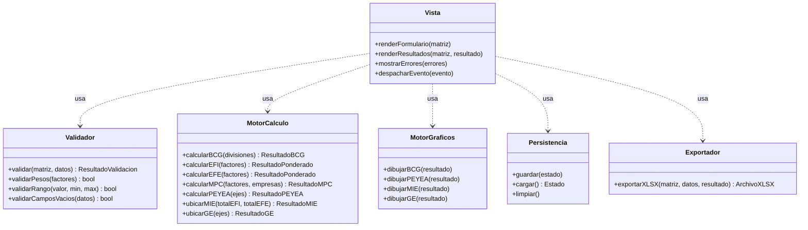
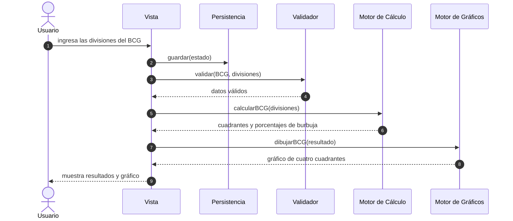
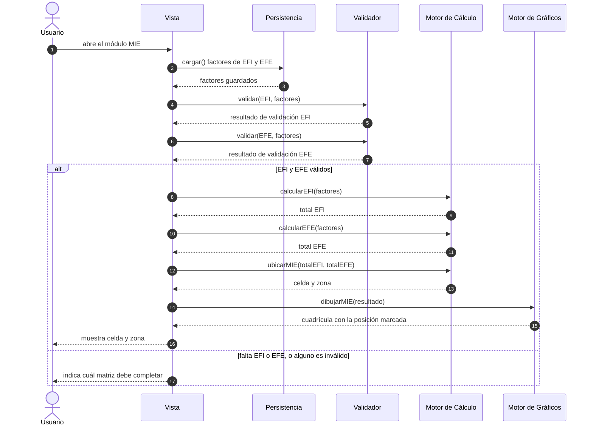
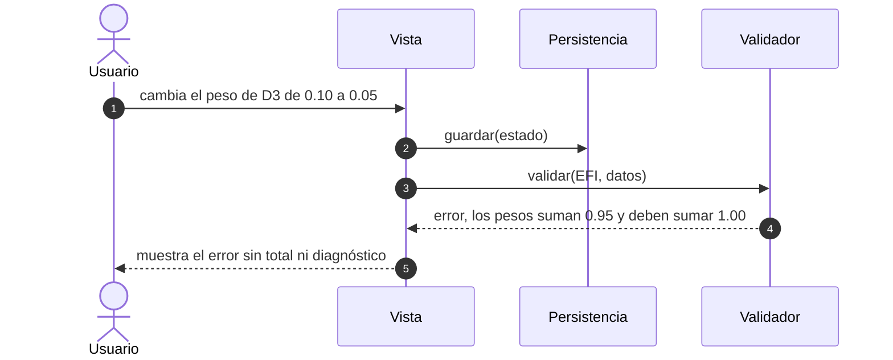
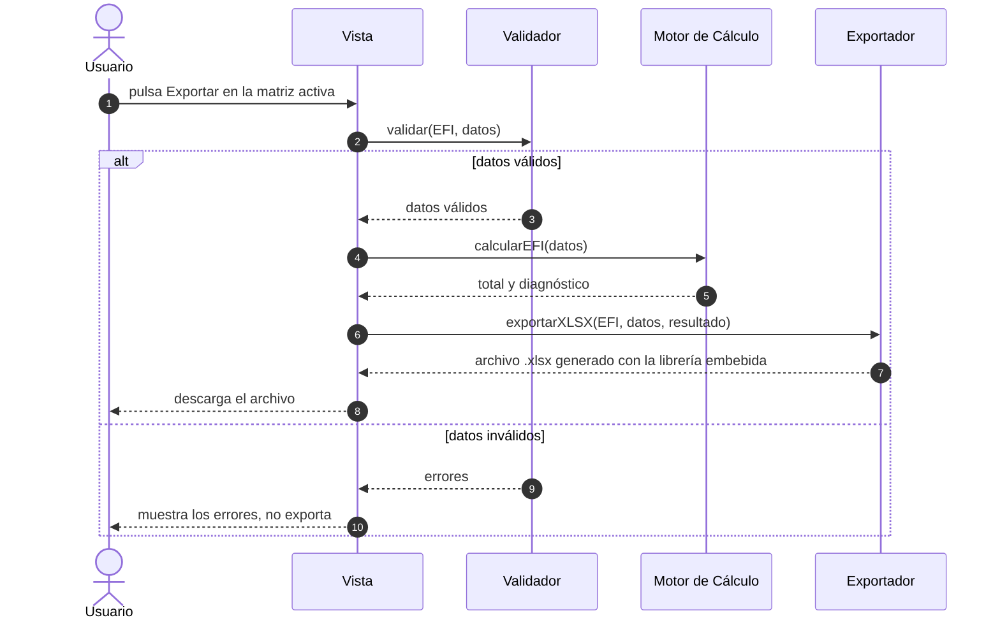
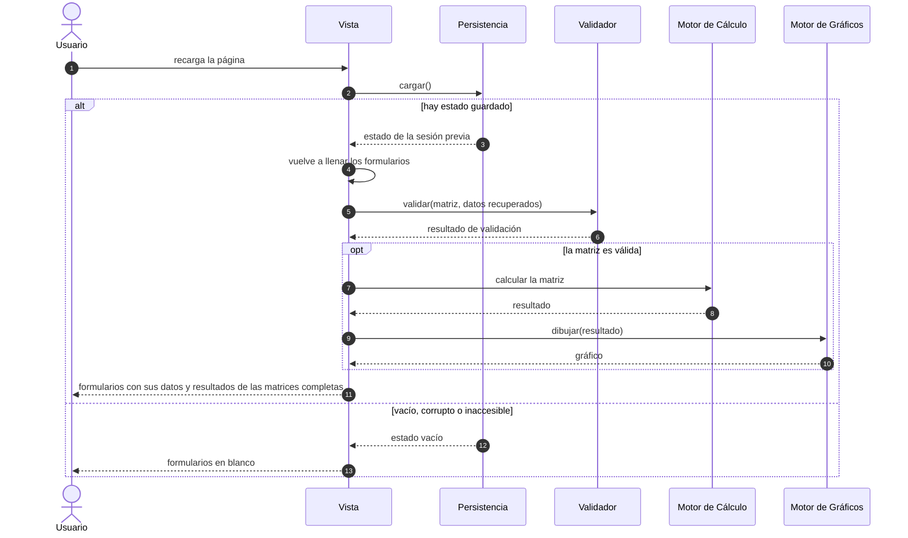

# Mtx: Documento VUP (Vibe Unified Process)

Estado: borrador de la fase Inception, pendiente de confirmación de Gerson antes de pasar a Elaboration I.
Referencia del proceso: https://vibeprocess.org/ (Vibe Unified Process, Dr. Michael Dorin, University of St. Thomas), adaptado de Jacobson, Booch y Rumbaugh (1999), El Proceso Unificado de Desarrollo de Software.

Flujo de trabajo acordado: este documento y el código viven en esta carpeta local. Claude Code trabaja aquí como constructor (fases de Elaboration II en adelante). La sesión de Cowork del Project "Prompt Engineering" en claude.ai actúa como juez, lee este mismo documento y el código a través del puente con la computadora, aplica los prompts de revisión de rol de VUP (Product Owner, QA, Arquitecto, Desarrollador) y documenta qué se acepta o se rechaza antes de desbloquear la siguiente fase.

## Inception

### Nombre del proyecto
Mtx

### Declaración de visión

Para los estudiantes y profesores del curso de Gestión Estratégica, que necesitan aplicar las matrices clásicas de planeamiento estratégico sin depender de una instalación frágil de Excel con macros VBA y bases de datos Access, Mtx es una suite de calculadoras estratégicas interactivas que corre íntegramente en el navegador. Calcula y grafica cada matriz al instante, sin instalación ni configuración previa. A diferencia de las plantillas actuales en Excel VBA más Access, Mtx elimina toda dependencia de software de escritorio, macros bloqueadas por seguridad de Windows, y bases de datos que se rompen al mover la carpeta a OneDrive o SharePoint.

### Fuera de alcance (v1)

- Replicar el modelo PE-BSC completo (34 hojas: misión, visión, EFI, EFE, objetivos estratégicos, análisis FLOR, ADN de misión y visión, Balanced Scorecard) queda para una fase posterior.
- Análisis Estructural (estilo MICMAC), Priorización de Iniciativas y Radar Estratégico quedan para fases posteriores.
- Persistencia compartida entre varios integrantes de un mismo grupo trabajando a la vez no se resuelve en esta primera versión.
- Generación de conclusiones asistida por IA, al estilo de Praxio, se evalúa en una fase posterior, no en el primer entregable.

### Justificación

El sistema actual depende de Excel VBA más Access, lo que genera fallas documentadas en el propio manual técnico del profesor: macros bloqueadas por seguridad la primera vez que el archivo llega por internet o WhatsApp, rutas rotas si la carpeta se mueve a OneDrive o SharePoint, necesidad de tener instalado el motor de Access del mismo bitness que Office, y solo un usuario a la vez por archivo porque Access no soporta escritura simultánea. Migrar a una suite HTML autónoma elimina esa fricción sin costo de licencias, mejora la experiencia de los alumnos del curso de Gestión Estratégica, y sirve como caso de estudio propio de ingeniería de software asistida por IA.

### Historias de usuario (v1, módulo Matrices de Combinación)

1. Como estudiante, quiero cargar los ingresos y utilidades de cada división de mi empresa y obtener automáticamente el gráfico BCG, para no depender de una hoja de Excel con macros.
2. Como estudiante, quiero calificar mis factores internos y externos con peso y clasificación, y obtener el puntaje ponderado de EFI y EFE automáticamente, para no sumar a mano.
3. Como estudiante, quiero comparar mi empresa contra varios competidores en una matriz de perfil competitivo (MPC), para visualizar mi posición relativa.
4. Como estudiante, quiero ingresar los valores de fuerza financiera, ventaja competitiva, fuerza de la industria y estabilidad del entorno, para obtener automáticamente el vector y el cuadrante de la matriz PEYEA.
5. Como estudiante, quiero que el sistema ubique automáticamente mi empresa en la matriz interna-externa (MIE) a partir de mis totales de EFI y EFE, para saber en qué celda cae.
6. Como estudiante, quiero ver la matriz de la gran estrategia con mi posición marcada, para identificar qué tipo de estrategias me corresponden.
7. Como profesor, quiero que mis alumnos puedan usar estas siete matrices sin instalar nada ni depender de un laboratorio con Office y Access configurados.

### Requisitos no funcionales

- Todos los cálculos se ejecutan en el navegador, sin backend ni servidor propio.
- El archivo abre directamente haciendo doble clic o desde un enlace, sin instalación.
- Los resultados y gráficos deben coincidir exactamente con las fórmulas clásicas de cada matriz (BCG, PEYEA, EFI, EFE, MPC, MIE, GE), verificables contra un caso de bibliografía conocido.
- La interfaz debe ser usable por un estudiante sin conocimientos técnicos, replicando o mejorando la simplicidad guiada del Excel original (qué se escribe a mano y qué sale solo).
- El progreso del usuario se guarda automáticamente en el navegador (localStorage) para no perderse si cierra la pestaña.

### Riesgos de desarrollo

- Terminología ambigua en el modelo PE-BSC original (análisis FLOR, ADN de misión y visión) que no corresponde a bibliografía estándar reconocible y requiere confirmación del profesor antes de replicarla en fases posteriores.
- Las bases de datos Access originales del profesor fueron reconstruidas y arrancan vacías, sin datos de ejemplo ya resueltos contra los cuales validar los cálculos; hay que construir casos de prueba propios a partir de las fórmulas documentadas y de la bibliografía clásica de gestión estratégica.
- Fidelidad a la terminología exacta de D'Alessio (EFI, EFE, PEYEA, MPC, MIE, GE), dado que probablemente se usa para calificar en el curso.

### URLs de referencia

- https://github.com/hcornejovillena-cmd/praxio (referencia arquitectónica: aplicación HTML única, sin backend, flujo por módulo de carga, validación, análisis, resultados, exportación y conclusiones asistidas por IA)

## Elaboration I

Objetivo de la fase: definir, para cada historia de usuario de Inception, al menos una prueba de aceptación concreta en formato Given-When-Then (Dado / Cuando / Entonces), con valores numéricos y resultado esperado exacto. Todos los resultados esperados fueron recalculados con un script aparte antes de escribirse aquí.

Convenciones generales de las pruebas:

- Los valores numéricos se comparan con dos decimales, salvo donde se indique otra cosa.
- Las marcas [VERIFICAR] señalan una convención que las fórmulas estándar no fijan de forma única y que debe confirmarse con el profesor o el material del curso antes de la fase de construcción. Se consolidan al final de esta sección.
- Las pruebas de las historias 2, 3 y 5 comparten datos a propósito: el EFI (2.45) y el EFE (2.90) de las pruebas 2.1 y 2.2 son las entradas de la prueba 5.1, para verificar la coherencia entre matrices.

### Historia 1: BCG

Hallazgo sobre la historia: el texto solo menciona "ingresos y utilidades", pero el eje X (participación relativa de mercado) y el eje Y (tasa de crecimiento del mercado) necesitan sus propios datos de entrada. La prueba los incluye como datos que el estudiante ingresa. Si el curso pide que la herramienta calcule la participación relativa a partir de ventas de competidores, la historia debe ampliarse [VERIFICAR].

**Prueba 1.1: cuadrantes y tamaño de burbuja**

- Dado que el estudiante carga cuatro divisiones con estos datos (ingresos y utilidades en millones):

  | División | Ingresos | Utilidades | Participación relativa (X) | Crecimiento del mercado (Y) |
  |---|---|---|---|---|
  | A | 500 | 100 | 1.80 | 15 % |
  | B | 300 | 30 | 0.40 | 12 % |
  | C | 150 | 60 | 1.50 | 4 % |
  | D | 50 | 10 | 0.30 | 2 % |

- Cuando calcula el gráfico BCG usando los umbrales participación relativa = 1.0 y crecimiento = 10 % [VERIFICAR]
- Entonces se cumple todo lo siguiente:
  - A cae en Estrella, B en Interrogante, C en Vaca lechera y D en Perro.
  - Los ingresos totales son 1 000 y las utilidades totales son 200.
  - El tamaño de burbuja por % de ingresos es A = 50 %, B = 30 %, C = 15 %, D = 5 % (suma 100 %).
  - El tamaño de burbuja por % de utilidades es A = 50 %, B = 15 %, C = 30 %, D = 5 % (suma 100 %).

Puntos sin definir en la historia, no probados hasta que se decidan [VERIFICAR]:

- Qué hace la burbuja cuando una división tiene utilidad negativa o cero (el tamaño no puede ser negativo).
- A qué cuadrante pertenece una división con participación relativa exactamente 1.0 o con crecimiento exactamente igual al umbral.
- Si el umbral de crecimiento es 10 % fijo, es configurable, o sigue la convención de D'Alessio, que centra el eje en 0 %. Lo mismo para si el eje X va en escala logarítmica.

### Historia 2: EFI y EFE

**Prueba 2.1: EFI débil**

- Dado que el estudiante ingresa estos factores internos (peso, clasificación):
  - Fortalezas: F1 (0.20, 4), F2 (0.15, 4), F3 (0.10, 3).
  - Debilidades: D1 (0.25, 1), D2 (0.20, 2), D3 (0.10, 1).
- Cuando el sistema calcula el EFI
- Entonces se cumple todo lo siguiente:
  - La suma de pesos es 1.00.
  - Los ponderados son 0.80, 0.60, 0.30, 0.25, 0.40 y 0.10.
  - El total EFI es 2.45.
  - Como 2.45 < 2.5, el diagnóstico es "posición interna débil".

**Prueba 2.2: EFE que aprovecha oportunidades**

- Dado que el estudiante ingresa estos factores externos (peso, clasificación):
  - Oportunidades: O1 (0.25, 4), O2 (0.20, 3), O3 (0.10, 2).
  - Amenazas: A1 (0.25, 3), A2 (0.15, 2), A3 (0.05, 1).
- Cuando el sistema calcula el EFE
- Entonces se cumple todo lo siguiente:
  - La suma de pesos es 1.00.
  - Los ponderados son 1.00, 0.60, 0.20, 0.75, 0.30 y 0.05.
  - El total EFE es 2.90.
  - Como 2.90 > 2.5, el diagnóstico es "la organización aprovecha oportunidades y evita amenazas por encima del promedio".

**Prueba 2.3: pesos que no suman 1**

- Dado el EFI de la prueba 2.1 en el que se cambia el peso de D3 de 0.10 a 0.05, de modo que la suma de pesos pasa a 0.95
- Cuando el estudiante intenta ver el resultado
- Entonces el sistema muestra que la suma es 0.95, indica que debe ser 1.00 y no presenta el total ni el diagnóstico como resultado válido. (El total aritmético sería 2.40. La redacción exacta del mensaje se define en el diseño.)

**Prueba 2.4: tolerancia de punto flotante en la suma de pesos**

- Dado un EFE con tres factores de pesos 0.6, 0.3 y 0.1 (en JavaScript, 0.6 + 0.3 + 0.1 da 0.9999999999999999)
- Cuando el sistema valida que los pesos suman 1
- Entonces la validación acepta la suma como 1.00. Hace falta una tolerancia, por ejemplo |suma − 1| < 0.001, y no una comparación con igualdad estricta.

Puntos sin definir [VERIFICAR]:

- Qué diagnóstico se muestra cuando el total es exactamente 2.5 (la regla dada solo cubre menor y mayor).
- Si el curso restringe la clasificación por tipo de factor. D'Alessio usa 3 o 4 para fortalezas y 1 o 2 para debilidades en el EFI, y 1 a 4 libre en el EFE. La regla dada dice 1 a 4 para todos; la prueba 2.1 cumple ambas lecturas.
- Si se rechaza una clasificación fuera de 1 a 4 (por ejemplo 5) o un peso fuera de 0 a 1. Se asume que sí, pero no se fija con una prueba numérica.

### Historia 3: MPC

**Prueba 3.1: empresa propia frente a dos competidores**

- Dado que los factores críticos y sus pesos son los mismos para todos: Participación de mercado 0.30, Competitividad de precios 0.25, Calidad del producto 0.25, Lealtad del cliente 0.20 (suma 1.00), y estas clasificaciones (en el orden de los factores):
  - Mi empresa: 3, 2, 4, 3.
  - Competidor A: 4, 3, 3, 2.
  - Competidor B: 2, 4, 2, 4.
- Cuando el sistema calcula el MPC
- Entonces se cumple todo lo siguiente:
  - Mi empresa obtiene 0.90 + 0.50 + 1.00 + 0.60 = 3.00.
  - El Competidor A obtiene 1.20 + 0.75 + 0.75 + 0.40 = 3.10.
  - El Competidor B obtiene 0.60 + 1.00 + 0.50 + 0.80 = 2.90.
  - El orden de mayor a menor es A (3.10), Mi empresa (3.00), B (2.90), por lo que mi empresa queda en 2.º lugar de 3.

**Prueba 3.2: los pesos se comparten entre todas las empresas**

- Dado el MPC de la prueba 3.1
- Cuando el estudiante cambia los pesos a 0.10, 0.50, 0.20 y 0.20 (suma 1.00) una sola vez
- Entonces las tres columnas se recalculan con los nuevos pesos, sin que el estudiante tenga que reescribirlos por empresa: Mi empresa 2.70, Competidor A 2.90 y Competidor B 3.40. El orden pasa a ser B, A, Mi empresa, por lo que mi empresa queda en 3.er lugar.

Puntos sin definir [VERIFICAR]:

- Cantidad mínima y máxima de competidores admitidos (el Excel original podría limitarla).
- Si el curso también valida la clasificación 1 a 4 en el MPC como en EFI y EFE.
- Cómo se muestran los empates (ninguna prueba los cubre).

### Historia 4: PEYEA

Convención de cálculo usada: cada eje es el promedio simple de sus factores. Fuerza financiera (FF) y fuerza de la industria (FI) se califican de 1 (peor) a 6 (mejor); ventaja competitiva (VC) y estabilidad del entorno (EE) se califican de −1 (mejor) a −6 (peor). Ninguna de las cuatro variables admite el valor 0, siguiendo la convención de D'Alessio y Rowe. Eje X = ventaja competitiva + fuerza de la industria. Eje Y = estabilidad del entorno + fuerza financiera. Cuadrantes: agresivo (X>0, Y>0), conservador (X<0, Y>0), defensivo (X<0, Y<0), competitivo (X>0, Y<0).

**Prueba 4.1: perfil agresivo**

- Dado que el estudiante califica: Fuerza financiera (FF) = 5, 4, 4, 3; Fuerza de la industria (FI) = 4, 5, 3; Ventaja competitiva (VC) = −2, −3, −1, −2; Estabilidad del entorno (EE) = −3, −2, −4, −3, −3
- Cuando el sistema calcula la matriz PEYEA
- Entonces los promedios son FF = 4.00, FI = 4.00, VC = −2.00, EE = −3.00. Por tanto X = −2.00 + 4.00 = 2.00 e Y = −3.00 + 4.00 = 1.00. El vector termina en (2.00, 1.00) y el cuadrante es agresivo.

**Prueba 4.2: perfil conservador**

- Dado FF = 5, 5, 5; FI = 1, 2; VC = −4, −4; EE = −2, −1, −3
- Cuando el sistema calcula la matriz PEYEA
- Entonces FF = 5.00, FI = 1.50, VC = −4.00, EE = −2.00, X = −2.50, Y = 3.00 y el cuadrante es conservador.

**Prueba 4.3: perfil defensivo**

- Dado FF = 1, 2; FI = 1, 1; VC = −4, −4, −4; EE = −5, −5
- Cuando el sistema calcula la matriz PEYEA
- Entonces FF = 1.50, FI = 1.00, VC = −4.00, EE = −5.00, X = −3.00, Y = −3.50 y el cuadrante es defensivo.

**Prueba 4.4: perfil competitivo**

- Dado FF = 1, 2, 3; FI = 5, 5, 5; VC = −1, −2; EE = −5, −5, −5
- Cuando el sistema calcula la matriz PEYEA
- Entonces FF = 2.00, FI = 5.00, VC = −1.50, EE = −5.00, X = 3.50, Y = −3.00 y el cuadrante es competitivo.

Puntos sin definir [VERIFICAR]:

- Vector: la historia pide "el vector". Se asume que el vector es el segmento del origen a (X, Y). Si el curso exige magnitud y ángulo, para la prueba 4.1 serían √5 = 2.24 y 26.57° (atan2(1, 2)).
- Cuadrante cuando X = 0 o Y = 0: no está definido por la regla dada.
- Cantidad de factores por eje (las pruebas usan de 2 a 5 factores por eje, sin asumir un número fijo).

### Historia 5: MIE

Convención: el total de EFI (eje X) y el total de EFE (eje Y) se clasifican como débil (1.0 a menos de 2.0), promedio (2.0 a menos de 3.0) o fuerte (3.0 a 4.0). Numeración de celdas en romano, de I a IX, con EFE fuerte arriba y EFI fuerte a la izquierda [VERIFICAR]. Zonas: crecer y construir = I, II, IV; retener y mantener = III, V, VII; cosechar o desinvertir = VI, VIII, IX.

**Prueba 5.1: celda central con los totales de las pruebas 2.1 y 2.2**

- Dado EFI = 2.45 y EFE = 2.90
- Cuando el sistema ubica la empresa en la MIE
- Entonces el EFI es "promedio", el EFE es "promedio", la celda es V y la zona es "retener y mantener".

**Prueba 5.2: esquina de crecimiento**

- Dado EFI = 3.20 y EFE = 3.50
- Cuando el sistema ubica la empresa en la MIE
- Entonces ambos son "fuerte", la celda es I y la zona es "crecer y construir".

**Prueba 5.3: esquina de cosecha**

- Dado EFI = 1.80 y EFE = 1.50
- Cuando el sistema ubica la empresa en la MIE
- Entonces ambos son "débil", la celda es IX y la zona es "cosechar o desinvertir".

**Prueba 5.4: valores en el límite de rango**

- Dado un EFE fijo de 3.50 (fuerte) y estos valores de EFI: 1.99, 2.00, 2.99 y 3.00
- Cuando el sistema ubica la empresa en la MIE con cada uno
- Entonces la celda es III para EFI 1.99 (débil), II para 2.00 (promedio), II para 2.99 (promedio) e I para 3.00 (fuerte).

Puntos sin definir [VERIFICAR]:

- Qué se hace con un valor entre 1.99 y 2.00, por ejemplo 1.995. Los rangos dados dejan un hueco. La prueba 5.4 asume cortes en < 2.0 y < 3.0, lo que equivale a los rangos dados con valores de dos decimales.
- Numeración de celdas y asignación de zonas: usadas aquí según David y D'Alessio, sin confirmación del curso.

### Historia 6: Gran Estrategia (GE)

La historia no admite una prueba de extremo a extremo con la información actual. Pide "ver la matriz con mi posición marcada", pero ni la historia ni el resto de VUP.md definen de dónde salen los dos valores: si el estudiante los ingresa directamente, en qué escala, cuál es el punto que separa rápido de lento y fuerte de débil, o si se derivan de otras matrices (por ejemplo del EFE y del EFI, o de los ejes de la PEYEA). Sin eso, cualquier valor de entrada con resultado "exacto" sería inventado.

Lo que sí se puede verificar hoy es la correspondencia de cada cuadrante con sus estrategias sugeridas, según la Matriz de la Gran Estrategia clásica [VERIFICAR contra el material del curso, porque las listas varían entre autores].

**Prueba 6.1: correspondencia cuadrante y estrategias (tabla de búsqueda)**

- Dado que el sistema clasifica la empresa en un cuadrante
- Cuando el estudiante consulta el resultado
- Entonces el cuadrante determina el tipo de estrategia sugerida:
  - Crecimiento rápido con posición fuerte (cuadrante I): estrategias intensivas, integración y diversificación concéntrica.
  - Crecimiento rápido con posición débil (cuadrante II): estrategias intensivas, integración horizontal, desinversión, liquidación.
  - Crecimiento lento con posición débil (cuadrante III): reducción, diversificación conglomerada, desinversión, liquidación.
  - Crecimiento lento con posición fuerte (cuadrante IV): diversificación concéntrica, horizontal y conglomerada, empresas conjuntas.

Decisiones necesarias antes de escribir la prueba de ubicación (bloquean la prueba de extremo a extremo de la historia 6):

1. ¿Los dos ejes los ingresa el estudiante o se derivan de otras matrices?
2. ¿En qué escala están, y cuál es el punto que separa rápido de lento y fuerte de débil?
3. ¿Qué pasa cuando un valor cae exactamente en el punto de corte?

### Historia 7: uso sin instalación (profesor)

Esta historia es un criterio de aceptación de despliegue, no de cálculo, y por eso su prueba no lleva números de negocio. Es concreta y comprobable, pero necesita un equipo real para ejecutarse.

**Prueba 7.1: abrir y usar las siete matrices en un equipo limpio**

- Dado un equipo con navegador moderno, sin Microsoft Office, sin motor de Access y sin conexión a un servidor propio (por ejemplo, la carpeta copiada a un pendrive o descargada de un enlace)
- Cuando el profesor o un alumno abre el archivo principal con doble clic (protocolo `file://`) y usa las siete matrices
- Entonces se cumple todo lo siguiente:
  - No aparece ningún aviso de macros, permisos ni instalación de componentes.
  - Las siete matrices (BCG, EFI, EFE, MPC, PEYEA, MIE, GE) están accesibles desde la interfaz.
  - Los datos de las pruebas 1.1, 2.1, 2.2, 3.1, 4.1, 5.1 y 5.2 producen exactamente los resultados esperados descritos arriba.
  - La consola del navegador no registra errores.
  - La pestaña de red no registra solicitudes a un backend propio.
  - Al recargar la página, los datos ingresados siguen ahí (localStorage).

Puntos sin definir [VERIFICAR]:

- Navegadores y versiones mínimas que el curso debe soportar.
- Resuelto en Elaboration II: todo el código, incluida cualquier librería como la del Exportador, va embebido en el mismo archivo, sin depender de un CDN, para que funcione sin conexión a internet.

### Resumen de la fase

| Historia | Pruebas | Estado |
|---|---|---|
| 1. BCG | 1.1 | Con prueba concreta |
| 2. EFI y EFE | 2.1, 2.2, 2.3, 2.4 | Con prueba concreta |
| 3. MPC | 3.1, 3.2 | Con prueba concreta |
| 4. PEYEA | 4.1, 4.2, 4.3, 4.4 | Con prueba concreta |
| 5. MIE | 5.1, 5.2, 5.3, 5.4 | Con prueba concreta |
| 6. GE | 6.1 (solo tabla de búsqueda) | Sin prueba de ubicación: faltan definiciones de entrada |
| 7. Uso sin instalación | 7.1 | Con prueba concreta, ejecutable solo en equipo real |

Total: 17 pruebas Given-When-Then.

Lista consolidada de puntos [VERIFICAR] para confirmar con el profesor:

1. BCG: umbrales de participación relativa y crecimiento, escala del eje X, si la herramienta calcula la participación relativa, y tratamiento de utilidad negativa o cero.
2. EFI y EFE: diagnóstico en total exactamente 2.5, y restricción de clasificación por tipo de factor.
3. MPC: cantidad de competidores admitidos, validación de clasificación 1 a 4 y manejo de empates.
4. PEYEA: definición del vector (segmento o magnitud y ángulo), cuadrante en el eje cero.
5. MIE: numeración de celdas, asignación de zonas, y huecos entre rangos.
6. GE: origen, escala y punto de corte de los dos ejes, y listas de estrategias por cuadrante.
7. Historia 7: navegadores soportados y uso de CDN.

## Elaboration II

Objetivo de la fase: definir la arquitectura del framework (componentes, colaboraciones y diagramas) sin escribir todavía código de la aplicación. Las convenciones de cálculo, clasificación y validación ya fijadas en Elaboration I no se reinterpretan aquí; los componentes solo las aplican. Las decisiones que Inception y Elaboration I no resuelven se marcan [VERIFICAR] y se consolidan al final de esta sección.

Decisión de esta fase que afecta a Elaboration I: el Exportador usa una librería de generación de .xlsx embebida en el propio archivo, sin CDN externa, para funcionar sin conexión a internet. Esto responde al punto [VERIFICAR] de la Historia 7 sobre el uso de CDN. La lista de Elaboration I no se modificó en esta fase.

Principios de la arquitectura:

- La Vista es el único orquestador. Recibe los eventos del usuario y llama a los otros cinco componentes en el orden que corresponda. Ningún otro componente llama a otro, lo que evita dependencias cruzadas.
- El Validador y el Motor de Cálculo no dependen del navegador ni de la interfaz (entran datos, salen resultados). Por eso las pruebas de Elaboration I se pueden ejecutar contra ellos sin abrir una página.
- La fuente de verdad es lo que el usuario ingresó (factores, divisiones, calificaciones). Los totales y clasificaciones se recalculan cuando hacen falta, no se guardan como datos independientes, así que nunca quedan desactualizados respecto de los datos.
- Los datos ingresados se guardan en cada cambio, sean válidos o no, para no perder progreso (requisito no funcional de persistencia). Los resultados solo se calculan y muestran cuando la validación pasa.

### 1. Componentes del framework

| Componente | Responsabilidad |
|---|---|
| Vista | Renderiza los formularios de entrada y los resultados de cada matriz, y despacha los eventos del usuario hacia los demás componentes. |
| Validador | Verifica que los datos ingresados cumplan las reglas de cada matriz antes de calcular (pesos que suman 1, rangos numéricos válidos según la convención de cada matriz, campos no vacíos). |
| Motor de Cálculo | Contiene la lógica de las siete matrices (BCG, EFI, EFE, MPC, PEYEA, MIE, GE), aplicando exactamente las fórmulas y clasificaciones ya definidas y probadas en Elaboration I. |
| Motor de Gráficos | Dibuja las representaciones visuales de cada matriz (cuadrantes del BCG, vector del PEYEA, cuadrícula de la MIE, y las demás según corresponda). |
| Persistencia | Guarda y recupera el estado de la sesión en el almacenamiento local del navegador, para que los datos no se pierdan al recargar. |
| Exportador | Genera un archivo Excel (.xlsx) descargable con los datos ingresados y los resultados calculados de la matriz activa, usando una librería de generación de Excel embebida en el propio archivo (sin CDN externa), para mantener el funcionamiento sin conexión a internet. |

Relación con las pruebas de Elaboration I:

| Componente | Pruebas de Elaboration I que lo ejercitan |
|---|---|
| Validador | 2.3 (pesos suman 0.95), 2.4 (tolerancia de punto flotante) |
| Motor de Cálculo | 1.1, 2.1, 2.2, 3.1, 3.2, 4.1 a 4.4, 5.1 a 5.4, y 6.1 en lo que se pueda ubicar |
| Motor de Gráficos | 1.1 (cuadrantes y burbujas), 4.1 a 4.4 (cuadrante del vector), 5.1 a 5.4 (celda de la MIE) |
| Persistencia | 7.1 (los datos siguen tras recargar) |
| Vista y Exportador | 7.1 (las siete matrices accesibles); el Exportador no tiene prueba propia en Elaboration I [VERIFICAR] |

### 2. Escenarios (plays)

**Escenario 1: cálculo simple de una matriz nueva (BCG)**

El usuario abre el módulo BCG e ingresa las cuatro divisiones de la prueba 1.1. Con cada cambio, la Vista pide a la Persistencia que guarde el estado. Luego la Vista pasa los datos al Validador, que confirma que cada división tenga ingresos, utilidades, participación relativa y crecimiento numéricos. La Vista pasa los datos válidos al Motor de Cálculo, que devuelve el cuadrante de cada división (A Estrella, B Interrogante, C Vaca lechera, D Perro) y los porcentajes de ingresos y utilidades. La Vista entrega ese resultado al Motor de Gráficos, que dibuja las burbujas en el plano de cuatro cuadrantes, y muestra el resultado al usuario.
Componentes: Vista, Persistencia, Validador, Motor de Cálculo, Motor de Gráficos.

**Escenario 2: una matriz reutiliza resultados de otras (MIE con EFI y EFE)**

El usuario abre el módulo MIE. La Vista pide a la Persistencia los factores guardados de EFI y EFE. El Validador comprueba ambos conjuntos de factores. Si son válidos, el Motor de Cálculo recalcula los totales (2.45 y 2.90 con los datos de las pruebas 2.1 y 2.2) y con ellos ubica la empresa en la celda V, zona "retener y mantener", como en la prueba 5.1. La Vista entrega el resultado al Motor de Gráficos, que dibuja la cuadrícula de nueve celdas con la posición marcada. Si falta EFI o EFE, o alguno no pasa la validación, la Vista indica cuál matriz debe completarse y no calcula la MIE.
Componentes: Vista, Persistencia, Validador, Motor de Cálculo, Motor de Gráficos.
Decisión tomada: la MIE reutiliza los datos de EFI y EFE y recalcula los totales, no lee totales guardados. [VERIFICAR] si el curso permite ingresar los totales a mano cuando el estudiante no ha llenado EFI y EFE (la Historia 5 dice "a partir de mis totales de EFI y EFE", sin aclarar el origen).

**Escenario 3: rechazo por datos inválidos**

El usuario, en el EFI de la prueba 2.1, cambia el peso de D3 de 0.10 a 0.05. La Vista guarda el estado en la Persistencia y pasa los datos al Validador, que detecta que los pesos suman 0.95 en lugar de 1.00 y devuelve el error. La Vista muestra el error y no muestra total ni diagnóstico. El Motor de Cálculo no se invoca, y el Motor de Gráficos tampoco.
Componentes: Vista, Persistencia, Validador.
Este escenario cubre la prueba 2.3. Muestra un patrón distinto al del escenario 1: el flujo se corta en la validación.

**Escenario 4: exportación a Excel de la matriz activa**

Con el EFI válido de la prueba 2.1 abierto, el usuario pulsa "Exportar". La Vista pasa los datos al Validador, que confirma que sean válidos. La Vista pide el resultado al Motor de Cálculo (total 2.45 y diagnóstico "posición interna débil") y entrega al Exportador la matriz, los datos ingresados y el resultado. El Exportador genera el archivo .xlsx con la librería embebida y la Vista dispara la descarga en el navegador. Todo ocurre sin conexión a internet. Si los datos no son válidos, la Vista muestra los errores y no llama al Exportador.
Componentes: Vista, Validador, Motor de Cálculo, Exportador.
[VERIFICAR] si se permite exportar datos incompletos o inválidos (solo con los datos ingresados y sin resultados), en lugar de bloquear la exportación.

**Escenario 5: recuperación de una sesión previa al recargar**

El usuario recarga la página o vuelve a abrir el archivo. La Vista pide a la Persistencia el estado guardado. Si existe, la Vista vuelve a llenar los formularios con esos datos y el Validador los revisa. Para cada matriz que pase la validación, el Motor de Cálculo recalcula el resultado y el Motor de Gráficos lo dibuja de nuevo. Las matrices incompletas se muestran con sus datos pero sin resultado. Si el almacenamiento está vacío, corrupto o inaccesible, la Persistencia devuelve un estado vacío y la Vista muestra los formularios en blanco.
Componentes: Vista, Persistencia, Validador, Motor de Cálculo, Motor de Gráficos.
[VERIFICAR]: si una matriz incompleta tras la recarga muestra mensajes de error de inmediato o solo después de que el usuario la edite; y si el usuario recibe un aviso cuando se descarta un estado corrupto.

Cobertura de componentes por escenario:

| Componente | Esc. 1 | Esc. 2 | Esc. 3 | Esc. 4 | Esc. 5 |
|---|---|---|---|---|---|
| Vista | sí | sí | sí | sí | sí |
| Validador | sí | sí | sí | sí | sí |
| Motor de Cálculo | sí | sí | no | sí | sí |
| Motor de Gráficos | sí | sí | no | no | sí |
| Persistencia | sí | sí | sí | no | sí |
| Exportador | no | no | no | sí | no |

### 3. Diagramas

**Diagrama de clases**

Los nombres de las clases van sin acentos ni espacios por compatibilidad con Mermaid: `MotorCalculo` es el Motor de Cálculo y `MotorGraficos` es el Motor de Gráficos. La Vista es la única clase que depende de las demás, coherente con el principio de orquestación único.



Notas del diagrama de clases:

- Las firmas de `ubicarGE` y `dibujarGE` son provisionales: dependen de las decisiones pendientes de la Historia 6 (origen y escala de los ejes) [VERIFICAR].
- El Motor de Gráficos solo lista los métodos de las matrices con representación visual definida en Elaboration I (BCG, PEYEA, MIE, GE). [VERIFICAR] si EFI, EFE y MPC llevan también una representación gráfica (por ejemplo barras en el MPC) o solo tabla.

**Diagrama de secuencia del escenario 1: cálculo simple (BCG)**



**Diagrama de secuencia del escenario 2: MIE reutiliza EFI y EFE**



**Diagrama de secuencia del escenario 3: rechazo por datos inválidos**



**Diagrama de secuencia del escenario 4: exportación a Excel**



**Diagrama de secuencia del escenario 5: recuperación al recargar**



### Puntos nuevos marcados [VERIFICAR] en esta fase

1. Estructura del Excel exportado: hojas, nombre del archivo, valores fijos o fórmulas vivas, y si incluye una imagen del gráfico. Solo está decidido que se exporta la matriz activa, con datos ingresados y resultados.
2. Librería concreta de generación de .xlsx que se embebe: peso, licencia y forma de incluirla en el archivo. Se decide al comienzo de Construction.
3. Representación gráfica de EFI, EFE y MPC (gráfico o solo tabla), y firmas definitivas de `ubicarGE` y `dibujarGE` (dependen de las decisiones pendientes de la Historia 6).
4. Origen de los totales en la MIE cuando el estudiante no ha llenado EFI y EFE: si se permite ingresarlos a mano.
5. Exportación con datos incompletos o inválidos: bloquear (como está descrito) o permitir solo con los datos ingresados.
6. Recuperación de sesión: mensajes de error para matrices incompletas tras la recarga, aviso al descartar un estado corrupto, y detalles de almacenamiento (clave, estructura, versión del formato guardado, si el estado es por matriz o global).
7. El Exportador no tiene prueba de aceptación en Elaboration I. Decisión del juez: no se agrega ahora. Se define un caso de prueba concreto en el plan de pruebas de Construction III, cuando ya exista una implementación real que genere el archivo .xlsx.

## Construction I

Objetivo de la fase: dejar decidido el stack y documentado el esqueleto de la estructura del proyecto, sin comportamiento real. Los cuerpos de los métodos están vacíos o llevan un comentario de marcador de posición. Ninguna lógica de cálculo, validación, graficado, persistencia ni exportación se implementa en esta fase. Esta fase no crea ningún archivo nuevo del proyecto: el esqueleto vive dentro de este documento y se copiará a un archivo HTML al empezar Construction II.

### 1. Stack tecnológico y decisiones de arquitectura

| Decisión | Justificación (requisito no funcional de Inception) |
|---|---|
| Stack: HTML, CSS y JavaScript sin framework ni backend. | "Todos los cálculos se ejecutan en el navegador, sin backend ni servidor propio" y "el archivo abre directamente haciendo doble clic, sin instalación". Un framework agregaría un paso de compilación o una dependencia externa. |
| Almacenamiento persistente: en el navegador (localStorage), sin base de datos ni servidor. | "El progreso del usuario se guarda automáticamente en el navegador (localStorage) para no perderse si cierra la pestaña". Además evita la fragilidad de Access que motivó el proyecto. |
| Alcance de autenticación: ninguno. | Sin backend no hay dónde validar identidades, y la persistencia compartida entre integrantes está fuera del alcance de v1. Los datos quedan en el navegador de cada usuario. |
| Alcance de interfaz: interfaz web mínima integrada en el mismo archivo, sin páginas separadas. | El archivo debe abrir con doble clic y funcionar sin conexión. Como se decidió en Elaboration II, no hay CDN: HTML, estilos, script y librerías van en un solo archivo. |

Consecuencias de estas decisiones que conviene tener presentes:

- Los datos viven en un solo navegador y equipo. Otro navegador o dispositivo no los ve.
- Borrar los datos del sitio en el navegador borra el progreso. Este comportamiento coincide con lo ya declarado como fuera de alcance en Inception.

### 2. Esqueleto del proyecto

Estructura de archivos prevista. El archivo HTML no existe todavía [VERIFICAR: nombre del archivo, se propone `index.html`].

```text
Mtx/
├── VUP.md            documento del proceso (este archivo)
└── index.html        (por crear en Construction II) todo el producto en un solo archivo
    ├── <style>       estilos
    ├── <body>        barra de navegación, un contenedor por matriz y botón de exportar
    └── <script>      seis objetos: Validador, MotorCalculo, MotorGraficos,
                      Persistencia, Exportador y Vista
```

Esqueleto del archivo. Las firmas de los métodos son las del diagrama de clases de Elaboration II. Cada cuerpo queda vacío con un marcador de posición.

```html
<!DOCTYPE html>
<html lang="es">
<head>
  <meta charset="utf-8">
  <meta name="viewport" content="width=device-width, initial-scale=1">
  <title>Mtx</title>
  <style>
    /* Construction II: estilos base, sin diseño visual definido todavía */
    .matriz[hidden] { display: none; }
  </style>
</head>
<body>
  <header>
    <h1>Mtx</h1>
    <!-- Construction II: navegación entre las siete matrices [VERIFICAR] -->
    <nav id="navegacion"></nav>
    <button id="btn-exportar" type="button">Exportar a Excel</button>
  </header>

  <main>
    <section id="matriz-bcg" class="matriz" data-matriz="BCG">
      <h2>BCG</h2>
      <div class="formulario"></div>
      <div class="errores"></div>
      <div class="resultados"></div>
      <div class="grafico"></div>
    </section>

    <section id="matriz-efi" class="matriz" data-matriz="EFI" hidden>
      <h2>EFI</h2>
      <div class="formulario"></div>
      <div class="errores"></div>
      <div class="resultados"></div>
      <div class="grafico"></div>
    </section>

    <section id="matriz-efe" class="matriz" data-matriz="EFE" hidden>
      <h2>EFE</h2>
      <div class="formulario"></div>
      <div class="errores"></div>
      <div class="resultados"></div>
      <div class="grafico"></div>
    </section>

    <section id="matriz-mpc" class="matriz" data-matriz="MPC" hidden>
      <h2>MPC</h2>
      <div class="formulario"></div>
      <div class="errores"></div>
      <div class="resultados"></div>
      <div class="grafico"></div>
    </section>

    <section id="matriz-peyea" class="matriz" data-matriz="PEYEA" hidden>
      <h2>PEYEA</h2>
      <div class="formulario"></div>
      <div class="errores"></div>
      <div class="resultados"></div>
      <div class="grafico"></div>
    </section>

    <section id="matriz-mie" class="matriz" data-matriz="MIE" hidden>
      <h2>MIE</h2>
      <div class="formulario"></div>
      <div class="errores"></div>
      <div class="resultados"></div>
      <div class="grafico"></div>
    </section>

    <section id="matriz-ge" class="matriz" data-matriz="GE" hidden>
      <h2>GE</h2>
      <div class="formulario"></div>
      <div class="errores"></div>
      <div class="resultados"></div>
      <div class="grafico"></div>
    </section>
  </main>

  <!-- Construction III: librería de generación de .xlsx embebida aquí, sin CDN [VERIFICAR] -->

  <script>
    'use strict';

    const Validador = {
      validar(matriz, datos) {
        // Construction II/III
      },
      validarPesos(factores) {
        // Construction II/III
      },
      validarRango(valor, min, max) {
        // Construction II/III
      },
      validarCamposVacios(datos) {
        // Construction II/III
      }
    };

    const MotorCalculo = {
      calcularBCG(divisiones) {
        // Construction II/III
      },
      calcularEFI(factores) {
        // Construction II/III
      },
      calcularEFE(factores) {
        // Construction II/III
      },
      calcularMPC(factores, empresas) {
        // Construction II/III
      },
      calcularPEYEA(ejes) {
        // Construction II/III
      },
      ubicarMIE(totalEFI, totalEFE) {
        // Construction II/III
      },
      ubicarGE(ejes) {
        // Construction II/III (firma provisional, depende de la Historia 6)
      }
    };

    const MotorGraficos = {
      dibujarBCG(resultado) {
        // Construction II/III
      },
      dibujarPEYEA(resultado) {
        // Construction II/III
      },
      dibujarMIE(resultado) {
        // Construction II/III
      },
      dibujarGE(resultado) {
        // Construction II/III (firma provisional, depende de la Historia 6)
      }
    };

    const Persistencia = {
      guardar(estado) {
        // Construction II/III
      },
      cargar() {
        // Construction II/III
      },
      limpiar() {
        // Construction II/III
      }
    };

    const Exportador = {
      exportarXLSX(matriz, datos, resultado) {
        // Construction III
      }
    };

    // La Vista es el único orquestador: llama a los otros cinco objetos.
    const Vista = {
      renderFormulario(matriz) {
        // Construction II/III
      },
      renderResultados(matriz, resultado) {
        // Construction II/III
      },
      mostrarErrores(errores) {
        // Construction II/III
      },
      despacharEvento(evento) {
        // Construction II/III
      }
    };

    // Construction II: rutina de arranque (ver decisión del juez en el punto 4 de "Puntos nuevos marcados [VERIFICAR] en esta fase"), no un método de la Vista
  </script>
</body>
</html>
```

Correspondencia con Elaboration II:

- Los seis objetos del script son los seis componentes del diagrama de clases, con los mismos nombres y las mismas firmas. `MotorCalculo` y `MotorGraficos` van sin acentos por compatibilidad, igual que en los diagramas.
- El script no agrega métodos ni componentes nuevos. No hay métodos auxiliares, constantes de configuración ni estado global.
- Cada `<section class="matriz">` es el contenedor de una de las siete matrices. Sus cuatro `<div>` son las zonas que la Vista llena: `formulario` (`renderFormulario`), `errores` (`mostrarErrores`), `resultados` (`renderResultados`) y `grafico` (donde dibuja el Motor de Gráficos).
- Solo la sección BCG arranca visible. Es un valor inicial provisional del esqueleto, no una decisión de qué matriz se muestra primero [VERIFICAR].

### Puntos nuevos marcados [VERIFICAR] en esta fase

1. Resuelto: el archivo se llama `index.html`.
2. Resuelto: se implementó en Construction II (un botón por matriz dentro del `<nav id="navegacion">`; la Vista muestra la sección elegida y oculta las demás con `hidden`; BCG se muestra al abrir).
3. Resuelto: el Motor de Gráficos usa SVG, no canvas. Los gráficos de Mtx son formas simples en dos dimensiones (cuadrantes, burbujas, un vector, una cuadrícula de nueve celdas), no requieren dibujar grandes volúmenes de píxeles, y SVG permite inspeccionar, probar y dar estilo con CSS a cada elemento como un nodo del DOM, sin una librería adicional. Los contenedores `grafico` siguen siendo `<div>` en el esqueleto; el `<svg>` se agrega dentro de cada uno en Construction II.
4. Resuelto: se agrega una rutina de arranque fuera de los seis componentes (no un método nuevo en la Vista, para no modificar las firmas ya aprobadas en Elaboration II), que al cargar la página llama a `Persistencia.cargar()` y, con el resultado, a los métodos ya existentes de la Vista para repoblar cada matriz. El código de esta rutina se agrega en Construction II, junto con el resto del comportamiento.
5. Resuelto: se implementó en Construction II (la librería va embebida en un `<script id="sheetjs">` del propio `index.html`, antes del script de la aplicación, donde estaba el comentario marcador).
6. Resuelto: `matriz` es siempre un string con una de las siete siglas ya usadas en Elaboration I y en el atributo `data-matriz` del esqueleto (`"BCG"`, `"EFI"`, `"EFE"`, `"MPC"`, `"PEYEA"`, `"MIE"`, `"GE"`), no un objeto ni un código numérico.

## Construction II

Objetivo de la fase: implementar la lógica real de las seis matrices con fórmulas ya probadas en Elaboration I, sobre el esqueleto de Construction I, más la navegación entre matrices y la exportación a Excel. Es la primera fase que escribe código de la aplicación.

### 1. Resumen de lo implementado y lo pendiente

Archivos creados o modificados en esta fase:

| Archivo | Cambio |
|---|---|
| `index.html` | Nuevo. Un solo archivo con estilos, HTML, la librería SheetJS embebida y el script de la aplicación (unas 1 190 líneas de script propio). |
| `tests/elaboration1.test.js` | Nuevo. Script de Node sin dependencias que verifica `Validador`, `MotorCalculo`, `Exportador` y `Persistencia` contra las pruebas de Elaboration I. No estaba pedido explícitamente; se agregó para que el juez pueda repetir la verificación con `node tests/elaboration1.test.js` [VERIFICAR: si se conserva en el repositorio]. |
| `VUP.md` | Esta sección, y los puntos 2 y 5 de Construction I marcados como resueltos. |

| Componente o matriz | Estado |
|---|---|
| BCG, EFI, EFE, MPC, PEYEA, MIE | Implementados: formulario, validación, cálculo y resultados en pantalla. BCG, PEYEA y MIE además dibujan su gráfico en SVG. |
| GE | No implementada, como decidió el juez. `ubicarGE` y `dibujarGE` lanzan un error explícito de módulo pendiente y la interfaz nunca los llama. La sección GE muestra un mensaje claro de que el módulo está pendiente de definir con el curso (Historia 6), y su botón de exportar queda deshabilitado. |
| Navegación | Un botón por matriz dentro de `<nav id="navegacion">`. La Vista muestra la sección elegida y oculta las demás con `hidden`. BCG se muestra al abrir. |
| Persistencia | Guarda en localStorage en cada cambio, sea válido o no. Al abrir la página recupera la sesión previa (matriz activa y datos) y recalcula. |
| Exportador | Genera un `.xlsx` de la matriz activa con SheetJS embebido. |
| Gráficos de EFI, EFE y MPC | Sin gráfico, solo tabla de resultados (queda abierto el punto 3 de Elaboration II). |

Decisiones de implementación que no cambian ninguna firma aprobada:

- Los seis objetos (`Vista`, `Validador`, `MotorCalculo`, `MotorGraficos`, `Persistencia`, `Exportador`) tienen exactamente los métodos y el número de parámetros del diagrama de clases de Elaboration II. La prueba X.1 lo comprueba leyendo el diagrama de este documento.
- Fuera de esos objetos hay constantes y funciones auxiliares privadas (por ejemplo `aNumero`, `redondear`, `evaluarMatriz`, `actualizarMatriz`) y dos variables de módulo (`estado` y `contextoMatriz`). La rutina `arrancar()` es la rutina de arranque decidida por el juez en Construction I: no es un método de la Vista.
- La Vista sigue siendo el único orquestador. Ningún componente llama a otro.
- Los números se escriben como texto y se aceptan con coma o punto decimal (`1,80` o `1.80`). Los resultados se redondean a 6 decimales antes de clasificar, para que el ruido de punto flotante no cambie un diagnóstico.
- El script de la aplicación no toca el DOM al cargarse fuera del navegador, por eso `Validador` y `MotorCalculo` se prueban en Node.

### 2. Verificación prueba por prueba contra Elaboration I

Comando para repetirla:

```bash
node tests/elaboration1.test.js
```

Resultado de la última ejecución: 21 de 21 comprobaciones correctas (16 pruebas de Elaboration I y 5 comprobaciones adicionales). Además se comprobó que las pruebas detectan errores: con cuatro fallos introducidos a propósito en una copia fuera del repositorio, 6 comprobaciones fallaron.

| Prueba | Qué verifica | Resultado |
|---|---|---|
| 1.1 | Cuadrantes A Estrella, B Interrogante, C Vaca lechera, D Perro; totales 1 000 y 200; % de ingresos 50/30/15/5 y de utilidades 50/15/30/5 | Coincide |
| 2.1 | EFI: suma de pesos 1.00, ponderados 0.80, 0.60, 0.30, 0.25, 0.40, 0.10, total 2.45, "posición interna débil" | Coincide |
| 2.2 | EFE: suma de pesos 1.00, ponderados 1.00, 0.60, 0.20, 0.75, 0.30, 0.05, total 2.90, diagnóstico de aprovechamiento por encima del promedio | Coincide |
| 2.3 | Pesos que suman 0.95: se rechazan y el mensaje muestra 0.95 y 1.00; el total aritmético de referencia sería 2.40 | Coincide |
| 2.4 | Pesos 0.6, 0.3 y 0.1 (suma 0.9999999999999999 en JavaScript) se aceptan con tolerancia de 0.001 | Coincide |
| 3.1 | MPC: totales 3.00, 3.10, 2.90; orden A, mi empresa, B; mi empresa en 2.º lugar de 3 | Coincide |
| 3.2 | Nuevos pesos 0.10, 0.50, 0.20, 0.20: totales 2.70, 2.90, 3.40; orden B, A, mi empresa; mi empresa en 3.er lugar | Coincide |
| 4.1 | PEYEA agresivo: promedios 4.00, 4.00, −2.00, −3.00; X = 2.00, Y = 1.00 | Coincide |
| 4.2 | PEYEA conservador: X = −2.50, Y = 3.00 | Coincide |
| 4.3 | PEYEA defensivo: X = −3.00, Y = −3.50 | Coincide |
| 4.4 | PEYEA competitivo (versión corregida): FF = 2.00, X = 3.50, Y = −3.00 | Coincide |
| 5.1 | MIE con los totales 2.45 y 2.90 derivados de las pruebas 2.1 y 2.2: promedio, promedio, celda V, retener y mantener | Coincide |
| 5.2 | MIE con 3.20 y 3.50: celda I, crecer y construir | Coincide |
| 5.3 | MIE con 1.80 y 1.50: celda IX, cosechar o desinvertir | Coincide |
| 5.4 | MIE con EFE 3.50 y EFI 1.99, 2.00, 2.99, 3.00: celdas III, II, II, I | Coincide |
| 6.1 | GE: no hay lógica de ubicación. `ubicarGE`, `dibujarGE` y `validar("GE")` indican que el módulo está pendiente y no devuelven ningún resultado inventado | No aplica (decisión del juez); se comprueba que falla de forma explícita |
| 7.1 | Uso sin instalación | Verificada en parte, ver más abajo |

Comprobaciones adicionales del script (no son pruebas de Elaboration I):

| Comprobación | Qué verifica |
|---|---|
| X.1 | Los seis objetos tienen exactamente los métodos y parámetros del diagrama de clases |
| X.2 | Validación de rangos, vacíos y formatos: PEYEA rechaza el 0 en las cuatro variables y valores fuera de rango, EFI rechaza clasificación 0, 5, 2.5 o vacía, MPC exige mi empresa más un competidor, la coma decimal se acepta |
| X.3 | Los casos límite marcados [VERIFICAR] se detectan (total 2.5, X = 0, umbrales del BCG, 1.995 en la MIE) |
| X.4 | El Exportador, con la copia de SheetJS que está dentro de `index.html`, genera las hojas "Datos" y "Resultados" con los valores esperados |
| X.5 | Persistencia: guardar, cargar, JSON corrupto, estructura inválida y almacenamiento inaccesible devuelven un estado vacío sin lanzar errores |

Verificación de la interfaz (Chrome y el navegador integrado de la aplicación; no está automatizada en el repositorio):

- Con el archivo abierto desde el disco (`file://`) en Chrome sin interfaz gráfica, los scripts corren, BCG queda visible, el formulario se dibuja y no aparecen errores de consola de la página.
- En el navegador integrado, con datos escritos con el teclado (incluido `1,80`) y con eventos reales, se reprodujeron en pantalla los resultados de las pruebas 1.1, 2.1, 2.2, 3.1, 4.1, 5.1 y 2.3, con los mismos números de la tabla.
- Tras recargar la página, la sesión se recuperó completa: volvió a la matriz activa, conservó lo escrito y recalculó todas las matrices (escenario 5 de Elaboration II).
- El botón de exportar disparó la descarga de `Mtx-EFI.xlsx` y el contenido de `Mtx-MPC.xlsx`, leído de vuelta con SheetJS, coincide con los datos y resultados de la prueba 3.1.
- La sección GE muestra el mensaje de módulo pendiente y el botón de exportar queda deshabilitado en ella.
- El script de la aplicación no contiene solicitudes de red (`fetch`, `XMLHttpRequest`, `WebSocket`); no hay CDN ni recursos externos.
- No se verificó en Edge, Firefox ni Safari, ni con un archivo descargado de internet (marca de la web). La prueba 7.1 queda por completar en un equipo real, como ya decía Elaboration I.

### 3. Librería de exportación: SheetJS Community Edition

| Dato | Valor |
|---|---|
| Versión embebida | 0.20.3. Es la versión que la página oficial de instalación standalone (docs.sheetjs.com) declaraba como vigente el 2026-09-29. |
| Archivo | `xlsx.full.min.js`, build completa (951 904 bytes). |
| Fuente | `https://cdn.sheetjs.com/xlsx-0.20.3/package/dist/xlsx.full.min.js` |
| SHA-256 | `cc015130aa8521e7f088f88898eba949ccdcbfb38df0bd129b44b7273c3a6f41` |
| Licencia | Apache-2.0, según el `package.json` y el `LICENSE` del paquete de esa versión. |
| Cómo se incluye | Texto completo, sin modificar, dentro de `<script id="sheetjs">` de `index.html`, precedido por un comentario con versión, fuente y licencia. No se carga desde un archivo aparte ni desde un CDN. |
| API usada | `XLSX.utils.book_new()`, `XLSX.utils.aoa_to_sheet()`, `XLSX.utils.book_append_sheet()` y `XLSX.writeFile()`. |

Nota técnica: el texto de la librería contiene la secuencia `<!--` cinco veces, todas dentro de cadenas de JavaScript, sin ninguna etiqueta `<script` ni `</script`, así que no interfiere con el análisis del HTML. Se comprobó que carga sin errores en el navegador. `index.html` pesa ahora un poco más de 1 MB por esta librería.

### 4. Criterios provisionales aplicados donde Elaboration I dejó un [VERIFICAR]

Cada uno tiene un comentario en el código que cita el [VERIFICAR] correspondiente, y la Vista avisa en pantalla de los casos límite con un texto que dice que la regla está pendiente de confirmar.

| Punto abierto de Elaboration I | Criterio implementado |
|---|---|
| EFI y EFE con total exactamente 2.5 | Menor que 2.5 es débil y 2.5 o más es fuerte; se muestra el aviso. |
| BCG con valor exactamente en el umbral | Participación relativa 1.0 o más es alta y crecimiento 10 % o más es alto; se muestra el aviso. |
| BCG con umbrales y escala del eje X | Umbrales 1.0 y 10 %. El eje X es logarítmico, con alta participación a la izquierda y el umbral en el centro; el eje Y es lineal con el umbral en el centro. |
| BCG con utilidad negativa o cero | La burbuja se dibuja con el tamaño mínimo. Se exige que la suma de utilidades sea mayor que 0. |
| PEYEA con X = 0 o Y = 0 | El 0 se toma como positivo; se muestra el aviso. |
| MIE con un valor entre 1.99 y 2.0 | Cortes en menos de 2.0 y menos de 3.0. |
| MPC con empates | Los empates comparten posición. |
| MPC con cantidad de competidores | Mi empresa más al menos un competidor, sin máximo. |
| EFI con clasificación por tipo de factor | Se acepta de 1 a 4 para todos los factores. |
| PEYEA con vector | Se muestra el vector (X, Y); no se calculan magnitud ni ángulo. |

### Puntos nuevos marcados [VERIFICAR] en esta fase

1. Nombres opcionales: el nombre de una división, factor o empresa no es obligatorio; se rellenan con "División 1", "Factor 2", etc. Falta confirmar si el curso exige nombres.
2. Utilidades del BCG: se rechaza un conjunto de divisiones cuya suma de utilidades sea cero o negativa, porque no se puede sacar el porcentaje de utilidades. Puede bloquear el caso legítimo de una empresa con pérdidas totales. Falta decidir si se debe permitir y qué mostrar entonces.
3. Rango del crecimiento del mercado en el BCG: se acepta cualquier número mayor o igual a −100 (%). Es un valor razonable, no fijado por el curso.
4. PEYEA con decimales: los factores de PEYEA se aceptan con decimales dentro del rango (por ejemplo 3.5). D'Alessio califica con enteros. Las clasificaciones de EFI, EFE y MPC sí exigen enteros de 1 a 4.
5. MIE: se calcula solo a partir de EFI y EFE ya completados y válidos; no se permite escribir los totales a mano (punto 4 de Elaboration II, sigue abierto). Si falta alguno, la sección indica cuál matriz completar.
6. Exportación: estructura provisional de dos hojas ("Datos" y "Resultados"), solo valores, sin imagen del gráfico y con el nombre `Mtx-<SIGLA>.xlsx`. Sin datos válidos no se exporta. Los puntos 1 y 5 de Elaboration II siguen abiertos.
7. Persistencia: una sola clave (`mtx.estado`), versión 1 del formato y estado global; un estado corrupto se descarta sin aviso. Además, una matriz sin ningún dato no muestra errores hasta que el usuario escribe. El punto 6 de Elaboration II sigue abierto.
8. Navegadores: la verificación se hizo solo en Chrome. La lista de navegadores soportados (Historia 7) sigue abierta.
9. Carpeta `tests/`: falta decidir si se conserva en el repositorio o si la verificación debe hacerse fuera de él.
10. Diseño visual: los estilos son mínimos y funcionales; el diseño visual definitivo sigue sin definirse.

## Construction III (pendiente)

## Transition (pendiente)
